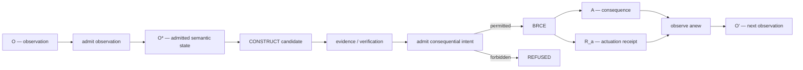

# The Chatman Ecosystem

> **Current operational snapshot:** `v26.8.18` — `PARTIAL_ALIVE`  
> **Constitutional specification:** `FROZEN`  
> **Next composition crown:** `v26.9.1` — remains `PARTIAL_ALIVE` until required exact-subject crown receipts exist.

The Chatman Ecosystem is a constitutional engineering system for turning observations into admitted meaning, admitted meaning into lawful candidates, lawful candidates into receipted consequences, and solved instances into reusable classes.

The current operational review is [`v26.8.18-release.md`](v26.8.18-release.md). The long-form release theorem remains intentionally scoped to `v26.9.1`; these are different admitted subjects rather than competing version labels.

Its shortest governing equation is:

\[
\boxed{A=\mu(O^*)}
\]

with the receipt law:

\[
\boxed{R=\operatorname{receipt}(A)}
\]

and the recursive form:

\[
\boxed{
O_t
\xrightarrow{\operatorname{admit}}
O_t^*
\xrightarrow{\mu}
(A_t,R_t)\sqcup REFUSED
\xrightarrow{\operatorname{observe}}
O_{t+1}
}
\]

The system is not defined by a repository topology, an LLM, a graph database, a programming language, an agent framework, or a particular cloud. Those are replaceable implementations of roles inside the calculus. The constitution is the set of type boundaries and mandatory factorizations that determine what may acquire standing and what may cause consequential change.

## The central invariant

**Zero unreceipted actuation.**

A model may propose. A planner may search. A generator may manufacture. A theorem prover may establish evidence. A process engine may carry state. None of those facts grants ambient authority to change the world.

Consequential execution crosses one explicit boundary:

\[
\boxed{
\mathsf{BRCE}:A_c^*\rightarrow A\times R_a
}
\]

There is therefore no valid successful type corresponding to an unreceipted consequential actuation.

## v26.8.18 operational realization

The constitutional calculus is no longer documented only as a Rust control-plane abstraction. The reviewed 2026-08-18 tree also contains a live-tested local Kubernetes platform surface with admission policy, identity/RBAC, mTLS/network segmentation, managed service shapes, observability, ggen manufacture, bounded Castle execution, evidence-led compliance readiness, and disaster-recovery materialization.

That operational realization does not change the constitution. It gives the constitution additional executed subjects against which it can be falsified.

The correct standing remains `PARTIAL_ALIVE` at ecosystem scope because component evidence is not uniform and the repo-level ggen rail is explicitly `PARTIAL_ALIVE`.

## What the ecosystem is trying to remove

The target is not merely labor cost or task latency. The target is **manufactured complexity**: work that exists because representations drift, authority must be rediscovered, evidence must be reconstructed, coordination creates queues, solved problems are repeatedly rediscovered, or systems manufacture compensatory work around their own defects.

The operational ordering is:

\[
\boxed{
Eliminate(w)\succ Automate(w)\succ Accelerate(w)
}
\]

A faster unnecessary process is still unnecessary. A fully automated unnecessary process is still unnecessary. Constitutional compression preserves the required consequence while changing the system that made the recurring work necessary.

## Semantic manufacture

The ecosystem treats `ggen` as a semantic manufacturing system rather than a code generator. One admitted semantic state may lawfully project to code, tests, controls, policies, process definitions, infrastructure, APIs, documentation, training, audit narratives, executive briefs, and other representations.

\[
\boxed{T_i=\pi_i(O^*)}
\]

The governing doctrine is:

> **Author meaning once. Manufacture every lawful representation.**

A representation is not the meaning itself. Editing a generated document therefore proposes a semantic delta; it does not silently canonize that delta into admitted truth.

## Closure

The book develops four independent closure obligations:

1. **Epistemic closure** — observation cannot silently become admitted truth.
2. **Representational closure** — every required projection is current, valid, and semantically correspondent.
3. **Operational closure** — forbidden transitions refuse before `DO`; permitted transitions can occur only through BRCE with receipts.
4. **Class closure** — a solved class transfers to a distinct lawful instance without semantic rediscovery.

The last condition is critical. Replaying the original instance proves reproduction. Solving a distinct member of the same class without rediscovery proves transfer. Only that stronger result establishes class closure.

## Release subjects

Documentation must name which release subject it is discussing.

### v26.8.18

`v26.8.18` is the current operational/documentation snapshot. It records what is implemented and what remains bounded on the reviewed 2026-08-18 repository subject. Its decisive question is whether each claimed mechanism has exact observed evidence and an honest ceiling.

### v26.9.1

`v26.9.1` is the next dependency-closed ecosystem composition crown. Its manifest and long-form theorem remain future-scoped and are not renamed to match the current date.

For that crown the decisive question remains:

\[
\boxed{\textbf{Where is the receipt?}}
\]

The release is `ALIVE` only when every required crown leaf terminates in independently replayable evidence against the exact admitted subject. Until then, the correct standing remains below `ALIVE`.

## Substrate independence

The same calculus can be instantiated through clay tokens, writing, ledgers, databases, RDF graphs, generated semantics, formal proof, bounded executors, and future machine substrates.

\[
\boxed{
\mathfrak C\times S
}
\]

where the substrate \(S\) may change while the constitutional relation does not.

> **The clay sheep does not precede the calculus. It witnesses it.**

The deepest claim of the ecosystem is therefore not that one software stack should dominate all domains. It is that domains, representations, substrates, and intelligence may vary while the admission–manufacture–receipt recursion remains the constitutional invariant.

\[
\boxed{
\text{Substrates vary. Representations vary. Domains vary. Intelligence varies. }\mathfrak C\text{ does not.}
}
\]
