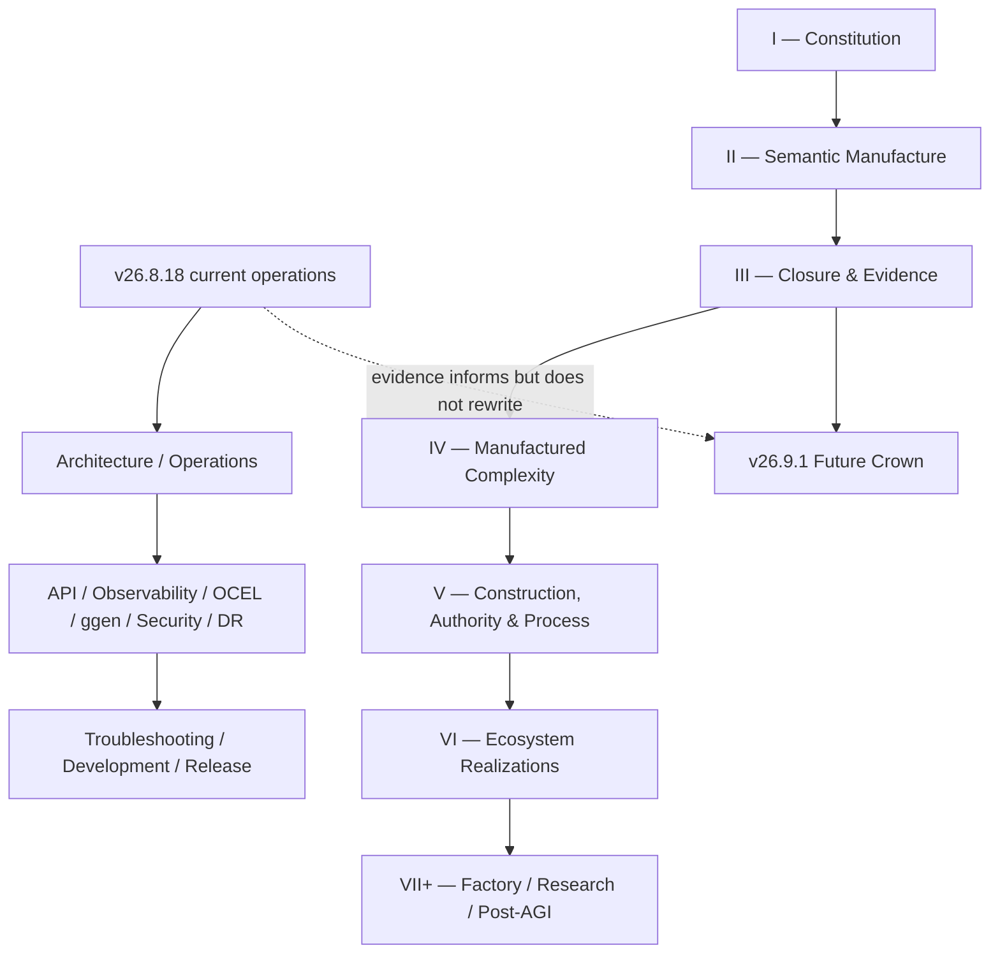

# How to Read This Documentation

The repository contains **three different kinds of reading** that should not be collapsed:

1. current v26.8.18 operational documentation;
2. long-form constitutional/research doctrine;
3. future v26.9.1 release/proof doctrine.

Start with [`DOCUMENTATION-INVENTORY.md`](DOCUMENTATION-INVENTORY.md) when you need to know which file owns a fact and whether it may be rewritten.

## One map



## Fastest current-operator path

Read, in order:

1. [`v26.8.18-release.md`](v26.8.18-release.md)
2. [`ARCHITECTURE.md`](ARCHITECTURE.md)
3. [`OPERATIONS.md`](OPERATIONS.md)
4. [`API-SURFACES.md`](API-SURFACES.md)
5. the subsystem you operate:
   - [`OBSERVABILITY.md`](OBSERVABILITY.md)
   - [`OCEL-PROCESS-EVIDENCE.md`](OCEL-PROCESS-EVIDENCE.md)
   - [`GGEN-SERVICE.md`](GGEN-SERVICE.md)
   - [`SECURITY-MODEL.md`](SECURITY-MODEL.md)
   - [`RELIABILITY-AND-DR.md`](RELIABILITY-AND-DR.md)
6. [`TROUBLESHOOTING.md`](TROUBLESHOOTING.md)

## Implementer path

Read:

- [`DEVELOPMENT.md`](DEVELOPMENT.md)
- [`DOCS-MAINTENANCE.md`](DOCS-MAINTENANCE.md) when docs/projections change
- numbered chapters **3–17** for admission/manufacture/receipt mechanics
- numbered chapters **35–43** for DfCM, authority, security, process and concrete repository roles

## Release-verification path

Read:

1. [`RELEASE-PROCESS.md`](RELEASE-PROCESS.md)
2. chapters **18–28**
3. [`v26.9.1/00_CANONICAL_INDEX.md`](v26.9.1/00_CANONICAL_INDEX.md)

This is the shortest route to the receipt DAG, standing algebra, Definition of Done, and future Crown obligations.

## Semantic-manufacturing path

Read chapters **12–16**, then **40–42**, then [`GGEN-SERVICE.md`](GGEN-SERVICE.md). This connects the general semantic-manufacturing calculus to the currently deployed ggen bridge without treating implementation as the definition of the calculus.

## Process-intelligence path

Read:

1. chapter **39** (`Process Is State`);
2. [`OBSERVABILITY.md`](OBSERVABILITY.md);
3. [`OCEL-PROCESS-EVIDENCE.md`](OCEL-PROCESS-EVIDENCE.md);
4. handbook chapter 31 (`OCEL as Executable Memory`).

This makes the current OTel -> OCEL path concrete while preserving the distinction between process evidence and actuation receipts.

## Post-AGI handbook path

The 65-chapter nested handbook has its own exhaustive reading order at [`post-agi-platform-handbook/SUMMARY.md`](post-agi-platform-handbook/SUMMARY.md). Treat it as a complete sub-book, not a replacement for the current operator docs.

## The notation that must not collapse

| Symbol | Meaning | Must not be confused with |
|---|---|---|
| \(O\) | observed candidate reality | admitted truth |
| \(O^*\) | admitted semantic state | raw observation |
| \(A_c\) | constructed candidate | consequential action |
| \(E\) | evidence | authority/admission |
| \(A_c^*\) | admitted candidate for consequence | consequence itself |
| \(A\) | consequential artifact/action/state | candidate manufacture |
| \(R_d\) | derivation receipt | actuation receipt |
| \(R_a\) | actuation receipt | proof/log alone |
| \(S_{[x]}\) | reusable solution structure | one replayed instance |

```text
Observed != Admitted != Executed != Verified != Inferred
Proof != Authority
CONSTRUCT != DO
Derivation receipt != Actuation receipt
```

## Evidence ladder

A repository may contain a workflow without that workflow executing. A workflow may execute without satisfying acceptance. A generated artifact may exist without class closure.

```text
Executed < Verified < InstanceClosed < ClassClosed
```

Use the tagged standing states literally: `UNKNOWN`, `PARTIAL_ALIVE`, `ALIVE`, `BLOCKED`, `BUILD_BROKEN`, `UNSUPPORTED`, and typed `REFUSED`.

## Repositories are coordinates, not the constitution

Implementations such as ggen, ggen-legacy, DfCM, GymAct, AutoFDE, wasm4pm, mfact, OCEL stores and marketplace packs are replaceable role implementations. For any component ask:

> Which object, morphism, admission boundary, verifier, projection, receipt, replay function, or closure obligation does it implement?

## Specification versus current state

The v26.9.1 architecture/mathematics can be frozen while the v26.8.18 implementation remains `PARTIAL_ALIVE`.

```text
SpecificationFrozen != ReleaseALIVE
```

Do not rewrite the frozen proof corpus merely because a current implementation edge changes. Conversely, do not use the future proof corpus as evidence that a current runtime edge executed.

## Recurring test

At every layer ask:

> **Where is the exact receipt?**

Then ask whether that receipt is derivation or actuation, whether it binds the exact subject, and whether replay/postcondition evidence exists for the claim being made.
