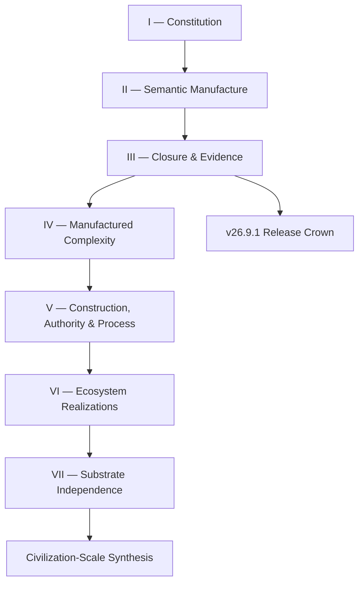

# How to Read This Book

The Chatman Ecosystem is easiest to understand as a sequence of type boundaries rather than as a list of repositories. The book therefore moves from constitutional primitives, through semantic manufacture and evidentiary closure, into complexity removal, authority, process, concrete realizations, and finally substrate-independent synthesis.

## One map

## The notation that must not collapse

| Symbol | Meaning | Must not be confused with |
|---|---|---|
| \(O\) | observed candidate reality | admitted truth |
| \(O^*\) | admitted semantic state | raw observation |
| \(\Gamma\) | admitted execution context | observation alone |
| \(A_c\) | constructed candidate | consequential action |
| \(E\) | evidence | authority/admission |
| \(A_c^*\) | admitted candidate for consequence | consequence itself |
| \(A\) | consequential artifact/action/state | candidate manufacture |
| \(R_d\) | derivation receipt | actuation receipt |
| \(R_a\) | actuation receipt | proof or log alone |
| \(S_{[x]}\) | reusable solution structure for a solved class | one replayed instance |

The central non-collapse sequence is:

\[
\boxed{
O\not\equiv O^*\not\equiv A_c\not\equiv A_c^*\not\equiv A\not\equiv R_a
}
\]

Two orthogonal distinctions recur throughout the book:

\[
\boxed{E\neq Admission}
\qquad
\boxed{R_d\neq R_a}
\]

## Evidence vocabulary

The book uses evidence terms literally:

\[
\boxed{
Observed\neq Admitted\neq Executed\neq Verified\neq Inferred
}
\]

A repository may contain a workflow without that workflow having executed. A workflow may execute without satisfying its acceptance relation. A proof may verify a proposition without granting authority. A generated artifact may exist without its semantic class being closed. A successful original replay does not establish transfer to a distinct lawful instance.

The evidentiary ladder is:

\[
\boxed{Executed<Verified<InstanceClosed<ClassClosed}
\]

## Five useful reading paths

### 1. First pass

Read chapters **1, 2, 5, 9, 12, 18, 24, 29, 33, 43, 44, and 50**. This gives the constitutional calculus, non-collapse law, BRCE, semantic manufacture, closure model, evidence semantics, manufactured-complexity thesis, Little's Law decomposition, repository ontology, substrate continuity, and final synthesis.

### 2. Implementer path

Read **3–17**, then **35–43**. The first range defines observation/admission/manufacture/receipt mechanics. The second range maps those mechanics into reversible construction, authority, security, process, ggen, marketplace reuse, legacy admission, and repository roles.

### 3. Release-verification path

Read **18–28** and the compact [`v26.9.1 canonical index`](v26.9.1/00_CANONICAL_INDEX.md). This is the shortest path to the crown receipt DAG, standing algebra, Definition of Done, and anti-WIP execution discipline.

### 4. Semantic-manufacturing path

Read **12–16**, then **40–42**. This path develops one admitted semantic source into heterogeneous lawful projections while preserving the rule that representations cannot canonize themselves.

### 5. Complexity and civilization path

Read **29–34**, then **44–50**. This connects manufactured complexity, constitutional compression, arrival-space engineering, information theory, historical substrate continuity, post-AGI execution, class memory, and civilization-scale accumulation.

## Repositories are coordinates, not the constitution

The ecosystem may be realized by ggen, ggen-legacy, DfCM, GymAct, AutoFDE, POWL/wasm4pm, mfact, gdmcp, RDF stores, OCEL, receipts, and marketplace packs. Those names are useful implementation coordinates. They are not the mathematical primitives.

For any component, ask:

> **Which object, morphism, boundary, verifier, projection, receipt, replay function, or closure obligation does it implement?**

If that question has no precise answer, the component may still be useful, but it is not a reason to mutate the constitutional calculus.

## Specification versus release standing

The architecture and mathematics described by the v26.9.1 book are frozen. That does not promote the implementation release.

\[
\boxed{SpecificationFrozen\neq ReleaseALIVE}
\]

The execution loop after specification freeze is:

\[
\boxed{
Inspect\rightarrow LocateReceipt\rightarrow ExecuteMissingBoundary\rightarrow Repair\rightarrow Replay\rightarrow ClassClose
}
\]

Architectural ideation reopens only when execution finds a constitutional falsifier. Everything else is evidence acquisition, missing implementation, implementation repair, or an external block.

## The recurring test

At every layer, return to one question:

\[
\boxed{\textbf{Where is the receipt?}}
\]

That question prevents a diagram, generated file, proof, configured workflow, branch, or assertion from silently acquiring execution standing.