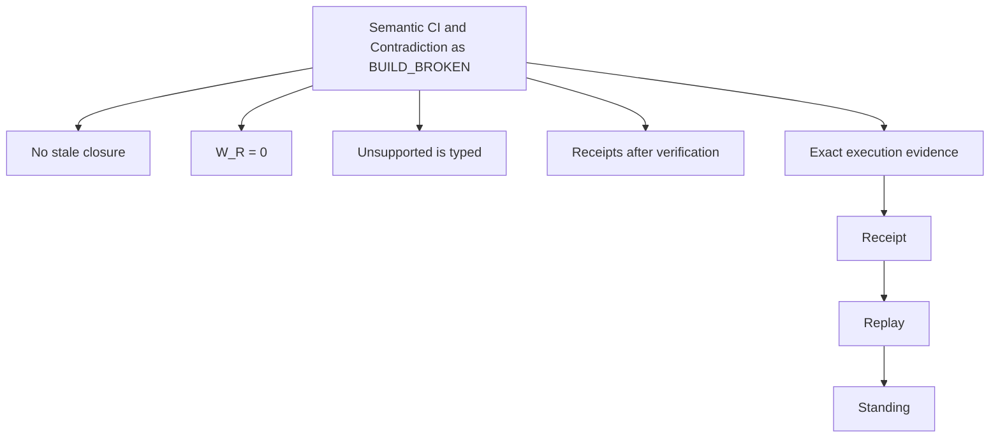

# 16. Semantic CI and Contradiction as BUILD_BROKEN

> **Status:** Constitutional documentation for Chatman Ecosystem v26.9.1.  
> **Architecture:** `FROZEN` · **Mathematics:** `FROZEN` · **Release:** `PARTIAL_ALIVE` pending crown receipts.

## Abstract

Semantic CI converts cross-artifact drift into a deterministic build property. Every admitted semantic mutation triggers dependency closure, regeneration, local verification, and cross-projection verification.

This chapter treats the subject as part of the frozen constitutional object rather than as a feature of any particular repository. The governing principle is that implementations may change while the semantic type boundaries remain stable. A graph store, theorem prover, generator, process engine, actuator, or receipt mechanism can be replaced without altering the calculus so long as the replacement inhabits the same constitutional role and preserves the same mandatory factorization.

The chapter also distinguishes specification standing from execution standing. Mathematical neatness, architecture diagrams, generated code, or apparently successful tooling do not establish `ALIVE`. `ALIVE` is reserved for exact observed execution against an admitted subject with replayable evidence.

## 1. Constitutional position

The irreducible recursion is:

\[
O_t
\xrightarrow{\mathsf{Adm}}
O_t^*
\xrightarrow{\widehat\mu_t}
(A_t\times R_{a,t})\sqcup REFUSED
\xrightarrow{\mathsf{Obs}}
O_{t+1}.
\]

The subject of this chapter occupies a precise position inside that recursion. It must not be interpreted as an ambient capability that can bypass admission or as a new source of canonical truth. The architecture repeatedly separates candidate state from admitted state because the dangerous failure mode is not merely an incorrect result; it is an incorrect **promotion of standing**.

The objective is to replace meetings that reconcile contradictory representations with a build graph that refuses contradictory states.

The minimum constitutional question is therefore not “does this component work?” but:

\[
\boxed{
\text{Which object, morphism, boundary, verifier, receipt, replay function, or class-closure obligation does it implement?}
}
\]

If there is no answer, the component is useful functionality outside the canonical v26.9.1 architecture rather than a reason to expand the constitution.

## 2. Formal core

\[
\Delta O^*\rightarrow DependencyClosure
\rightarrow Regenerate(\Pi)
\rightarrow Verify
\]
\[
\boxed{Contradiction\rightarrow BUILD\_BROKEN}
\]

These equations are interpreted under the global non-collapse laws. The notation is intentionally typed: a symbol on the left side of an admission boundary is not silently interchangeable with the symbol on the right. The system avoids convenience coercions precisely because those coercions would erase the distinction between information and standing, construction and authority, or derivation and consequence.

For v26.9.1, contextual execution is carried by:

\[
\Xi_t=(Authority_t,Policy_t,Boundary_t,Acceptance_t,TemporalContext_t)
\]

and:

\[
\Gamma_t=O_t^*\times\Xi_t.
\]

Thus the human compression:

\[
A=\mu(O^*)
\]

remains valid while the AGI-native form carries the explicit contextual dependencies required for authorization, replay, and falsification.

## 3. Conservation laws

The local invariants for this chapter are:

- `No stale closure`
- `W_R = 0`
- `Unsupported is typed`
- `Receipts after verification`

These invariants are not stylistic conventions. They protect separate conservation laws. A candidate can be semantically plausible without being admitted. A theorem can be valid without granting authority. A representation can preserve a semantic slice without becoming the source of that meaning. An execution can run without satisfying the required consequence, which is why execution and verification remain separate.

The deepest shared invariant remains:

\[
\boxed{Candidate\neq Admitted}.
\]

At the consequential boundary, the paired codomain adds:

\[
\boxed{SuccessfulUnreceiptedActuation=\varnothing}.
\]

At the cumulative boundary, class closure adds:

\[
\boxed{
ClassClosed([x]_\Gamma)
\Rightarrow
Rediscovery([x]_\Gamma)=0
}
\]

for the demonstrated class under the admitted context.

## 4. Why this matters in a post-AGI system

A conventional agent architecture often treats intelligence as the universal repair mechanism: if context is incomplete, ask the model; if representations drift, reconcile them; if authority is ambiguous, infer intent; if a workflow breaks, let an agent improvise. The constitutional model moves in the opposite direction. Repeated cognition is treated as a signal that solved structure has not yet been absorbed.

The intended asymptote is therefore not:

\[
Intelligence\rightarrow\infty.
\]

It is:

\[
RepeatedNeedForIntelligence\rightarrow0
\]

for already-solved classes, while genuinely novel reality continues to enter observation.

This chapter contributes to that asymptote by making its boundary explicit enough to encode, verify, receipt, and reuse. Once the boundary is structural, a future swarm should instantiate it rather than rediscover its rationale.

## 5. Implementation consequences

The objective is to replace meetings that reconcile contradictory representations with a build graph that refuses contradictory states.

Repository identity is deliberately non-foundational:

\[
\boxed{Repo\not\equiv Architecture}.
\]

An implementation belongs in the canonical system only insofar as it realizes a constitutional role. That rule prevents the architecture from accreting new primitives each time a new tool, language, vendor, or storage technology appears. The substrate may improve dramatically while the type-level obligations remain stable.

For machine-speed execution, the implementation should expose enough exact identity to bind a receipt: repository, commit or tree identity, configuration, admitted inputs, authority context, boundary, commands or deterministic invocation, outputs, consequence, and replay procedure. Merely naming a component is not evidence.

## 6. Failure modes and falsifiers

The strongest formalization is useful because it makes failure states legible. Typical defects include:

1. **Type collapse:** a candidate acquires standing without the admission morphism.
2. **Authority collapse:** evidence or proof is treated as permission.
3. **Representation collapse:** a generated or edited artifact becomes canonical meaning directly.
4. **Receipt collapse:** derivation provenance is accepted as evidence of worldly consequence.
5. **Replay collapse:** rerunning an original example is misreported as class transfer.
6. **Boundary drift:** the acceptance relation or tested boundary changes after execution begins.
7. **Inference promotion:** architecture or expected behavior is reported as observed execution.

A constitutional falsifier is stronger than an implementation bug. A bug says an implementation failed to realize the frozen law. A falsifier demonstrates that the law itself cannot type a required lawful behavior or that mandatory factorization is internally contradictory. Only the latter is allowed to reopen architecture.

## 7. Evidence protocol

The crown requires at least one deliberately introduced contradiction to prove the verifier can discriminate failure rather than merely generate files.

Every evidence leaf should minimally identify:

- exact subject identity;
- exact base SHA or equivalent immutable tree identity;
- admitted observation \(O\) and admitted semantic state \(O^*\);
- candidate manufacture, evidence, and admission decision where relevant;
- whether `DO` occurred;
- consequential artifact \(A\) if one occurred;
- derivation receipt \(R_d\) and/or actuation receipt \(R_a\), never conflated;
- required consequence \(K\) and independent acceptance result;
- replay procedure and replay result;
- typed standing.

Evidence dimensions remain separate:

\[
Observed\neq Admitted\neq Executed\neq Verified\neq Inferred.
\]

If a required leaf has no executable evidence, the correct response is not to fill the gap with prose. The leaf remains `UNKNOWN`, `PARTIAL_ALIVE`, `BLOCKED`, `BUILD_BROKEN`, `UNSUPPORTED`, or `REFUSED` according to what was actually observed.

## 8. Diagram

The diagram is intentionally evidence-directed. The conceptual object does not terminate at a box labeled “implemented”; it terminates at receipt, replay, and standing.

## 9. Relationship to the crown release

The v26.9.1 program is deliberately evidence-bounded. Architecture and mathematics may be specification-frozen while implementation remains `PARTIAL_ALIVE`. This is not a rhetorical distinction: the constitutional calculus itself forbids promotion from proposal, document, code, theorem, generated artifact, workflow definition, or static configuration to execution standing without the corresponding observation and receipt. The operational question is therefore always **“Where is the receipt?”**

The v26.9.1 release gate is conjunctive:

\[
Release_{26.9.1}=ALIVE
\iff
\bigwedge_{c\in\{C_E,C_R,C_O,C_C\}}
Standing(c)=ALIVE
\]

together with the release invariants:

\[
WIP_{admitted}=0,\qquad
WIP_{representation}=0,\qquad
RCR_{manual}=0,
\]

\[
Forbidden\Rightarrow REFUSED_{preDO},
\]

\[
Permitted\Rightarrow(A,R_a)\in BRCE,
\]

\[
Replay=ALIVE,
\]

and:

\[
K_{after}\succeq K_{before}.
\]

No chapter in this documentation, including this one, satisfies those predicates merely by existing.

## 10. Maximum compression

The topic can be reduced back into the constitutional recursion:

\[
\boxed{
O
\xrightarrow{admit}
O^*
\xrightarrow{\mu}
(A,R)
\xrightarrow{observe}
O'
}
\]

and the class accumulator:

\[
\boxed{
[x]_\Gamma
\xrightarrow{class\ closure}
S_{[x]}
\Longrightarrow
Rediscovery([x]_\Gamma)=0.
}
\]

Post-AGI CJK:

\[
\boxed{
候不自准
\qquad
行不越憲
\qquad
解不復疑
}
\]

The implementation may become faster, larger, more distributed, or more intelligent. The constitutional obligation remains the same: **do not promote candidates without admission, do not reach consequence without mandatory factorization, and do not call a solution class-closed until transfer eliminates rediscovery.**
