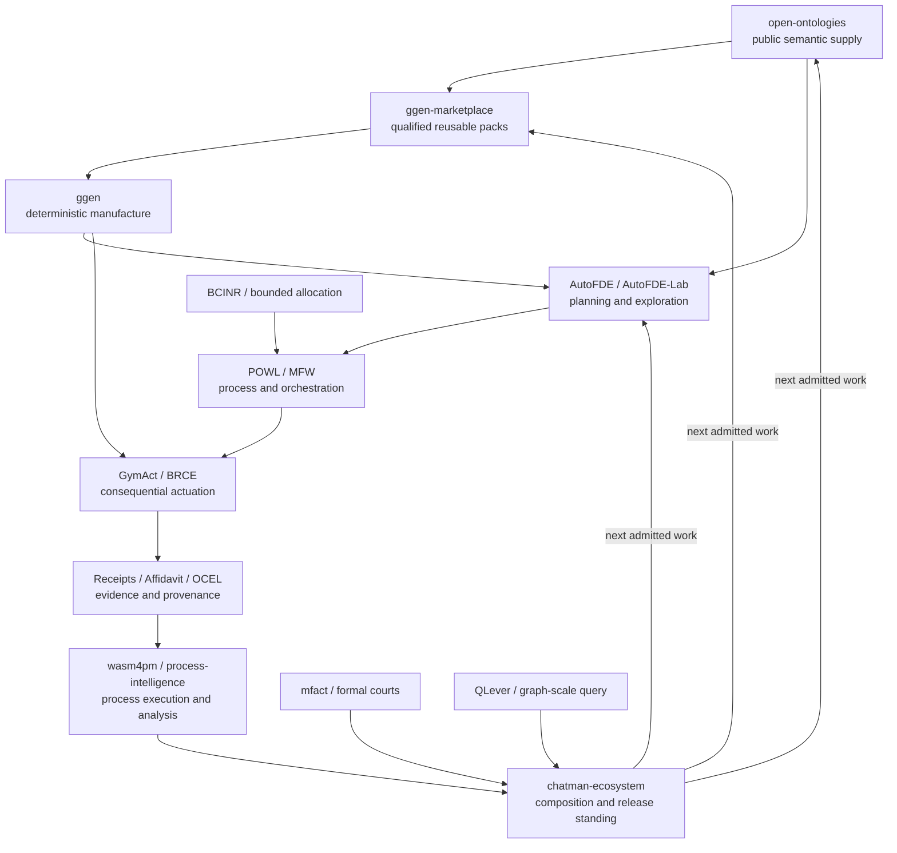

# 51. System Map

The Chatman Ecosystem is easiest to understand as a **typed graph of responsibilities**. The repositories matter, but the constitutional roles matter more. A component can be replaced if the replacement preserves the same admitted role, boundaries, falsifiers, and receipt contract.

## The end-to-end spine

No arrow in this diagram means “the upstream repository owns the downstream repository.” It means a lawful information or control relationship exists. The system continuously resists collapsing those relations into a monolith.

## Public semantic supply: `open-ontologies`

Public ontologies provide vocabulary that should not be reinvented project by project. PROV-O carries provenance, DCTERMS/DCAT carry identity and distribution semantics, SKOS carries controlled concepts, ODRL carries policy-shaped relationships, SHACL carries admission constraints, and OCEL provides object-centric event semantics. Domain ontologies extend this base only when the distinction is irreducible.

The design principle is **public ontology first, private ontology last**. A custom namespace is not forbidden; it carries a burden of proof. The goal is interoperability at the graph level rather than vocabulary proliferation.

## Semantic distribution: `ggen-marketplace`

The marketplace is civilization memory for reusable manufacturing law. A pack can include ontology, templates, semantic queries, refusal gates, qualification fixtures, provenance, and versioned boundaries. The marketplace does not gain the authority of its consumers. A pack describing a deployment or an MCP operation cannot itself deploy or actuate.

The strongest marketplace pattern is:

\[
\text{canonical RDF} \rightarrow \text{queries} \rightarrow \text{templates} \rightarrow \text{gates} \rightarrow \text{qualification receipt}.
\]

This is how one solved defect class can stop recurring across many repositories.

## Manufacture: `ggen`

`ggen` converts admitted graph state into deterministic projections. The important idea is not text templating; it is **semantic manufacture**. One graph can manufacture coordinated code, configuration, documentation, schemas, tests, workflows, policy artifacts, or runtime descriptors while preserving a common source of meaning.

The constitutional fence is:

\[
\boxed{\text{Generated} \neq \text{Authorized}}.
\]

A generated artifact is a candidate consequence. It still needs the downstream admission appropriate to its role.

## Planning and exploration: `AutoFDE` / `AutoFDE-Lab`

The planning plane explores alternatives without acquiring world authority. DfCM requires the system to preserve maximal lawful reversible possibilities before irreversible selection. A failed planner×world edge is recorded as topology; it is not permission to erase the remaining graph.

Formalism families such as PDDL, PPDDL, PDDL+, RDDL, and POWL provide increasingly explicit structures for state, action, time, uncertainty, reward, precedence, and partial order. Planner leagues and empirical meta-selection can compare candidate strategies, but selection evidence does not become actuation authority.

## Process and orchestration: `POWL` / `MFW`

Planning answers what lawful transition structures are available. Process execution answers which transitions are enabled now, what dependencies remain, how concurrency is bounded, how work is resumed, and how uncertain consequences are handled.

The process plane owns such concerns as stable step identity, leases, fencing, replay, and partial-order execution. It should not silently re-plan or grant itself authority. A workflow is a control structure, not a permission structure.

## Bounded resource allocation: `BCINR`

BCINR contributes bounded allocation and certification mechanisms such as CMCA. The constitutional point is the boundary: allocation output can influence orchestration without importing orchestration authority back into the allocator. A producer/consumer seam is complete only when both sides agree on an exact data contract and the authority split remains explicit.

## Consequential actuation: `GymAct` and BRCE

GymAct owns the world boundary. BRCE is the exclusive consequential DO path:

\[
\boxed{\text{SuccessfulUnreceiptedActuation}=\varnothing}
\]

MCP, generated code, planners, hooks, test harnesses, roles, and models can all manufacture **intents**. None of them receive ambient authority. The broker admits or refuses an exact intended transition under an exact subject, policy, capability scope, boundary, and temporal context. Postconditions are then independently checked and bound into the receipt.

## Process evidence: `wasm4pm`, `wasm4pm-compat`, and `process-intelligence`

Object-centric event evidence turns execution into analyzable state. The long-term direction is stronger than “store a workflow log next to the process.” It is **process is state**: the event/object graph is the durable evidence of what transitions actually occurred, which objects participated, what relationships changed, and what can be replayed.

`wasm4pm-compat` owns type-level compatibility and structural connectors; `wasm4pm` owns process execution and analysis capabilities; `process-intelligence` owns research and evidence-governed analysis. Their boundaries deliberately prevent a format adapter from acquiring runtime authority merely because it can represent runtime data.

## Formal and evidentiary courts: `mfact` and `Affidavit`

Formal proof, machine-checkable admission, provenance, and evidence federation all constrain claims. Proof does not become permission. Provenance does not become consequence. A derivation receipt and an actuation receipt answer different questions and must not be conflated.

The doctrine often compresses this as:

\[
\boxed{\text{ggen renders} \quad / \quad \text{Lean admits} \quad / \quad \text{mfact certifies}}
\]

while BRCE remains the only consequential DO boundary.

## Graph-scale query: QLever

As the ecosystem graph grows, the query substrate must scale independently of the constitutional model. QLever is therefore a substrate realization rather than a new constitutional primitive. The release program has used real large graph fixtures and independent ranking verification to ensure the graph plane is not merely diagramware.

## Composition root: `chatman-ecosystem`

This repository governs exact component identities, dependency topology, release roles, standing, portfolio observations, and completion frontiers. It is explicitly **not** the place to copy implementation code from every component.

The root should be able to answer:

- Which exact subject is admitted for each required role?
- Which dependencies block promotion?
- Which exact execution receipts justify current standing?
- Which heads have drifted since their last receipt?
- Which completion actions are reversible and lawful?
- Which release claims are still falsified by missing evidence?

That is the composition problem. It is distinct from implementing every component.

## Gyms as the experimental world layer

AI gyms, FDE gyms, governance gyms, life-world gyms, protocol gyms, and domain-specific simulators provide bounded worlds where planning, process, authority, receipts, and replay can be tested without converting synthetic competence into live-world permission. The registry/discovery layer preserves candidate identity, AutoFDE explores planner/world pairings, and GymAct independently admits execution.

This separation is crucial:

\[
\text{listed} \neq \text{compatible} \neq \text{admitted} \neq \text{executed} \neq \text{ALIVE}.
\]

## The system invariant

The ecosystem remains one system only if these components can compose without collapsing their authority. The central architectural test is therefore not whether every project can call every other project. It is whether the whole path can be traversed with explicit morphisms, typed refusals, exact identities, and receipts while preserving the non-collapse laws at every boundary.
