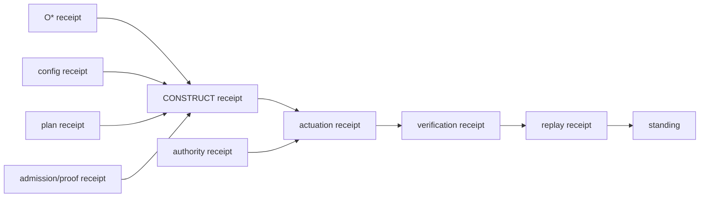

# 56. Receipts, Replay, and Evidence

The Chatman Ecosystem uses receipts because **successful execution is not self-proving**. A process can return exit code zero against the wrong subject, use the wrong authority, mutate a different object, produce the wrong postcondition, or become unreplayable after the fact.

A receipt turns “something ran” into a bounded evidence object.

## Two receipt families

The ecosystem distinguishes derivation from actuation.

### Derivation receipt \(R_d\)

A derivation receipt binds how an informational or constructed artifact was produced: source graph identity, generator version, query/template identities, inputs, output digests, proof artifacts, and replay method.

It answers:

> **Where did this result come from, and can the derivation be reproduced?**

### Actuation receipt \(R_a\)

An actuation receipt binds an authorized consequential transition: exact subject, prior state, requested transition, policy, authority, capability scope, temporal context, observed consequence, independent verification, and replay/audit identity.

It answers:

> **What was allowed to change, what actually changed, and under what authority?**

The distinction is constitutional:

\[
\boxed{R_d \neq R_a}
\]

A perfect derivation does not grant permission to perform the derived action.

## Minimum receipt identity

A high-value receipt should bind enough information to prevent substitution. Depending on the boundary, that can include:

- repository / ref / exact SHA or immutable artifact digest;
- admitted observation digest;
- canonical graph/config digest;
- generator, planner, process, verifier, or provider identity;
- operation/transition identity;
- authority identity and policy digest;
- parent receipt identities;
- precondition or before-state identity;
- consequence or after-state identity;
- acceptance relation and verifier result;
- timestamps or temporal validity bounds where relevant;
- replay identity;
- typed standing/refusal result.

The receipt is strongest when these fields are included in the digest rather than merely printed beside it.

## Receipt DAGs

Complex work rarely has one parent. A deployment might depend on admitted configuration, a generated artifact, a formal proof, a selected plan, an authority grant, and a previous checkpoint. The natural evidence structure is therefore a DAG:

A child must not silently outlive a revoked or mismatched parent if the parent is part of its admitted identity.

## BLAKE3 and content identity

Content hashes are used extensively because exact bytes matter. BLAKE3 is useful for fast domain-separated identities, but a hash alone proves only identity of bytes under the chosen encoding. It does not prove the bytes are authorized, correct, current, or meaningful.

Therefore:

\[
\boxed{\text{Digest equality} \neq \text{semantic admission} \neq \text{authority}}
\]

The ecosystem pairs content identity with schema/ontology admission, exact subject identity, typed policy, and receipts.

## Replay

Replay is not “run the demo again.” Replay verifies that the original evidence contract remains reproducible under the admitted replay semantics.

Useful replay classes include:

- byte replay: same admitted source produces byte-equivalent artifact;
- semantic replay: different physical representation preserves the same admitted semantics;
- process replay: event/object evidence reconstructs the same admitted transition sequence or partial order;
- verification replay: the independent verifier reaches the same conclusion on the same evidence;
- transfer replay: a class-level law reproduces on another member of the admitted equivalence class.

The last is much stronger than repeating the original fixture.

## OCEL as process evidence

Object-centric event logs are especially valuable because one event can relate to multiple objects and one object can participate in many process instances. This matches real software systems better than forcing every event into one case ID.

A receipted process can project:

- repository object;
- branch/PR object;
- build artifact;
- deployment/environment object;
- capability/authority object;
- evidence object;
- release component;
- events such as admitted, constructed, executed, verified, refused, superseded, merged, deployed, retired.

That graph supports WIP collapse, conformance checking, lifecycle closure, and root-cause analysis without inventing a separate narrative state store.

## Evidence dimensions remain orthogonal

The system repeatedly preserves:

\[
Observed \neq Admitted \neq Executed \neq Changed \neq Verified \neq Inferred.
\]

These dimensions answer different questions:

- **Observed:** was the subject seen?
- **Admitted:** did it satisfy the input/semantic boundary?
- **Executed:** did the relevant program/process run?
- **Changed:** was a consequence observed?
- **Verified:** did the consequence satisfy acceptance?
- **Inferred:** is a statement derived from other evidence rather than directly observed?

A high-integrity report never collapses these columns merely to produce a cleaner status page.

## Refusal receipts

Failure is also evidence. A well-designed refusal can bind:

- exact invalid input;
- violated invariant;
- refusal type/code;
- verifier or gate identity;
- absence of consequential mutation;
- replay method.

Negative fixtures are therefore first-class assets. They prove that the system rejects near-miss states rather than succeeding only on the happy path.

## Standing as receipt calculus

Standing is calculated from an evidence set, not attached manually because a maintainer is confident. A simplified relation is:

\[
Standing(S)=f(Identity, Positive, Negative, Integration, Execution, Consequence, Receipt, Replay, Drift).
\]

This makes standing intentionally brittle under subject drift. If the exact code changes, the old receipt remains historically true but does not automatically crown the new bytes.

## The operational question

For any consequential or release-level claim, the shortest useful review question remains:

> **Where is the receipt, what exact subject does it bind, and what would falsify it?**

If those three answers are precise, the rest of the architecture is usually inspectable. If they are not, prose should not fill the gap.
