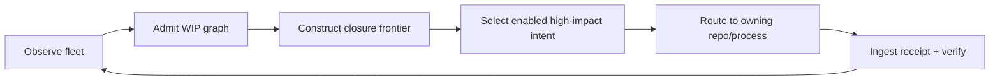

# Roadmap to an Autonomous Software Factory

The next phase of the Chatman Ecosystem is not “more agents.” The target is a production system in which routine work is **selected by admitted graph state**, manufactured deterministically wherever possible, actuated through narrow authority, and closed by receipts.

## Phase 1 — Make the book a projection of the real system

This mdBook is the first reader-facing composition of the existing constitutional corpus. The immediate closure criteria are mechanical:

- every canonical chapter appears exactly once in the navigation;
- every formal v26.9.1 chapter remains reachable;
- local Markdown targets resolve;
- the book builds with a pinned mdBook version;
- Pages deployment is isolated from release standing;
- publication does not mutate canonical release facts.

Documentation becomes useful when the same source that governs the system can continuously manufacture a comprehensible public view.

## Phase 2 — Close the release role frontier

The v26.9.1 release should be completed dependency-first. For each required role:

1. freeze/admit exact subject;
2. run the narrowest owning verifier;
3. repair exact failure transitions;
4. preserve negative fixtures;
5. capture execution/consequence receipt;
6. replay;
7. promote only that exact subject;
8. update downstream dependency closure.

The root should refuse a “release complete” claim until every required role satisfies the release theorem.

## Phase 3 — Make WIP a graph, not a conversation

The WIP engine should become a persistent observation of the portfolio:

- one logical identity per unit of unfinished work;
- branch/PR/issue/CI/source markers as projections;
- explicit blockers and dependents;
- closure throughput and cycle-time evidence;
- ERRC lane and impact;
- authority/receipt requirements;
- deterministic closure intents;
- OCEL-shaped transition history.

Once this graph is reliable, the human no longer needs to remember hidden WIP.

## Phase 4 — Pull work automatically

The completion controller can then run continuously without acquiring DO authority:



The controller stops when there is no enabled admitted work. It does not invent scope to keep workers busy.

## Phase 5 — Compile recurring cognition out of the path

Every repeated reasoning episode should be evaluated as a candidate for structural absorption:

```text
repeated human/model reasoning
    -> identify invariant
    -> ontology / constraint / query / planner / generator / theorem / process
    -> positive + negative court
    -> receipt + replay
    -> class closure
```

The goal is not to eliminate intelligence from novel discovery. It is to stop paying for rediscovery of solved classes.

## Phase 6 — Unify process and state

The process-is-state direction should remove redundant IRs. If OCEL/object-event evidence and the canonical graph fully represent the enabled transitions, object relationships, and consequences needed by the process engine, a separate workflow-state store becomes an implementation optimization rather than the source of truth.

This can reduce synchronization latency and drift, but only when the graph preserves the exact semantics needed for atomicity, leases, authority, and replay.

## Phase 7 — Make old repositories feed the factory

Legacy archaeology should become an intake process:

```text
repository / archive / format / document / API
    -> detect
    -> hash
    -> decode
    -> parse
    -> normalize
    -> observe
    -> map
    -> admit or quarantine
    -> compare to current ontology
    -> recover semantic delta
    -> reconstitute or retire
```

This converts historical work into civilization memory without granting it current standing automatically.

## Phase 8 — Self-manufacturing infrastructure

The highest leverage step is when the system that manufactures projects is itself manufactured from canonical law:

- CI/workflow packs;
- release packs;
- documentation packs;
- MCP protocol packs;
- enterprise assurance packs;
- process/gym packs;
- legacy ingestion packs;
- WIP/closure packs;
- self-host and root-dogfood courts.

At that point the marginal project contains progressively less handwritten scaffolding.

## Phase 9 — Evidence-driven autonomics

Second-order autonomic control can act only within explicit authority ceilings. Viability kernels, requisite variety, Good-Regulator model checks, VSM recursion, ultrastability, and bounded reconstitution can manufacture adaptation **intents**. Consequential adaptation still crosses BRCE.

This supports self-healing without creating a universal self-authorizing agent.

## Phase 10 — Civilization memory

The long-term fixed point is class closure. Once a class of transformations is demonstrated under an admitted context, the system stores enough semantic, proof, process, and receipt structure that the class can be reused without rediscovering its reasoning.

The accumulation law is roughly:

\[
\text{novel observation}
\rightarrow
\text{lawful solution}
\rightarrow
\text{class closure}
\rightarrow
\text{reusable memory}.
\]

The factory improves not merely because processors or models become faster, but because the amount of repeated cognition and repeated coordination per solved class falls.

## Target operating metrics

The ultimate metrics should reflect flow and constitutional integrity:

- logical WIP;
- closure throughput;
- median and tail cycle time;
- blocked-dependent impact;
- percentage of artifacts manufactured from canonical graph state;
- percentage of consequential transitions with valid receipts;
- replay success rate;
- defect classes permanently excluded after first discovery;
- human/model reasoning episodes per repeated class;
- operator touches per completed closure;
- exact-subject evidence age;
- release-role closure.

Commit volume can be an interesting byproduct. It is not the crown.
