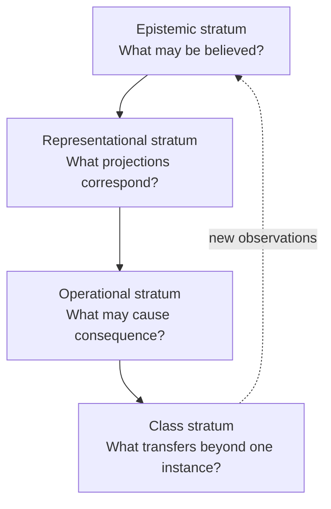

# 61. The Chatman Ecosystem as a Research Program

The Chatman Ecosystem is most useful when treated neither as a product family nor as a set of engineering preferences, but as a falsifiable research program in constitutional computation. Its central research question is:

> **What is the minimum lawful structure required for an autonomous computational system to transform observation into consequential action without collapsing knowledge, representation, authority, execution, and evidence into one undifferentiated mechanism?**

The answer proposed by this book is a typed manufacturing calculus with explicit admission, construction, authority, actuation, receipt, replay, and class-closure boundaries.

The core path is

\[
O_t \xrightarrow{\alpha_e} O_t^*
\xrightarrow{\mu_{\Xi_t}} C_t
\xrightarrow{\nu} A_t^*
\xrightarrow{\beta_o} A_{c,t}^*
\xrightarrow{\operatorname{BRCE}} (A_t,R_{a,t})
\xrightarrow{\omega} O_{t+1},
\]

where:

- \(O_t\) is raw observation;
- \(\alpha_e\) is epistemic admission;
- \(O_t^*\) is admitted semantic state;
- \(\Xi_t\) is execution context excluding the observation already carried by \(O_t^*\);
- \(\mu\) manufactures reversible candidates;
- \(\nu\) verifies candidate obligations;
- \(\beta_o\) admits consequential intent under authority and policy;
- BRCE is the only consequential actuation boundary;
- \(R_{a,t}\) is the actuation receipt;
- \(\omega\) re-observes consequence into the next epistemic cycle.

This factorization is the research object. Particular repositories are realizations of roles inside it.

## 61.1 Research claims

The program makes five progressively stronger claims.

### Claim C1 — Non-collapse is operationally valuable

Systems are safer and more diagnosable when observation, admitted fact, generated representation, verified candidate, authorized intent, consequential action, and evidence are separate types.

A falsifier would be a competing architecture that collapses these states yet achieves equivalent or better replayability, authority containment, semantic correspondence, and failure localization under the same workload.

### Claim C2 — Semantic manufacture reduces representational WIP

If multiple artifacts are projections of one admitted semantic state,

\[
T_i = \pi_i(O^*),
\]

then cross-representation drift can be reduced from pairwise synchronization among \(n\) artifacts toward synchronization with one semantic source.

Naively, pairwise representational consistency has potential relation count

\[
\binom{n}{2}=\frac{n(n-1)}{2}.
\]

A star projection topology reduces the primary semantic correspondence problem toward \(n\) projection obligations. This is not a proof that every artifact family becomes linear; it is a structural prediction that can be measured.

### Claim C3 — Zero-unreceipted-actuation is stronger than agent trust

The system does not require a planner, model, generator, or workflow engine to be trusted with ambient production authority. Instead, reachability to consequential state is structurally restricted.

The empirical prediction is that a compromised or hallucinating upstream component can create malformed candidates, but cannot create an admitted consequential success without crossing the same operational admission and receipt boundary as a correct component.

### Claim C4 — Class closure is the unit of durable progress

Solving one instance is insufficient. A system has learned a reusable class only when a distinct instance can be solved without rediscovering the semantic structure from scratch.

Let \([x]\) denote the admitted equivalence class of an instance. Class closure requires a transfer witness

\[
\tau:[x]\times x' \rightarrow (A',R'), \qquad x'\neq x,
\]

subject to the same constitutional obligations.

### Claim C5 — Autonomous software manufacture should be measured by intervention-adjusted closure

Raw commits, tokens, files, and agent steps are weak proxies. A stronger metric is

\[
\eta = \frac{\text{new ALIVE capability transitions}}{\text{irreducible human interventions}}.
\]

The post-operator objective is not infinite activity. It is increasing verified closure per unit of human attention while preserving bounded authority.

## 61.2 Null hypotheses

A doctoral research program needs explicit nulls.

- \(H_{0,1}\): typed constitutional separation does not improve failure containment relative to conventional agent orchestration.
- \(H_{0,2}\): semantic-source projection does not reduce representational drift or repair burden.
- \(H_{0,3}\): receipt completeness adds audit data but does not improve replay or causal diagnosis.
- \(H_{0,4}\): DfCM candidate expansion does not improve solution coverage once bounded cost is controlled.
- \(H_{0,5}\): class-closure tests do not predict transfer to novel instances better than instance-level tests.

The architecture earns standing only to the extent these nulls are repeatedly rejected under controlled experiments.

## 61.3 Research strata

The program spans four strata that must not certify themselves.

Each stratum has an independent failure mode. A theorem about representation cannot authorize production. A successful production act cannot retroactively prove that the underlying semantic claim was true. A replay of one instance cannot establish class closure.

## 61.4 The doctoral standard

For a claim in this ecosystem to deserve PhD-level standing, it should identify:

1. the subject and boundary;
2. the formal object or measurable variable;
3. the competing hypothesis;
4. the experiment or proof obligation;
5. the receipt that binds the observation to the exact subject;
6. the falsifier;
7. the transfer condition.

That standard converts architecture from doctrine into research.