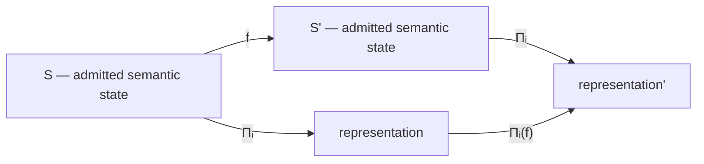

# 63. Categorical Semantics and Commuting Manufacture

Category theory is useful here because the ecosystem is fundamentally about preserving meaning across transformations. The goal is not decorative abstraction. It is to state when two different manufacturing paths are required to agree.

## 63.1 The semantic category

Let \(\mathbf S\) be a category whose objects are admitted semantic states and whose morphisms are lawful semantic transformations. Let \(\mathbf R_i\) be representation categories for code, policy, documentation, process models, infrastructure, tests, and other artifacts.

A projection is a functor

\[
\Pi_i:\mathbf S\rightarrow\mathbf R_i.
\]

If \(f:S\rightarrow S'\) is a lawful semantic change, functoriality requires

\[
\Pi_i(f):\Pi_i(S)\rightarrow\Pi_i(S').
\]

The representation is therefore not independently authored truth. It is a view of a semantic transformation.

## 63.2 The commuting-square obligation

Suppose a semantic state changes from \(S\) to \(S'\). There are two conceptual paths:

1. transform meaning then render;
2. render then update the representation according to the induced projection morphism.

Correct manufacture demands commutation:

\[
\Pi_i(f)\circ\Pi_i(S)=\Pi_i(S').
\]

Diagrammatically:

In implementation, perfect textual equality is often too strong. The appropriate criterion is a semantic equivalence relation \(\simeq_i\) or a validation predicate \(K_i\):

\[
\Pi_i(f)(\Pi_i(S))\simeq_i\Pi_i(S').
\]

## 63.3 Natural transformations as version migration

Two projection strategies \(\Pi,\Pi':\mathbf S\to\mathbf R\) may represent different generator versions. A migration is well behaved when there exists a natural transformation

\[
\eta:\Pi\Rightarrow\Pi'
\]

such that for every semantic morphism \(f:S\to S'\),

\[
\eta_{S'}\circ\Pi(f)=\Pi'(f)\circ\eta_S.
\]

This gives a rigorous interpretation of generator evolution: changing the renderer should not arbitrarily rewrite semantics.

## 63.4 Reverse semantic mutation

A user may edit a generated representation \(r\in\mathbf R_i\). The architecture must not assume an inverse functor exists. Most projections are lossy, many-to-one, or enriched with representation-specific structure.

Instead define a partial interpretation relation

\[
\rho_i:\Delta\mathbf R_i\rightharpoonup \Delta\mathbf S\sqcup F.
\]

A representation edit proposes a semantic delta; it does not directly mutate \(S\).

This distinction prevents a common collapse:

\[
\text{edited Markdown}\not\equiv\text{new constitutional truth}.
\]

## 63.5 Products of projections

For a family of representations \(I\), define

\[
\Pi_I(S)=\prod_{i\in I}\Pi_i(S).
\]

A release may require a closure predicate over the product:

\[
K_I(S,\Pi_I(S))=\bigwedge_{i\in I}K_i(S,\Pi_i(S)).
\]

This makes representational closure explicit. Missing one required projection is not partial semantic success masquerading as release closure; it is a failed product obligation.

## 63.6 Authority is not functorial projection

The operational boundary must remain outside this representational equivalence. A functor can preserve semantic structure, but **no functor from semantic state to a representation category is sufficient to grant consequential authority**.

That is why the architecture distinguishes

\[
\Pi_i:\mathbf S\to\mathbf R_i
\]

from

\[
\operatorname{BRCE}:A_c^*\to A\times R_a.
\]

Representation and actuation live in different constitutional roles.

## 63.7 A semantic CI theorem schema

For every projection \(\Pi_i\), define three obligations:

1. **Totality on the admitted domain:** required semantic states can be rendered.
2. **Correspondence:** rendered states satisfy \(K_i\).
3. **Change commutation:** admitted semantic deltas induce valid representational deltas.

A semantic CI court should therefore test not only whether an artifact parses, but whether the diagram commutes under controlled semantic mutations.

The key research move is this: **CI becomes a test of preserved meaning, not merely preserved syntax.**