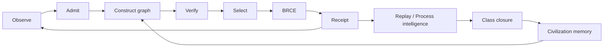

# 70. Dissertation Synthesis: Toward Constitutional Autonomous Manufacture

The deepest claim of the Chatman Ecosystem is not that software can be generated quickly. That has become ordinary. The deeper claim is that increasingly autonomous manufacture requires a constitutional structure that makes epistemic standing, semantic correspondence, authority, consequence, evidence, and transfer mechanically distinguishable.

## 70.1 The dissertation in one expression

A compact form of the system is

\[
\boxed{
\mathcal C:
O
\xrightarrow{\alpha_e}
O^*
\xrightarrow{\mu_{\Xi}}
C
\xrightarrow{\nu}
(A^*,E)
\xrightarrow{\beta_o}
A_c^*
\xrightarrow{BRCE}
(A,R_a)
\xrightarrow{\omega}
O'
}
\]

with lawful refusal available at every partial boundary and with class closure defined only after distinct-instance transfer.

Everything else in the ecosystem is either:

1. an implementation of one of these morphisms;
2. a representation of one of these objects;
3. a verifier of one of these obligations;
4. a control on reachability among them;
5. a memory/replay mechanism preserving evidence across time.

## 70.2 Why AGI increases the need for constitution

As generative and planning capability increases, three historical assumptions weaken:

- generation is expensive;
- candidate count is naturally small;
- a human will inspect each consequential transition.

When those assumptions disappear, safety cannot depend on scarcity of action proposals or human review throughput. The architecture must tolerate abundant candidate generation while keeping consequential authority narrow.

This is the asymmetry:

\[
|CONSTRUCT|\rightarrow large,
\qquad
|Authorized\ DO|\rightarrow bounded.
\]

DfCM deliberately expands reversible search while BRCE deliberately contracts irreversible reachability.

## 70.3 The post-AGI invariant

A post-AGI system may outperform human cognition in planning, coding, theorem search, diagnosis, and design. None of those capabilities logically implies permission to act.

The constitutional invariant therefore survives capability growth:

\[
Intelligence\uparrow \not\Rightarrow Authority\uparrow.
\]

Authority must be granted by an independently represented relation.

This makes the architecture substrate-invariant with respect to intelligence source: human, LLM, symbolic planner, theorem prover, optimizer, swarm, or future system.

## 70.4 Civilization memory

A mature manufacturing system should accumulate solved classes, not merely artifacts. Let \(\mathcal I_t\) be the set of class identities with historical standing at time \(t\). Then

\[
\mathcal I_{t+1}=(\mathcal I_t\setminus F_t)\cup N_t,
\]

where \(F_t\) contains invalidated classes and \(N_t\) newly admitted classes.

For each class, preserve:

- semantic definition;
- admissibility constraints;
- projection contracts;
- construction methods;
- verifiers;
- authority requirements;
- receipts;
- replay procedures;
- transfer evidence;
- known falsifiers.

This is the role of a marketplace/civilization-memory layer: not a bag of templates, but a graph of reusable admitted manufacturing knowledge.

## 70.5 Autonomous closure loop

A fully developed ecosystem approaches:

Human intervention migrates from routine actuation toward constitutional change, exceptional ambiguity, and governance of new classes. Even those interventions should themselves become receipted observations rather than invisible ambient control.

## 70.6 Open theorem program

The book closes with ten research obligations that should remain open until proved or empirically crowned.

### T1 — Semantic projection scaling

Determine conditions under which canonical semantic manufacture reduces coordination complexity from superlinear growth toward linear projection obligations.

### T2 — Authority cut completeness

Given a capability graph, prove that all paths to declared consequential vertices cross the intended BRCE/admission cuts.

### T3 — Receipt sufficiency

Characterize the minimal receipt schema sufficient for deterministic replay, forensic causality, and standing transfer across environments.

### T4 — Process-as-state equivalence

Specify when event-complete process history is semantically equivalent to a separately stored workflow state and quantify the coherence savings.

### T5 — DfCM bounded-completeness theorem

Relate ontology constraints, capability limits, search budget, and discovered solution coverage.

### T6 — Class-closure generalization bound

Define how many and what diversity of transfer instances are sufficient to claim a useful class rather than an overfit equivalence relation.

### T7 — Intervention-adjusted autonomy

Validate \(\eta\) or a stronger metric as a predictor of durable autonomous manufacturing productivity.

### T8 — Constitutional compression law

Identify classes of organizational work whose arrival rates can be eliminated by changing semantic/manufacturing architecture rather than accelerating task execution.

### T9 — Adversarial non-reachability

Establish scalable methods for proving protected bad outcomes unreachable from compromised upstream components under dynamic capability graphs.

### T10 — Recursive self-improvement without authority collapse

Demonstrate that a system can improve its own generators, verifiers, ontologies, and class memory while constitutional changes remain independently admitted and receipted.

## 70.7 What would falsify the dissertation

The dissertation should be weakened or rejected if repeated controlled studies show that:

- typed separation adds complexity without improving containment or diagnosis;
- semantic manufacture does not reduce representation drift or coordination burden;
- receipts do not materially improve replay, causality, or audit standing;
- class-transfer criteria fail to predict real generalization;
- DfCM reversible breadth is dominated by simpler search under representative complex workloads;
- authority-as-reachability cannot be maintained at realistic ecosystem scale;
- process-as-state creates more coherence burden than it removes;
- human intervention remains proportional to generated output rather than to exceptional semantic change.

A constitution that cannot state its own failure conditions is theology, not engineering.

## 70.8 Final statement

The target is not an agent that performs more work. The target is a manufacturing civilization in which avoidable work ceases to arrive, solved classes remain solved, representations are projections rather than competing truths, abundant intelligence can explore without ambient authority, and every consequential transition leaves evidence sufficient to establish exactly what acquired standing.

The system can therefore be summarized by four imperatives:

\[
\boxed{
Preserve\ meaning.
\quad Bound\ authority.
\quad Receipt\ consequence.
\quad Close\ classes.
}
\]

That is the doctoral thesis of the Chatman Ecosystem.