# The Chatman Ecosystem

> **Book standing:** explanatory projection. **Not constitutional authority.**  
> Canonical authority remains in `CONSTITUTION.md`, admitted catalog/release TOML, owning component repositories, exact-subject verifiers, and receipts.

The Chatman Ecosystem is a **constitutional software manufacturing system**. Its central problem is not how to make a model produce more text or more code. Its central problem is how to turn partial observation into lawful, bounded, verifiable consequences while preserving the distinction between information, construction, authority, execution, evidence, replay, and standing.

The compact equation is:

\[
\boxed{A = \mu(O^*)}
\]

where \(O^*\) is admitted observation, \(\mu\) is lawful manufacture under an explicit context and authority boundary, and \(A\) is an artifact or consequence whose standing is justified by evidence rather than narrative. The operational recursion extends that compression:

\[
O_t \rightarrow O_t^* \rightarrow \text{SELECT} \rightarrow \text{CONSTRUCT} \rightarrow \text{DO} \rightarrow R_t \rightarrow \text{replay} \rightarrow O_{t+1}.
\]

This book explains the ecosystem as one system rather than a list of repositories. It preserves the key non-collapse laws:

- **Candidate is not admitted.** A plausible result is not a lawful result.
- **Generated is not authorized.** A generator, planner, model, hook, or MCP transport cannot manufacture consequential authority merely by producing an action-shaped object.
- **SELECT is not CONSTRUCT and CONSTRUCT is not DO.** Reversible reasoning and artifact manufacture do not silently become worldly mutation.
- **Capability is not authority.** Tool access, credentials, code execution, repository ownership, or a network route do not imply permission.
- **Execution is not verification.** A command can run and still fail the required consequence.
- **Receipt is not a label.** A receipt binds exact identity, evidence, authority, consequence, and replay.
- **Repository is not architecture.** Repositories realize roles in the constitutional graph; they do not define those roles by existing.
- **ALIVE is not project closure.** A capability can be ALIVE while lifecycle obligations, replacement work, release composition, or consumer migration remain unfinished.

## What the ecosystem is optimizing

Conventional AI systems often place a language model in the middle of every transition. The Chatman Ecosystem treats repeated cognition as a cost signal. If a class of work has already been understood, the preferred next state is to absorb that understanding into ontology, constraints, generators, admission gates, deterministic planning, executable process, receipts, and replay.

The asymptote is therefore not simply “more intelligence.” It is:

\[
\boxed{\text{RepeatedNeedForIntelligence} \rightarrow 0}
\]

for solved classes, while genuinely novel observations continue to enter the system.

This produces a very different architecture. Public ontologies and canonical graphs preserve meaning. ggen manufactures deterministic projections. Formal and mechanical admission constrain what may be promoted. AutoFDE-style planning preserves and explores lawful possibility spaces. POWL/MFW-style process systems own ordering and orchestration. GymAct and BRCE own consequential DO. Receipts and OCEL-shaped evidence record what happened. Process intelligence and WIP governance feed observed consequences back into the next admission cycle. The composition root then reasons about exact component identities and release standing without becoming an implementation monolith.

## The constitutional pipeline

```mermaid
flowchart LR
    O[Raw observation O] --> ADM[Admission]
    ADM --> OS[Admitted observation O*]
    OS --> G[Canonical graph]
    G --> GGEN[ggen manufacture]
    G --> PLAN[SELECT / planning]
    PLAN --> C[CONSTRUCT]
    GGEN --> C
    C --> BROKER[Authority admission]
    BROKER -->|admitted| DO[BRCE DO]
    BROKER -->|refused| REF[Typed refusal]
    DO --> K[Observed consequence]
    K --> R[Receipt]
    R --> OCEL[OCEL / process evidence]
    OCEL --> REPLAY[Replay / verifier]
    REPLAY --> S[Standing]
    S --> O2[Next observation]
```

The system is deliberately asymmetric around DO. Large reversible search spaces can exist on the left side of the boundary. Consequential actuation is narrow, explicitly admitted, independently verified, and receipted on the right.

## Three ways to read this book

### The constitutional path

Read Parts I–III first. They define the Chatman Equation, non-collapse algebra, contextual execution, refusal, BRCE, receipts, crowns, standing, and Definition of Done. This is the best path for understanding *why* the ecosystem refuses many shortcuts that ordinary software teams accept.

### The manufacturing path

Read Parts II, IV, and V. These chapters explain semantic manufacture, projection contracts, DfCM, Little’s Law, anti-WIP governance, ggen, marketplace memory, ggen-legacy, and repository ontology. This path shows how a software portfolio becomes a factory rather than an expanding pile of hand-maintained implementations.

### The operations path

Start with **System Map**, **Repository Atlas**, **Current Standing**, **From Operator Push to Pull System**, and **Operating the Composition Root**. Then use the formal appendices when a specific boundary must be resolved precisely.

## Canonical source and projection law

This mdBook is intentionally a projection. It explains constitutional law and points to current operating surfaces, but it does not outrank them. A future book build can be perfectly rendered and still describe a broken component. Likewise, a chapter can contain a valid mathematical argument without granting any repository, workflow, process, or agent permission to execute.

The authority order is approximately:

1. constitutional law and admitted canonical source;
2. exact component source and configuration at an immutable subject;
3. executable admission/verifier contracts;
4. observed execution and consequences;
5. receipts and replay;
6. calculated standing;
7. human-facing projections, including this book.

The book should therefore teach a habit that appears throughout the ecosystem:

> **Where is the receipt, and what exact subject does it bind?**

## The factory thesis

The ecosystem can be summarized as a transformation from a human-scheduled collection of projects into a graph-governed software factory.

Early software organizations repeatedly perform the same sequence by hand: interpret a request, choose a repository, rediscover local conventions, write artifacts, run checks, diagnose failures, coordinate dependencies, merge, deploy, and later explain what happened. The Chatman Ecosystem attempts to absorb those repeated decisions into reusable law.

A local defect is therefore valuable when it can be generalized into an exclusion. A successful project is valuable when it can be compressed into a pack, process, verifier, or class-level law. An old prototype is valuable when its still-valid semantic delta can be recovered without inheriting obsolete ancestry. A failed edge is valuable when it narrows the graph without deleting unrelated possibilities.

The intended fixed point is not a repository with no change. It is a system where normal work is pulled by admitted demand and dependency state, manufactured by deterministic machinery, actuated only through bounded authority, and closed by receipts rather than by declaration.

The rest of this book develops that system in detail.
