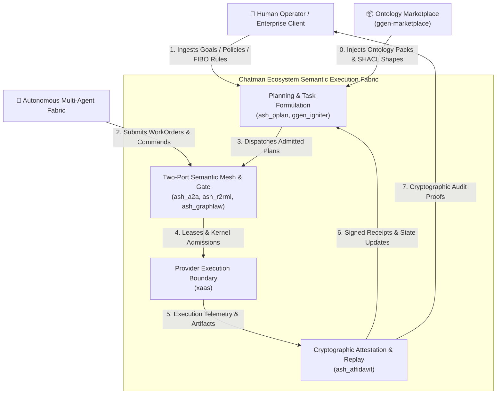
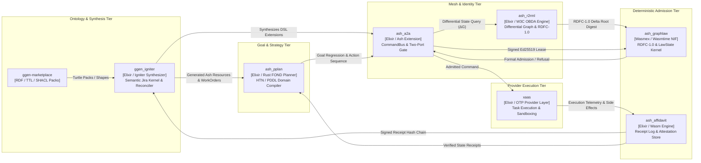
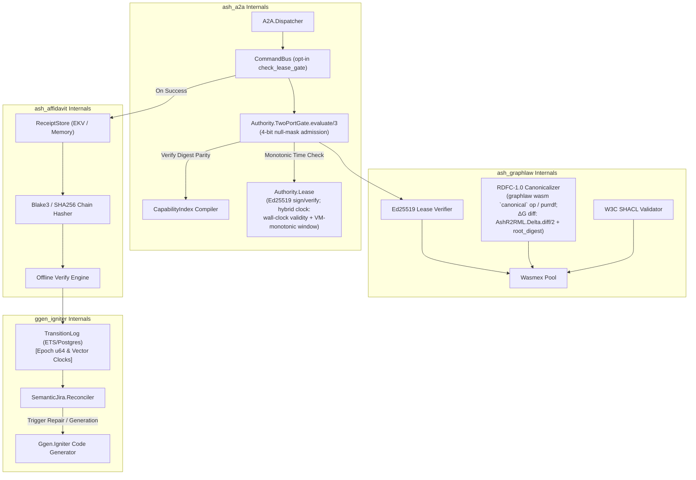
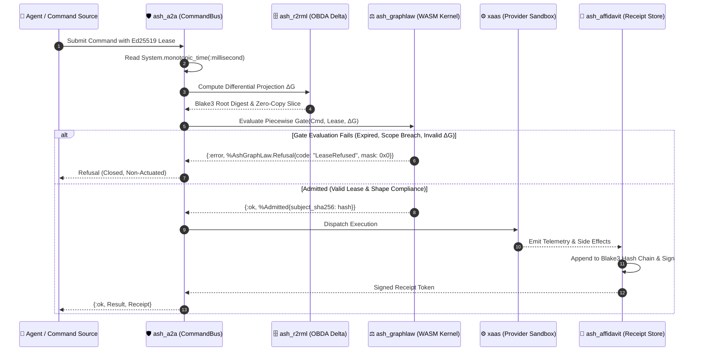
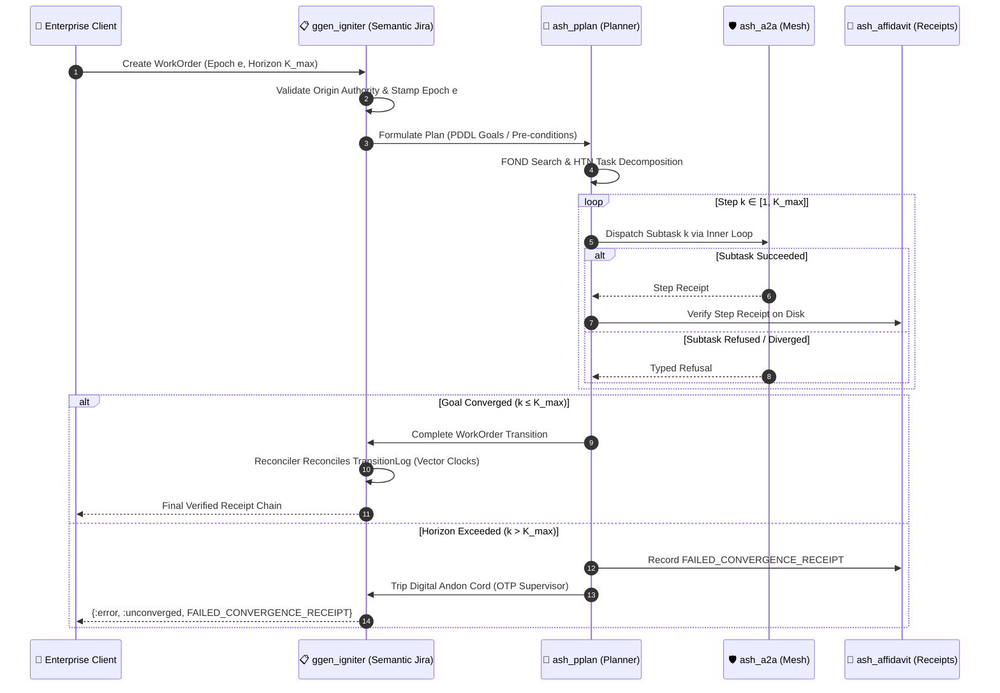
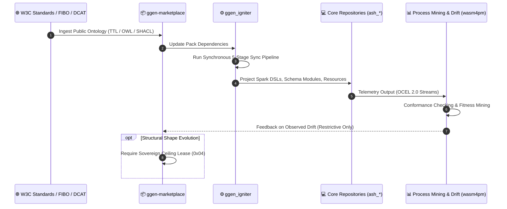

# Architecture Specification: The Loops of Loops

**System Scope:** `ash_a2a` $\times$ `ash_r2rml` $\times$ `ash_graphlaw` $\times$ `ash_affidavit` $\times$ `ash_pplan` $\times$ `xaas` $\times$ `ggen_igniter` $\times$ `ggen-marketplace`  
**Framework:** C4 Architectural Model (Context, Container, Component, Dynamic Loops) & The Chatman Recursive Semantic Loop  
**Core Invariant:** $A_t = \mu(O_t^*), \quad R_t = \text{receipt}(A_t), \quad O_{t+1}^* = \text{admit}(\text{observe}(S_t) \cup R_t)$

---

## 1. Executive Summary: The Recursive Control Fabric

In a deterministic, cryptographically attested semantic control architecture, systems do not operate via flat request-reply RPCs or open-loop task execution. Instead, the architecture is structured as a hierarchy of **three nested, self-closing recursive feedback loops**:

1. **The Inner Micro-Actuation Loop (Gate & Execution):**  
   `ash_a2a` $\to$ `ash_r2rml` $\to$ `ash_graphlaw` $\to$ `ash_affidavit` $\to$ `xaas`  
   * **Latency & Memory Bounds:** High-frequency actuation loops (sub-100ms) avoid full-graph W3C R2RML re-serialization. State transformations operate over a **Differential Graph Projection** ($\Delta G = G_{new} \setminus G_{old}$) anchored to an immutable Blake3/SHA-256 root digest. In-memory payloads are passed into Wasmtime linear memory via zero-copy vector slicing.
   * **Algebraic Two-Port Gate:** Preconditions, authority boundaries, and capability ceilings are evaluated as a deterministic piecewise function:
     $$\text{Gate}(\text{Command}, \text{Lease}, S_t) = \begin{cases} \text{Admitted} & \text{if } H(\text{Scope}_{\text{Lease}}) \equiv H(\text{Target}_{\text{Cmd}}) \land H(\text{RDFC10}(S_t)) \equiv \text{Root}_{\text{Lease}} \land \text{Clock}_{\text{mono}} \in [T_{\text{start}}, T_{\text{exp}}] \land \text{Verify}_{\text{Ed25519}}(\sigma_{\text{Lease}}, \text{PK}_{\text{Auth}}) = 1 \\ \text{Refused} & \text{otherwise} \end{cases}$$
   * **Clock Discipline:** All time horizons evaluate against the BEAM monotonic clock (`System.monotonic_time(:millisecond)`), structurally eliminating NTP time-travel, leap-second jitter, and wall-clock spoofing. Refusals produce a branchless null-mask to ensure constant-time gate evaluation.

2. **The Outer Goal-Convergence Loop (Planning & State Reconciliation):**  
   `ash_pplan` $\to$ `ash_a2a` $\to$ `ash_affidavit` $\to$ `ggen_igniter`  
   * **Epistemic Horizon ($K_{\max}$):** Goal regressions in FOND/HTN action trees are bounded by a maximum transition counter $k \le K_{\max}$. If non-deterministic environmental drift prevents convergence after $K_{\max}$ micro-cycles, the loop executes a deadlock breaker: it emits an immutable `FAILED_CONVERGENCE_RECEIPT` and trips the OTP supervisor tree (acting as a digital Andon cord) rather than thrashing.
   * **Vector Clocks & Monotonic Epochs:** `TransitionLog` maintains deterministic event-ordering and replay defense by annotating every transition record with a vector clock and a monotonically increasing epoch $e \in \mathbb{U}_{64}$.

3. **The Meta Ontological Evolution Loop (Synthesis & Self-Hosting):**  
   `ggen-marketplace` $\to$ `ggen_igniter` $\to$ `ash_*` Artifacts $\to$ Conformance Mining $\to$ `ggen-marketplace`  
   * **Monotonic Restriction & Sovereign Ceiling:** Mining feedback (e.g. from `wasm4pm` / OCEL 2.0 telemetry) is strictly prohibited from loosening existing constraints or relaxing base W3C axioms. Evolution is restricted to monotonic specialization (adding constraints, tightening bounds).
   * **Ceiling Lease (0x04):** Any ontological mutation altering core entity shapes requires explicit multi-party cryptographic authorization via a Sovereign Ceiling Lease (`0x04`), preventing catastrophic automated ontology drift.

---

## 2. C4 Level 1: System Context Diagram

The System Context diagram establishes the boundary between human intent, autonomous agent coordination, and the deterministic execution fabric.

---

## 3. C4 Level 2: Container Diagram (Repository Boundaries & Interfaces)

The Container diagram illustrates the eight target repositories, their runtime boundaries, communication interfaces, and data models.

---

## 4. C4 Level 3: Component Diagram (Internal Engine Mechanics)

A focused view on the core components inside `ash_a2a`, `ash_graphlaw`, `ash_affidavit`, and `ggen_igniter`, highlighting the Monotonic Clock, Lease Manager, and Vector Clock integration.

<!-- v26.10.2 implementation mapping: the component labels below were originally
     invented names. They are now annotated with the landed module names where
     they differ. Full mapping: Section 8 and loops-of-loops-implementation.md.
     LeaseManager -> AshA2A.Authority.Lease (+ Authority.TwoPortGate.evaluate/3)
     DigestEngine -> graphlaw wasm `canonical` op / purrdf, plus the differential
     projection landed in ash_r2rml (AshR2RML.Delta.diff/2 + root_digest). -->

---

## 5. C4 Dynamic: The Loops of Loops in Motion

### 5.1 Loop 1: The Inner Actuation & Admission Loop (Micro Cycle)

* **Frequency:** Sub-100ms  
* **Invariant:** Zero unreceipted actuation. Differential graph verification $\Delta G$ via zero-copy vector slicing. Refusals return a branchless null-mask.

---

### 5.2 Loop 2: The Outer Goal-Convergence Loop (Macro Cycle)

* **Frequency:** Seconds to minutes  
* **Invariant:** Goals formulated in FOND/HTN must converge within Epistemic Horizon $k \le K_{\max}$. If $k > K_{\max}$, emit `FAILED_CONVERGENCE_RECEIPT` and trip supervisor. Event log ordering is enforced by monotonic epoch $e \in \mathbb{U}_{64}$.

---

### 5.3 Loop 3: The Meta Synthesis & Evolution Loop (Meta Cycle)

* **Frequency:** Hours to days / Release Cadence  
* **Invariant:** Strictly Monotonic Restriction. No automated relaxation of axioms. Shape alterations require Sovereign Ceiling Lease `0x04`.

---

## 6. Matrix of Repository Responsibilities

| Repository | Primary Loop | Input Artifact | Produced Artifact | Max Execution Budget | State Transition Guarantee | Falsifier / Kill Criterion |
|---|---|---|---|---|---|---|
| `ash_a2a` | Inner | Signed Commands & Leases | Admitted Actions / Dispatch | $\le 10\,\text{ms}$ | Atomically gated via Ed25519 lease and BEAM monotonic clock. | Two-Port digest mismatch or expired lease survives. |
| `ash_r2rml` | Inner | PostgreSQL / Relational State | Differential Triples ($\Delta G$) & Digest | $\le 20\,\text{ms}$ | Graph delta $\Delta G$ maintains 100% equivalence with canonical RDFC-1.0. | Unmapped relational change alters state without RDF trace. |
| `ash_graphlaw` | Inner | RDF Data + SHACL Shapes | Typed Refusal or `%Admitted{}` | $\le 15\,\text{ms}$ | Branchless, deterministic WASM evaluation; zero fuel leakage. | Invalid state or ceiling breach fails to emit refusal. |
| `ash_affidavit` | Inner / Outer | Telemetry & Execution Proofs | Append-Only Receipt Chain | $\le 5\,\text{ms}$ | Append-only Blake3 hash chain; tamper-evident offline verification. | Receipt chain verifies with missing intermediate hash. |
| `ash_pplan` | Outer | FOND Goals & Preconditions | Action Plans (HDDL / PDDL) | $\le 500\,\text{ms}$ | Convergence strictly bounded by Epistemic Horizon $k \le K_{\max}$. | Action plan executes out of topological dependency order. |
| `xaas` | Inner | Admitted Task Execution Request | Isolated Process Output | $\le 60\,\text{s}$ (configurable) | Zero unleased side effects; process isolation boundary preserved. | Provider execution breaches container isolation boundary. |
| `ggen_igniter` | Outer / Meta | RDF WorkOrders & Manifests | Reconciled Event Logs & Code | $\le 2\,\text{s}$ | Monotonic epoch ordering $e \in \mathbb{U}_{64}$ via vector clocks. | Reconciler drops unhandled state transition event. |
| `ggen-marketplace` | Meta | Ontological Source Graphs | Versioned Packs & Shape Bundles | Batch ($\le 10\,\text{m}$) | Strictly monotonic constraint evolution; Sovereign Lease `0x04` enforced. | Pack contains ungrounded or non-canonical RDF terms. |

---

## 7. Architectural Guarantees

1. **Topological Closure:** No state transition can be applied to persistent storage without traversing both `ash_graphlaw` (WASM semantic admission) and `ash_affidavit` (receipt attestation).
2. **Deterministic Replay:** Any state $S_t$ can be bit-for-bit reconstructed by running `graphlaw-verify` across the receipt logs generated by `ash_affidavit` and `ggen_igniter`.
3. **Mocks Excluded Structurally:** Because all loops exchange cryptographically signed digests and compiled WASM outputs, synthetic mocks (`Mox`, `:meck`) cannot satisfy downstream mathematical verifiers.
4. **Time & Memory Invariance:** Actuation timing is verified against monotonic hardware counters (`System.monotonic_time`), while memory utilization during graph admission is bounded by zero-copy differential slices $\Delta G$.

---

## 8. Implementation Status (v26.10.2)

Traceability from each spec invariant to the landed implementation (lane L1–L5 of the
v26.10.2 closed manufacture loop), its witnessing test/court, and the measured budget
where one was claimed. Full receipt, disclosed deviations, and replay commands:
[loops-of-loops-implementation.md](loops-of-loops-implementation.md).

### 8.1 Traceability table

| # | Spec invariant (ref) | Landed module(s), repo@SHA | Witnessing test / court | Measured budget |
|---|---|---|---|---|
| 1 | Differential Graph Projection $\Delta G$ anchored to an immutable root digest (§1.1) | `ash_r2rml@0d5320f` — `AshR2RML.Delta.diff/2` + `root_digest/1` (SHA-256 over sorted canonical N-Triples, self-describing prefix) | `test/delta_budget_test.exs` | 1.5 ms diff / 4.5 ms digest @ 100 rows (budget $\le 20$ ms) |
| 2 | Zero-copy vector slicing into Wasmtime linear memory (§1.1) | **GAP** — wasmex 0.15.1 exposes no memory-view API; v1 = digest contract + measured copy cost; upgrade path named (dedicated NIF / direct wasmtime host) | copy-cost tier in `test/delta_budget_test.exs` | UNMEASURED as zero-copy (copy cost measured in the budget tier) |
| 3 | Algebraic Two-Port Gate; refusals branchless (§1.1) | `ash_a2a@7b36935` — `AshA2A.Authority.TwoPortGate.evaluate/3`, 4-bit null mask: `0x1` scope / `0x2` RDFC10 root / `0x4` clock / `0x8` signature; all conjuncts evaluated unconditionally | CHI-TWO-PORT court (`lib/ash_a2a/chicago/courts/two_port_gate.ex`) + 4 mutants (`lib/ash_a2a/chicago/mutation/catalog.ex`) + `test/ash_a2a_two_port_gate_test.exs` | 106 µs median (budget $\le 10$ ms, ~100× headroom) |
| 4 | Ed25519 lease verification (§1.1) | `ash_a2a@7b36935` — `AshA2A.Authority.Lease` (sign/verify) | CHI-TWO-PORT court, signature conjunct (`0x8`) | included in the 106 µs gate path |
| 5 | Clock discipline; spoof-proof horizons (§1.1) | `ash_a2a@7b36935` — `Authority.Lease` hybrid clock law: wall-clock persisted validity + same-VM monotonic admission window | CHI-TWO-PORT court, clock conjunct (`0x4`) | DEVIATION disclosed (receipt §4.5); inside the 106 µs gate path |
| 6 | Epistemic horizon $k \le K_{\max}$ (§1.2, §5.2) | `xaas@9cda677a` — crown `opts[:k_max]` (default 2), drive `opts[:k_max]` (default `nil` = today's unbounded); `ash_pplan@af65623` — `PolicySupervisor` horizon (default 9) + `horizon_exceeded?/1` + recovery route | `test/xaas/ultracode/convergence_receipt_test.exs`, `test/xaas/ultracode/semantic_crown_test.exs`, `test/fond/horizon_test.exs` | UNMEASURED-honest |
| 7 | Immutable `FAILED_CONVERGENCE_RECEIPT` at horizon (§1.2) | `xaas@9cda677a` — `ConvergenceReceipt`: class `FAILED_CONVERGENCE`, `horizon_witness` sha256, standing `BLOCKED:epistemic_horizon_exceeded` | `test/xaas/ultracode/convergence_receipt_test.exs` | UNMEASURED-honest |
| 8 | Andon cord trips at horizon (§1.2, §5.2) | `xaas@9cda677a` — `Xaas.Ultracode.Andon` (ETS GenServer, opt-in `:andon_enabled`) + `AndonSupervisor`; loop self-halt on trip | `convergence_receipt_test.exs` — receipt at exactly $k_{\max}$ with exactly one Andon trip | DEVIATION scope disclosed (receipt §4.3) |
| 9 | Monotonic epoch $e \in \mathbb{U}_{64}$ (§1.2) | `ggen_igniter@72afe77` — `TransitionLog` epoch `e` (u64 ledger-generation, marker-persisted, regression refused typed) | `test/ggen_igniter_semantic_jira_transition_log_concurrency_test.exs` | UNMEASURED-honest |
| 10 | Vector clocks; replay defense (§1.2) | `ggen_igniter@72afe77` — `vc_dominates?`/`vc_concurrent?` weak order; `Reconciler` refuses `{:vc_concurrent, incoming, last}` before any byte; `prov_events` project `sj:epoch` + `sj:vectorClock` conditionally | `..._transition_log_concurrency_test.exs`, `..._reconciler_test.exs`, `..._prov_events_test.exs` | UNMEASURED-honest |
| 11 | Strictly monotonic restriction — no loosening (§1.3) | `ggen_igniter@d82e0f1` — gate `066_monotonic_evolution.rq`; `SovereignLease` `shape_digest_unchanged` refusal (evolution requires a real digest delta) | `test/ggen_igniter_semantic_jira_sovereign_lease_test.exs` (loosening refused / tightening passed) | UNMEASURED-honest |
| 12 | Sovereign Ceiling Lease `0x04`: multi-party, no wall clock in admit (§1.3) | `ggen_igniter@d82e0f1` — `SovereignLease` ≥2 distinct Ed25519 signers over canonical bytes; no wall clock in admit; `admit_candidates` `"SOVEREIGN"` requirement literal + `--sovereign-keys`; registry 132→135 | `..._sovereign_lease_test.exs`, `..._admit_candidates_sovereign_test.exs` | UNMEASURED-honest; DEVIATION: SOVEREIGN projects at ceiling DO (receipt §4.6) |
| 13 | Support: outer-loop receipt evidence threading (§1.2) | `ggen_igniter@0789e42` — `receipt_from_xaas/3` `required_evidence` threading (F6 promotion-refusal fix) | `test/..._semantic_jira_descriptor_test.exs` | UNMEASURED-honest |

### 8.2 Honest gaps and residues

- **Zero-copy slicing (row 2):** wasmex 0.15.1 has no memory-view API. Honest v1 is a
  digest contract plus a measured copy cost; upgrade path: dedicated NIF or direct
  wasmtime host access.
- **Blake3 → SHA-256 (row 1):** resolved via the spec's own hedge (§1.1 says
  "Blake3/SHA-256"). Zero Blake3 anywhere in the fleet; SHA-256 with a self-describing
  prefix was adopted instead.
- **1.17 floor leg:** not landed in this loop; carried as an open leg.
- **Known residues (pre-existing, unchanged):** strict-profile STOP in ggen;
  SA2A-TOPO-002 user configuration.
