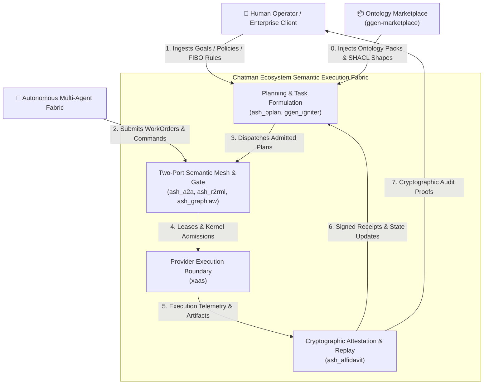
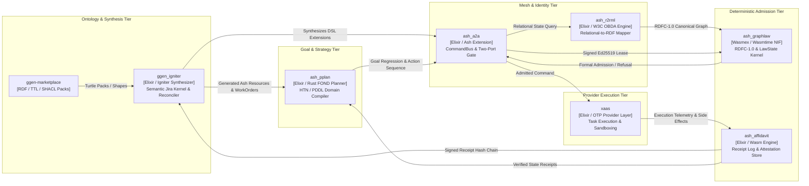
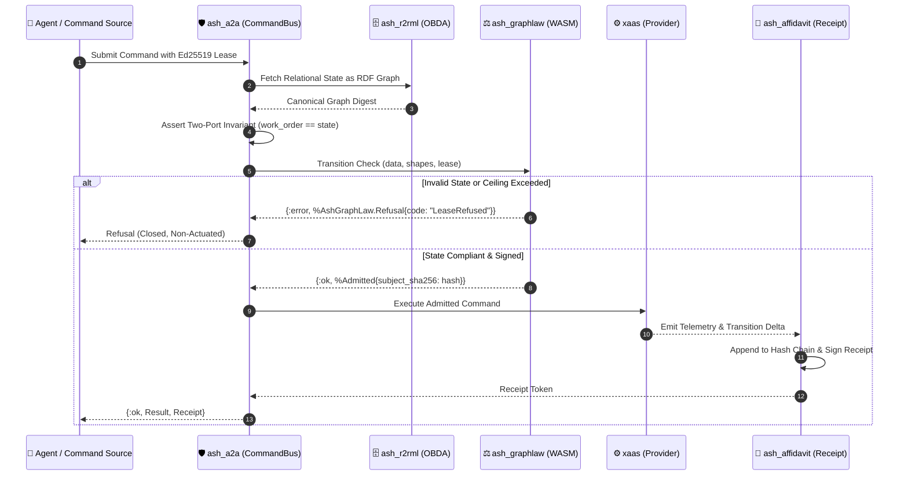
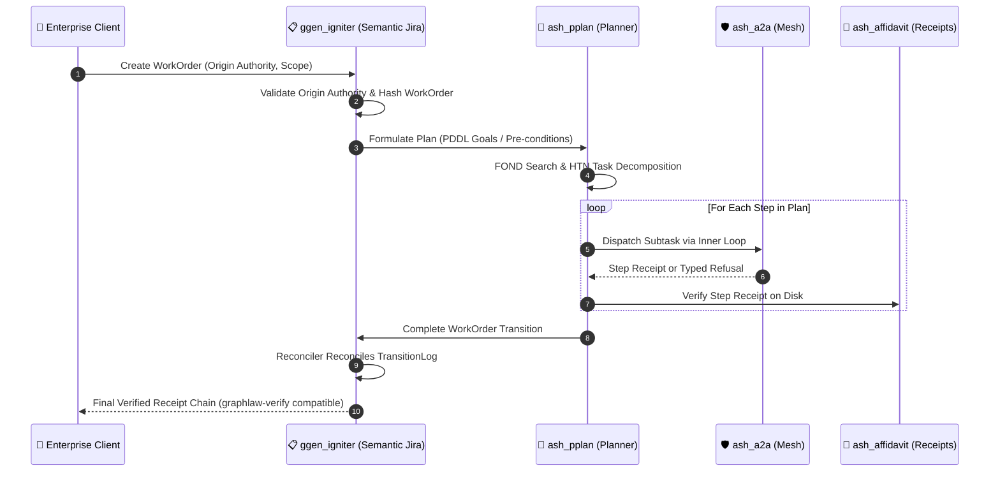
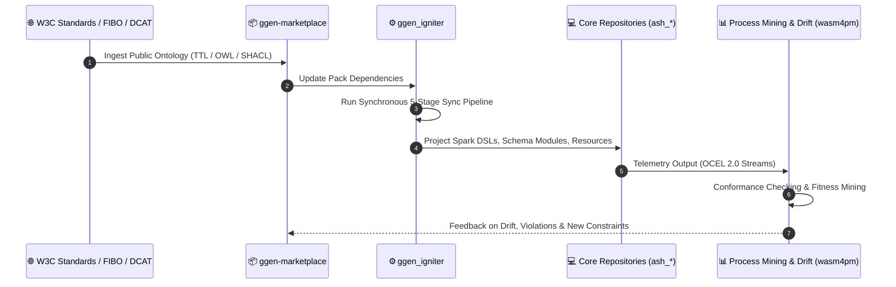

# Architecture Specification: The Loops of Loops

**System Scope:** `ash_a2a` $\times$ `ash_r2rml` $\times$ `ash_graphlaw` $\times$ `ash_affidavit` $\times$ `ash_pplan` $\times$ `xaas` $\times$ `ggen_igniter` $\times$ `ggen-marketplace`  
**Framework:** C4 Architectural Model (Context, Container, Component, Dynamic Loops) & The Chatman Recursive Semantic Loop  
**Core Invariant:** $A_t = \mu(O_t^*), \quad R_t = \text{receipt}(A_t), \quad O_{t+1}^* = \text{admit}(\text{observe}(S_t) \cup R_t)$

---

## 1. Executive Summary: The Recursive Control Fabric

In a deterministic, cryptographically attested semantic control architecture, systems do not operate via flat request-reply RPCs or open-loop task execution. Instead, the architecture is structured as a hierarchy of **three nested, self-closing recursive feedback loops**:

1. **The Inner Micro-Actuation Loop (Gate & Execution):**  
   `ash_a2a` $\to$ `ash_r2rml` $\to$ `ash_graphlaw` $\to$ `ash_affidavit` $\to$ `xaas`  
   Validates pre-conditions, cryptographically bounds authority with Ed25519 leases, admits transitions through branchless WASM kernels, executes provider tasks, and stamps immutable receipt records.
2. **The Outer Goal-Convergence Loop (Planning & State Reconciliation):**  
   `ash_pplan` $\to$ `ash_a2a` $\to$ `ash_affidavit` $\to$ `ggen_igniter`  
   Translates declarative work orders into FOND/HTN action trees, checks post-conditions against relational and RDF state, and reconciles state transitions through append-only event sourcing logs.
3. **The Meta Ontological Evolution Loop (Synthesis & Self-Hosting):**  
   `ggen-marketplace` $\to$ `ggen_igniter` $\to$ `ash_*` Artifacts $\to$ Conformance Mining $\to$ `ggen-marketplace`  
   Compiles W3C RDF/OWL ontologies into executable Spark DSL extensions, Ash resources, and validation shapes, feeding runtime process-mining metrics back into ontology refinement.

---

## 2. C4 Level 1: System Context Diagram

The System Context diagram establishes the boundary between human intent, autonomous agent coordination, and the deterministic execution fabric.

---

## 3. C4 Level 2: Container Diagram (Repository Boundaries & Interfaces)

The Container diagram illustrates the eight target repositories, their runtime boundaries, communication interfaces, and data models.

---

## 4. C4 Level 3: Component Diagram (Internal Engine Mechanics)

A focused view on the core components inside `ash_a2a`, `ash_graphlaw`, `ash_affidavit`, and `ggen_igniter`.

```mermaid
flowchart TB
    subgraph ash_a2a["ash_a2a Internals"]
        CmdBus["CommandBus"]
        Dispatcher["A2A.Dispatcher"]
        TwoPortGate["Two-Port Identity Validator"]
        CapabilityIndex["CapabilityIndex Compiler"]
    end

    subgraph ash_graphlaw["ash_graphlaw Internals"]
        WasmPool["Wasmex Pool"]
        DigestEngine["RDFC-1.0 Canonicalizer"]
        ShaclValidator["W3C SHACL Validator"]
        LeaseVerifier["Ed25519 Lease Verifier"]
    end

    subgraph ash_affidavit["ash_affidavit Internals"]
        ReceiptStore["ReceiptStore (EKV / Memory)"]
        ChainHasher["Blake3 / SHA256 Chain Hasher"]
        Attestor["Offline Verify Engine"]
    end

    subgraph ggen_igniter["ggen_igniter Internals"]
        Reconciler["SemanticJira.Reconciler"]
        TransitionLog["TransitionLog (ETS/Postgres)"]
        CodeGenerator["Ggen.Igniter Code Generator"]
    end

    Dispatcher --> CmdBus
    CmdBus --> TwoPortGate
    TwoPortGate -->|"Verify Digest Parity"| CapabilityIndex

    TwoPortGate --> LeaseVerifier
    LeaseVerifier --> WasmPool
    DigestEngine --> WasmPool
    ShaclValidator --> WasmPool

    CmdBus -->|"On Success"| ReceiptStore
    ReceiptStore --> ChainHasher
    ChainHasher --> Attestor

    Attestor --> TransitionLog
    TransitionLog --> Reconciler
    Reconciler -->|"Trigger Repair / Generation"| CodeGenerator
```

---

## 5. C4 Dynamic: The Loops of Loops in Motion

### 5.1 Loop 1: The Inner Actuation & Admission Loop (Micro Cycle)

*Frequency: Milliseconds to seconds*  
*Invariant: Zero unreceipted actuation. Real collaborators only.*

---

### 5.2 Loop 2: The Outer Goal-Convergence Loop (Macro Cycle)

*Frequency: Seconds to minutes*  
*Invariant: Goals formulated in FOND/HTN must reach deterministic goal states or emit explicit BLOCKED / UNSUPPORTED receipts.*

---

### 5.3 Loop 3: The Meta Synthesis & Evolution Loop (Meta Cycle)

*Frequency: Hours to days / Release Cadence*  
*Invariant: No handwritten boilerplate. Ontology is source; generated code is projection.*

---

## 6. Matrix of Repository Responsibilities

| Repository | Primary Loop | Input Artifact | Produced Artifact | Falsifier / Kill Criterion |
|---|---|---|---|---|
| `ash_a2a` | Inner | Signed Commands & Leases | Admitted Actions / Dispatch | Two-Port digest mismatch or expired lease survives. |
| `ash_r2rml` | Inner | PostgreSQL / Relational Tables | RDFC-1.0 Canonical Triples | Unmapped relational change alters state without RDF trace. |
| `ash_graphlaw` | Inner | RDF Data + SHACL Shapes | Typed Refusal or `%Admitted{}` | Invalid state or ceiling breach fails to emit refusal. |
| `ash_affidavit` | Inner / Outer | Telemetry & Execution Proofs | Append-Only Receipt Chain | Receipt chain verifies with missing intermediate hash. |
| `ash_pplan` | Outer | FOND Goals & Preconditions | Action Plans (HDDL / PDDL) | Action plan executes out of topological dependency order. |
| `xaas` | Inner | Admitted Task Execution Request | Isolated Process Output | Provider execution breaches container isolation boundary. |
| `ggen_igniter` | Outer / Meta | RDF WorkOrders & Manifests | Reconciled Event Logs & Code | Reconciler drops unhandled state transition event. |
| `ggen-marketplace` | Meta | Ontological Source Graphs | Versioned Packs & Shape Bundles | Pack contains ungrounded or non-canonical RDF terms. |

---

## 7. Architectural Guarantees

1. **Topological Closure:** No state transition can be applied to persistent storage without traversing both `ash_graphlaw` (WASM semantic admission) and `ash_affidavit` (receipt attestation).
2. **Deterministic Replay:** Any state $S_t$ can be bit-for-bit reconstructed by running `graphlaw-verify` across the receipt logs generated by `ash_affidavit` and `ggen_igniter`.
3. **Mocks Excluded Structurally:** Because all loops exchange cryptographically signed digests and compiled WASM outputs, synthetic mocks (`Mox`, `:meck`) cannot satisfy downstream mathematical verifiers.
