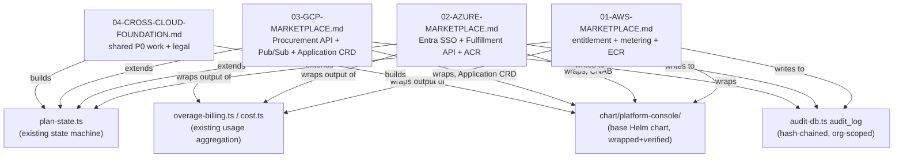

# v26.8.19 — Fortune 5 Multi-Cloud Marketplace Readiness (Backward-Chain Plan)

> **Provenance record.** This ticket set is written backward from a stated target: *"as if we
> could finish everything today."* Each ticket opens with that finished state asserted as the
> premise, then works backward asking "what real, currently-missing artifact would have had to
> exist for this to be true?" — the same backward-chaining method used in
> [`platform-engineers-handbook-backward-chain.md`](../../platform-engineers-handbook-backward-chain.md).
> This is deliberate **EXPLORE-mode** writing (see `explore-exploit-premises.md`): the finished
> state is a premise to reason from, not a claim that it is true today. Every ticket's
> "Backward from finished" section is followed by a "Real state today" section stating current,
> checked fact — the two are never allowed to blur into one another.
>
> **"Simulate time passing in gymact," stated precisely.** Checked against
> `~/gymact/src/gymact/kernel.py`: gymact has no time-fast-forward or external-review-queue
> simulation capability. What it has is real, bounded timeouts on real actuation calls
> (`RuntimeLimits.actuate_timeout_s`, `.verify_timeout_s`, etc.) — wall-clock bounds on things
> gymact actually does, not a mechanism for compressing external clocks. "Simulating time
> passing" in this document set means the backward-chain narrative device above: write the
> future state, then chain backward to what's missing now. It does not mean gymact can execute
> an AWS Marketplace review cycle in fast-forward. See
> [`05-GYMACT-AUTOFDE-ACTUATION-SCOPE.md`](05-GYMACT-AUTOFDE-ACTUATION-SCOPE.md) for the full,
> checked scope of what gymact and autofde-lab can and cannot actuate for this ticket set.

## Governing constraint carried over from v26.8.18

`CONSTITUTION.md`'s zero-unreceipted-actuation rule and `04-GGEN-BRCE-CROSS-CUTTING.md`'s
authority contract still bind every ticket below. A marketplace listing is a new *commerce
lifecycle* layered on top of the existing PaaS/SaaS closures documented in
[`../v26.8.18/00-OVERVIEW.md`](../v26.8.18/00-OVERVIEW.md) — it does not get to skip
entitlement/receipt discipline just because Stripe already works. Every cloud's entitlement
event (AWS SNS message, Azure webhook call, GCP Pub/Sub message) must resolve to the same real
`plan-state.ts` state machine and the same audited, hash-chained `audit_log` this session
already built (`docs/DOD-v26.8.18-FDE-ACTUATION.md`, `platform-console/app/lib/audit-db.ts`) —
not a parallel, unaudited billing rail per cloud.

## Real state today (2026-08-19), not projected

This session already produced real, checked evidence this ticket set builds on:

| Artifact | Real state | Evidence |
|---|---|---|
| Stripe billing rail | `PARTIAL_ALIVE`, live | `app/lib/stripe-billing.ts`, 44 revenue capabilities shipped this session (rounds 1-11) |
| Marketplace requirements (AWS/Azure/GCP) | researched, cited, real docs | `docs/jira/v26.8.19` this directory, sourced from `docs.aws.amazon.com`, `learn.microsoft.com`, GCP docs |
| Entitlement-adapter interface + 3 cloud stubs | generated, compiles, **not implemented** | `platform-console/app/lib/entitlement-adapter.ts`, `entitlement-adapters/{aws,azure,gcp}.ts` — every method body is `throw new Error(...)` |
| Helm chart | wraps all 6 cited manifests, `helm lint`/`helm template` pass | `platform-console/chart/platform-console/` — static copy, **not yet `.Values`-parameterized** |
| CI scan-gate workflow | generated, **never run** | `platform-console/.github/workflows/marketplace-scan-publish.yml` — references secrets that don't exist |
| EnvoyFilter API version | confirmed structural limitation, not a bug | `kubectl get crd envoyfilters.networking.istio.io` → only `v1alpha3` exists; `Gateway`/`VirtualService` are `v1` |
| gymact actuation capability for this work | checked, real, narrow | `PlatformConsoleProvider`'s only capabilities are `run_inventory_components` (DO) and `get_castle_jobs` (READ) — real end-to-end cycle run live this session (`POST /api/castle/run` → Job → `Complete` in 3s → key revoked → 401 confirmed) |
| autofde-lab plan execution | confirmed: projection only | `autofde-lab/CLAUDE.md`: "Projection is not execution... no component in the portfolio executes a POWL plan end to end" |
| EULA / listing legal content | **does not exist anywhere in the repo** | `grep` for "EULA"/"end user license" returns only unrelated OWL ontology / vendored license files |

## Fact-ownership layers across the three clouds

Five fact bundles recur across every cloud's integration. As with the Handbook backward-chain,
each converges on a candidate owning layer, with confidence stated honestly rather than
assumed uniform.

| Fact bundle | Candidate owning layer | Confidence |
|---|---|---|
| Entitlement/subscription state machine | `app/lib/plan-state.ts`, extended | Strong — already exists, already the single source of truth for Stripe; extending it (not replacing it) is the only architecture consistent with the zero-unreceipted-actuation rule |
| Usage aggregation for metering | `app/lib/overage-billing.ts` / `app/lib/cost.ts` | Strong — already computes real per-namespace usage rollups; each cloud's metering client is a thin wire adapter over this, not a new aggregation system |
| Kubernetes packaging | `chart/platform-console/` | Strong for the base chart; weak for per-cloud packaging format (Azure CNAB, GCP Application CRD) — those wrap the base chart, they don't replace it |
| Audit/entitlement-event trail | `app/lib/audit-db.ts`'s `audit_log` table | Strong — already hash-chained, already org-scoped (`org_id` column, round 9); every cloud's entitlement webhook must write here, never a side-channel log |
| Auth for the fulfillment landing page | `app/lib/*` session/OIDC modules | Contested — Azure's Entra ID SSO requirement is the most concretely scoped of the three; AWS/GCP have no equivalent identity-federation requirement in their SaaS listing contracts, so this fact bundle only cleanly owns Azure |

## Tickets

1. [01-AWS-MARKETPLACE](01-AWS-MARKETPLACE.md) — SaaS + container listing, entitlement/metering
   integration, FTR prep.
2. [02-AZURE-MARKETPLACE](02-AZURE-MARKETPLACE.md) — SaaS offer, Entra ID SSO, Fulfillment API
   v2, metering service.
3. [03-GCP-MARKETPLACE](03-GCP-MARKETPLACE.md) — SaaS listing, Procurement API, Pub/Sub
   entitlement listener, Kubernetes app packaging.
4. [04-CROSS-CLOUD-FOUNDATION](04-CROSS-CLOUD-FOUNDATION.md) — the shared P0 engineering work
   that unblocks all three, plus the non-engineering (legal/business) blockers named separately.
5. [05-GYMACT-AUTOFDE-ACTUATION-SCOPE](05-GYMACT-AUTOFDE-ACTUATION-SCOPE.md) — exactly what
   gymact and autofde-lab can and cannot actuate for this ticket set, checked against their real
   source, not assumed.

## Definition of done for v26.8.19 documentation

- Every "Backward from finished" section is followed by a "Real state today" section; neither
  is allowed to substitute for the other.
- No cloud's entitlement lifecycle is described as bypassing `plan-state.ts` or `audit_log`.
- gymact/autofde-lab capability claims are grounded in their real, current source — never
  asserted from what would be convenient for the narrative.
- External-clock items (credentials, KYC, EULA, marketplace review) are never described as
  compressible by engineering work, generation speed, or "simulating time" — see
  `../../` this session's own honest ledger on `ggen-marketplace`'s `marketplace-listing-scaffold-pack`
  for the precedent on this distinction.
- The EnvoyFilter finding is carried forward as a structural GCP-listing limitation, not
  re-opened as a "fixable" item without new evidence that a v1 API exists.
