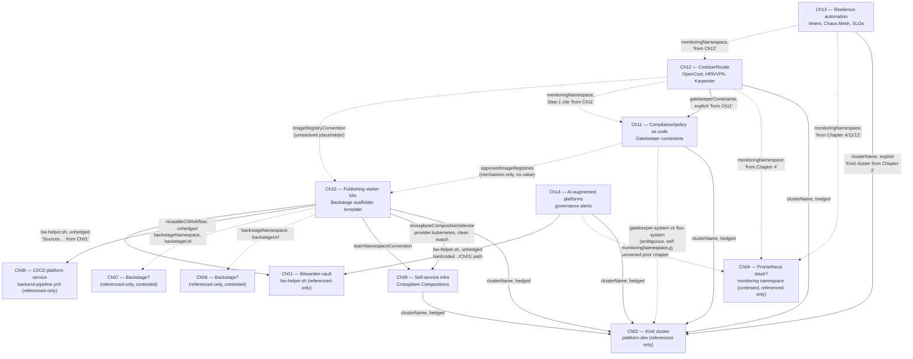

# The Platform Engineer's Handbook — Backward-Chain Composition Plan

> **Provenance record.** This document synthesizes a backward-chaining dependency analysis of
> *The Platform Engineer's Handbook* companion code (see
> [`platform-engineers-handbook-ggen-packs.md`](platform-engineers-handbook-ggen-packs.md) for
> the pack itself and its forward-direction review findings). The analysis was run
> chapter-by-chapter starting from Chapter 14 and working backward toward Chapter 1, asking at
> each step "what does this chapter's pack provide, and what does it demand of earlier
> chapters?" — the inverse of reading the book front-to-back.
>
> **Coverage caveat, stated up front rather than glossed over.** The chain data available to
> this synthesis is complete for Chapters 14, 13, 12, 11, and 10. The Chapter 9 step is
> **truncated in the source data** — its "Provides" section is present (and itself cuts off
> mid-list), but its "Mismatches found" and "Demands on earlier chapters" sections were never
> produced. Chapters 8 down to 1 have **no backward-chain step of their own** in this data set
> at all. Every claim below about Chapters 1, 2, 4, 6, 7, and 8 is therefore a *claim other
> chapters make about them* (a citation, a hedge, a hardcoded path) — not a verified fact
> checked against those chapters' own manifests. The graph marks this distinction explicitly:
> solid edges are citations from a chapter whose own step is in this data set; dotted edges are
> demands aimed at a chapter whose own producer-side step was never run in this chain.

## What this is

A cross-chapter ontology/composition plan for a proposed second-edition ggen-marketplace
build: which facts (cluster names, namespaces, release names, RBAC, registry conventions)
should be declared once at an owning chapter's layer and inherited by every later chapter that
needs them, instead of each chapter's README re-typing its own copy and hoping the string
matches. It also collects every mismatch the backward chain surfaced along the way, and
proposes a build order for constructing per-chapter (or merged) ggen packs that respects the
*real* dependency graph rather than assuming book order is automatically the build order.

## Fact-ownership layers and the dependency graph

Five fact bundles recur across the chapters this chain actually analyzed. For each, the chain
converges on a candidate owning layer — sometimes cleanly, sometimes only by majority citation
count with the citations themselves in conflict.

| Fact bundle | Candidate owning layer | Confidence |
|---|---|---|
| `clusterName` = `platform-dev` | Ch02 | Weak — named once, by Ch13, as "Kind cluster from Chapter 2"; every other chapter (09, 10, 11, 12, 14) just repeats the literal string as a hedged fallback, never citing a source chapter |
| `monitoringNamespace` = `monitoring` + Prometheus stack | Ch04 (contested) | Weak — cited by Ch12 ("from Chapter 4," README line 112) and Ch13 (lines 158, 193), but Ch12's own Step 1 verification separately cites "(from Chapter 11)" for the same install, and Ch11 does not actually install Prometheus itself |
| `prometheusReleaseName` = `monitoring` | Ch12 (de facto) | Ch12 is internally self-consistent and load-bearing (`install-opencost.sh` hardcodes the derived service name); Ch13 is internally *inconsistent* about this same value |
| Gatekeeper constraints (`require-resources`, `require-resource-limits`, …) | Ch11 | Strong — clean, self-consistent, explicitly designed (dryrun mode) not to break Ch12 |
| Crossplane Composition + `provider: kubernetes` label, `team-alpha`-style team namespace convention | Ch09 | Strong — clean, label-matched handoff to Ch10's claim manifests |
| Backstage instance (namespace, URL, guest auth) | Ch06 **or** Ch07 (contested) | Weak — Ch10's own README cites both, `load-secrets.sh` comment favors Ch06 |
| Reusable CI/CD workflow (`backend-pipeline.yml@v1`) | Ch08 | Cited once, unhedged, in Ch10's Related Chapters |
| Bitwarden vault + `bw-helper.sh` | Ch01 | Strong — the only fully unhedged, unambiguous citation in the entire chain; both Ch10 and Ch14 hardcode the literal path `../Ch01/scripts/bw-helper.sh` |
| Image registry convention (GHCR, org `platform-org`) | Ch10 (newly introduced, not inherited) | Ch10 defines this concretely but nothing downstream (Ch11's allowlist mechanism, Ch12's placeholder image) ever reconciles against it |

Solid arrows are citations from a chapter whose own step ran in this chain (Ch09–Ch14).
Dotted arrows are either self-acknowledged ambiguity, a demand aimed at a chapter with no
producer-side step in this data (Ch01, Ch02, Ch04, Ch06, Ch07, Ch08), or a downstream gap
that traces back to a chapter (Ch10) that never actually closed it.

### Nested-list form (facts flowing per edge)

- **Ch01** (Bitwarden vault, referenced-only)
  - → Ch10 (`backstageAuthMode` secrets, `templateRepo` token — unhedged)
  - → Ch14 (`llmApiKeySecretName` — unhedged, hardcoded relative path)
- **Ch02** (Kind cluster `platform-dev`, referenced-only)
  - → Ch09, Ch10, Ch11, Ch12, Ch14 (`clusterName` — all hedged as optional fallback, none assert it as a hard dependency on Ch02 by name)
  - → Ch13 (`clusterName` — the one explicit, named citation: "Kind cluster from Chapter 2")
  - ⇢ Ch11 (Gatekeeper install itself, if Ch02 provisions it via Flux/GitOps — self-acknowledged ambiguity, not confirmed)
- **Ch04** (Prometheus/monitoring, contested, referenced-only)
  - → Ch12, Ch13, Ch14 (`monitoringNamespace`, `prometheusOperatorRelease` — all hedged, and contradicted elsewhere by citations to Ch11 or Ch12 instead)
- **Ch06 / Ch07** (Backstage instance, contested, referenced-only)
  - → Ch10 (`backstageNamespace`, `backstageUrl`, `backstageAuthMode` — README cites Ch06 at one line, Ch07 at another, `load-secrets.sh` favors Ch06)
- **Ch08** (reusable CI/CD workflow, referenced-only)
  - → Ch10 (`reusableCiWorkflow` — unhedged)
- **Ch09** (Crossplane self-service infra)
  - → Ch10 (`crossplaneCompositionSelector = {provider: kubernetes}`, `teamNamespaceConvention = team-alpha` — clean, label-matched, confirmed on both sides)
- **Ch10** (Backstage starter-kit publishing)
  - → nothing in Ch11–Ch14 cites Ch10 as a producer; it is a pure consumer within the analyzed range
  - leaves `imageRegistryConvention` (GHCR, `platform-org`) undeclared as a shared fact, which is the root of Ch11's and Ch12's separate registry gaps
- **Ch11** (compliance/policy as code)
  - → Ch12 (`gatekeeperConstraints = {require-resources, require-resource-limits}` in `dryrun` — clean, deliberately designed not to block Ch12's Helm installs)
- **Ch12** (cost/performance/scale)
  - → Ch13 (cited as a possible monitoring-namespace source, hedged, unconfirmed)
- **Ch13** (resilience automation)
  - no downstream citations found within this chain (Ch14 does not cite Ch13)
- **Ch14** (AI-augmented platforms)
  - terminal in this chain; last chapter analyzed, cites nothing forward

## Mismatches the chain surfaced

Grouped by kind, each with the chapters it spans and, where possible, a cross-reference to the
already-known forward-direction findings named in the task framing (Ch01 primary-cloud/
primary-runtime, Ch03 Auth0/Keycloak, Ch05's 7 blocking issues, Ch08/Ch10/Ch12 blocking
issues, Ch09's 4 Crossplane bugs — full detail on the Ch01/Ch03/Ch09 findings lives in
[`platform-engineers-handbook-ggen-packs.md`](platform-engineers-handbook-ggen-packs.md)).
Chapters 1–8's own review findings are named in the task but were not independently
re-derivable from this backward chain except where a later chapter's demand happens to touch
them (Ch01's Bitwarden path, Ch09's RBAC gap) — so "no corroboration possible" below means
exactly that, not "refuted."

### 1. Cluster identity — collision by luck, not by contract

Six chapters (Ch09–Ch14) each independently run (or hedge on running)
`kind create cluster --name platform-dev`. None but Ch13 names Ch02 as the source. If these
chapters are exercised standalone in separate sessions, they produce identically-named
clusters by coincidence, not by a declared shared fact — the composition graph should own this
as one `ch:clusterName` fact at the Ch02 layer, not six independently-typed copies. No
overlap with the named Ch01/Ch03/Ch05/Ch08/Ch09 bug list; this is a **new finding**,
specific to the consumer-side (backward) lens.

### 2. Monitoring namespace / Prometheus release name — three-to-four-way ambiguity

- Ch12's own README cites **both** "from Chapter 4" (Prerequisites) and "(from Chapter 11)"
  (Step 1 verification) for the *same* install.
- Ch13's own README uses **two different Helm release names** for the same chart within
  itself: `kube-prometheus-stack` (Prerequisites, line 76) vs. `monitoring` (Step 1.1,
  line 199) — a self-contained drift bug, not a cross-chapter one.
- Ch12 is internally consistent (release name `monitoring`, matching what
  `install-opencost.sh` hardcodes as `monitoring-kube-prometheus-prometheus`).
- Net risk: if Ch12 and Ch13 are each run standalone against the same cluster, whichever runs
  first fixes the release name and the other may target the wrong Prometheus service.

**New finding**, not among the named prior bugs — corroborates the general *pattern* found in
the Ch09 review (mismatched identifiers for what should be one resource) without being the
same bug.

### 3. Two different cluster-identity strings for the same cluster

The Kind cluster is `platform-dev` everywhere, but Ch12's `install-opencost.sh` tags cost data
with `defaultClusterId="platform-cluster"` — a second, never-reconciled identifier for the
same physical cluster. Any cost report keyed by `platform-cluster` would not obviously
correlate back to `platform-dev`. **New finding**, same class of bug as #2 and as the known
Ch09 RBAC/naming issues, but a distinct instance — candidate addition to Ch12's blocking-issue
list.

### 4. Gatekeeper namespace fork, self-acknowledged in the book's own text

Ch11's own Troubleshooting section (line 739) admits Gatekeeper "may be in `flux-system`
instead of `gatekeeper-system`" if installed via Ch02/Flux GitOps instead of Ch11's own
Helm install. `ch11:gatekeeperNamespace` is therefore not a stable fact this chapter can
assert unconditionally — it is conditional on an earlier chapter's install path that is never
confirmed anywhere in this chain. **New finding** (not in the named prior-bug list); low
practical severity since constraints themselves are cluster-scoped CRDs and likely unaffected,
but a real provenance gap for the ontology.

### 5. `demo-app` name collision with two incompatible specs, within one chapter

Ch13's `backup-config-annotation.yaml` defines a `demo-app` Deployment (namespace `default`,
image `demo-app:1.0`, Redis sidecar, dedicated ServiceAccount). Ch13's own README Step 3.2
separately creates a *different* `demo-app` Deployment (namespace `chaos-testing`, image
`nginx:alpine`, no sidecar, no ServiceAccount) via imperative `kubectl create deployment`.
Same name, structurally incompatible resources. **New finding**, candidate addition to Ch13's
blocking-issue list; needs splitting into two distinct ontology identities
(`ch13:backupDemoApp` vs. `ch13:chaosDemoApp`).

### 6. Missing RBAC — a recurring pattern, one instance already known

- **Ch09** (known, corroborated): `crossplane-providers.yaml` installs `provider-kubernetes`
  but grants it no `ClusterRole`/`ClusterRoleBinding` anywhere in the directory — matches the
  already-documented Ch09 bug (see `platform-engineers-handbook-ggen-packs.md`'s "Scripts run
  for real" section, bug 3, now fixed and shipped in pack `v0.2.0`). The backward chain's
  `ch9:crossplaneKubernetesProviderRBAC` entry independently rediscovers exactly this gap:
  "only a manual `kubectl create clusterrolebinding` command in the README, not codified in
  any YAML manifest."
- **Ch13** (new instance): `backup-config-annotation.yaml` sets `serviceAccountName: demo-app`
  and creates the ServiceAccount, but no `Role`/`RoleBinding` anywhere in the directory grants
  it anything.
- **Ch12** (new instance): `install-opencost.sh` and `karpenter-provisioner.yaml` assume their
  controllers already hold cluster-level permissions (EC2/pricing APIs, node/pod read) but
  grant none in-directory.

Same *class* of bug recurring three times across the book — one already known and fixed at
Ch09, two new candidate findings at Ch12 and Ch13.

### 7. Registry convention — a fact defined once, never propagated forward or wired to enforcement

- Ch10 defines a concrete, real registry convention: GHCR via `secrets.GHCR_TOKEN`, org
  `platform-org` (in the generated `.github/workflows/ci.yml` and `catalog-info.yaml`).
- Ch11 ships the *mechanism* to restrict registries (`K8sRestrictImageRegistries` constraint
  template) but instantiates no default `allowedRegistries` value anywhere found.
- Ch12 has an unresolved placeholder image, `myregistry/checkout-api:v1`, never reconciled
  against either.

Ch10 precedes both Ch11 and Ch12 in book order, so a forward, chapter-by-chapter read of Ch11
and Ch12 (each checked only against its own README) would report "registry convention
undefined" at each — exactly what the task framing says was found (Ch11/Ch12 blocking
issues). What the **backward** chain adds that a forward per-chapter read would not
automatically surface: the convention *does* exist, defined at Ch10, and the real bug is a
**cross-chapter reconciliation failure** — Ch10's concrete value was simply never fed into
Ch11's enforcement mechanism or Ch12's image reference. This reframes "registry undefined" as
"registry defined but orphaned," a sharper and more actionable second-edition fix. Flagged
here as the clearest example in this chain of backward chaining catching something a forward,
per-chapter-isolated review would be structurally unlikely to connect.

### 8. Ch10's own internal namespace split

The scaffolder's `create-namespace` step creates a Kubernetes namespace named
`${{ values.serviceName }}`, but the same template's Crossplane infra-claim step places
`PostgreSQLClaim`/`MongoDBClaim` resources in `namespace: ${{ values.team }}` — two different
namespaces for the same generated service, never reconciled within the same template. **New
finding**, same drift-bug class as #2, #3, and #5, but chapter-internal rather than
cross-chapter — candidate addition to Ch10's blocking-issue list.

### 9. Ch10's Backstage provenance self-contradiction

Ch10's own README attributes the running Backstage instance to "Chapter 6" (line 91) and to
"Chapter 7" (line 128) two sections later; `load-secrets.sh`'s comment sides with Ch06. Three
citations, two different chapters, inside one file. **New finding**; must be resolved when
Ch06/Ch07 are eventually analyzed on their own.

### 10. `onboardingNamespaceApi` — an undocumented custom Backstage plugin

Ch10's scaffolder template invokes a custom Backstage backend action,
`POST /api/onboarding/v1/namespaces`, that creates a Kubernetes namespace on the scaffolder's
behalf. No chapter in this chain (or cited by it) documents where this plugin is installed or
what RBAC it runs with to create namespaces. **New finding** — structurally identical to the
known Ch09 RBAC-dangling-grant pattern, but for a plugin rather than a Crossplane provider,
and surfaced specifically because the backward chain asked "what does Ch10 actually need that
nothing upstream visibly provides," a question a forward read of Ch06/Ch07 alone would not
think to ask.

### 11. RTO/RPO defaults inconsistency within Ch13

README states 30-minute RTO / 60-minute RPO targets (Step 4.3), but `velero-dr-commands.sh`
defaults to 600 seconds (10 minutes) for the same parameter. Minor, chapter-internal. **New
finding**, low severity, candidate addition to Ch13's blocking-issue list.

### One deliberate non-mismatch worth naming

Ch11 is the single chapter in this chain that reaches *forward* with real foreknowledge: its
`require-compliance-labels.yaml` constraint already excludes namespaces `opencost` and
`monitoring` by name (Ch12's namespaces), and its `dryrun` enforcement mode is explicitly
commented as chosen so Ch12's Helm-installed OpenCost chart won't be blocked. This is the one
clean, intentional cross-chapter contract found in the entire chain — worth preserving as a
model for how the other, accidental collisions (fact #1, #2, #3) should be turned into
declared contracts instead.

## Proposed build order

Given the graph above, and the coverage caveat (Ch01–Ch08's own producer-side steps are not in
this data set), the order below is graded by confidence: chapters with a step in this chain
first, referenced-only chapters positioned by where their citations place them.

1. **Ch01** — Bitwarden vault (`bw-helper.sh`). Zero dependencies in this chain; the single
   most unambiguous producer found. Build first.
2. **Ch02** — Kind cluster `platform-dev`. Named as producer by six later chapters' identical
   literal string, confirmed explicitly once (Ch13). Build second; every later chapter in this
   chain implicitly assumes it exists even where the book's own hedged "skip if you already
   have one" language undersells that dependency.
3. **Ch04** (unconfirmed in this data) — Prometheus/`monitoring` namespace. Cited by Ch12,
   Ch13, and Ch14 as the source, contradicted by an internal Ch12 citation to Ch11 instead.
   Recommend resolving this ambiguity **before** building Ch04's pack — pick one owning
   chapter and make every later README cite it consistently, matching the fix already
   recommended for fact #2 above.
4. **Ch06 / Ch07** (unconfirmed in this data) — Backstage instance. Same treatment as Ch04:
   resolve the Ch10-internal Ch06-vs-Ch07 contradiction before Ch10 can cite a single owner.
5. **Ch08** — reusable CI/CD workflow. Cleanly cited, single dependency (implicitly Ch01 for
   any secrets it needs, not confirmed in this chain).
6. **Ch09** — Crossplane self-service infrastructure. Depends on Ch02 (cluster) only, per this
   chain's data; internally well-formed on the producer side (the `provider: kubernetes` /
   `team-alpha` facts Ch10 needs are both clean). Carries its own four known bugs
   (`platform-engineers-handbook-ggen-packs.md`), three of which already ship fixed in the
   pack (`v0.3.0`); the fourth (missing connection-details function) remains open and doesn't
   block Ch10's dependency on it.
7. **Ch11** — compliance/policy as code. Depends on Ch02 (cluster, hedged) and possibly Ch02's
   own Flux/GitOps install path for Gatekeeper itself (fact #4, unresolved). Internally the
   cleanest producer for Ch12.
8. **Ch10** — publishing starter kits. Depends on Ch01, Ch02, Ch06/Ch07 (once resolved), Ch08,
   and Ch09. Zero downstream dependents were found within Ch11–Ch14, so — despite sitting at
   position 10 in book order, between two chapters (Ch09, Ch11) that both matter to later
   chapters — it is a **leaf** in this chain's dependency graph and does not block Ch11 or
   Ch12's builds. Recommend building it here rather than strictly in book-position order, and
   using this build step to close fact #7 (wire Ch10's GHCR convention into Ch11's constraint
   and Ch12's image reference) rather than deferring that reconciliation.
9. **Ch12** — cost, performance, scaling. Depends on Ch02, Ch04 (once resolved), Ch11
   (confirmed clean), and should adopt Ch10's registry convention (step 8) instead of shipping
   a placeholder image.
10. **Ch13** — resilience automation. Depends on Ch02, Ch04 (once resolved), and possibly
    Ch12 (self-cited, unconfirmed). Needs the `demo-app` dual-identity split (fact #5) and the
    undefined `fast-ssd` StorageClass resolved — the latter traces to no chapter in this
    chain at all and may need a new, explicit declaration at the Ch02 layer.
11. **Ch14** — AI-augmented platforms. Depends on Ch01 (confirmed) and, hedged, on Ch04's
    monitoring namespace for its one `PrometheusRule`. Everything else in Ch14 (Steps 1–5,
    7–9) is self-contained local Python with no cluster dependency at all — the lightest
    chapter to build, and correctly last regardless of the fact-ownership questions above.

## Where the real graph diverges from book order

Mostly it doesn't — the local Ch09 → Ch10 → Ch11 → Ch12 chain the analysis actually covered
matches book order well: Ch09 is a genuine, clean prerequisite for Ch10; Ch11 is a genuine,
clean prerequisite for Ch12. Two divergences are worth calling out:

- **Ch02 and Ch04 are more load-bearing than the book's own prose admits.** Every one of
  Ch09–Ch14 either hedges cluster creation as "skip if you already have one" or hedges the
  monitoring namespace as "if not already installed" — none but Ch13 (for the cluster) names
  its actual source chapter. The book's pedagogy presents these as early, almost throwaway
  setup steps; the real composition graph treats them as hard, silently-assumed foundations
  for six and three downstream chapters respectively. A second edition's composition plan
  should promote both to an explicit, non-hedged "shared fact" layer rather than leaving them
  as fallback commands repeated (and, per fact #2, sometimes garbled) in every later chapter.
- **Ch10 is a leaf, not a link, within the analyzed range.** It sits between Ch09 and Ch11 in
  book order and depends on both Ch09 and (indirectly, via the registry-convention gap) on
  what Ch11 later needs — but nothing in Ch11–Ch14 actually cites Ch10 as a producer. It can
  be built independently of the Ch11 → Ch12 chain, and reordering its build slot (step 8
  above) to happen alongside Ch09 rather than strictly after Ch09 and before Ch11 costs
  nothing and creates the opportunity to close fact #7 before Ch11/Ch12 are built instead of
  after.

## See also

- [`platform-engineers-handbook-ggen-packs.md`](platform-engineers-handbook-ggen-packs.md) —
  the pack itself, the forward-direction review findings this chain cross-references (Ch01
  primary-cloud/primary-runtime, Ch03 Auth0/Keycloak, Ch09's four Crossplane bugs and their
  fix history), and the marketplace qualification record.
- [`platform-engineers-handbook-colima-runtime.md`](platform-engineers-handbook-colima-runtime.md)
  — running the book's cluster-dependent chapters on Colima instead of Docker Desktop.
