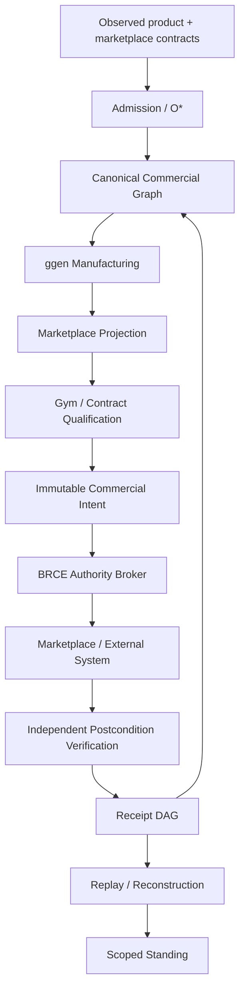

# Appendix L — Reference Architecture

## Planes

### Semantic plane

Owns canonical product identity, plans, offers, agreements, entitlements, meters, deployment classes, support, security claims, and ontology.

### Projection plane

Owns vendor mapping rules, generated listing metadata, adapters, deployment packages, schemas, and vendor extensions.

### Runtime plane

Owns fulfillment, customer tenancy, usage observation, operational reliability, and support.

### Commercial plane

Owns offers, agreement state, entitlement transitions, meter submissions, settlement import, reconciliation, and channel attribution.

### Authority plane

Owns SELECT/CONSTRUCT/DO classification, exact grants, idempotency, and BRCE.

### Evidence plane

Owns receipts, content identity, provenance, replay, standing, and drift.

### Qualification plane

Owns structural checks, contract tests, gyms, differential testing, sandbox execution, live qualification, and falsifiers.

No plane receives ambient authority merely because it can observe another plane.
