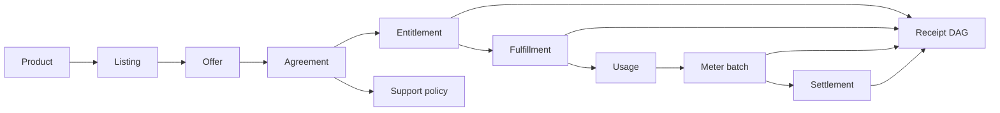

# 1. The Platform Is Built. Now Sell It.

> **Standing target:** define the boundary between a deployable platform and a commercially operable product. No marketplace or revenue standing is implied by this chapter.

## The boundary platform engineering does not close

Platform engineering closes an internal loop: source becomes a secure, observable, self-service runtime. Marketplace engineering closes a different loop: an external organization can discover a product, procure it through an approved channel, obtain rights, receive fulfillment, consume measurable value, be billed, receive support, renew, and terminate while every consequential transition remains explainable.

A container image is not a sale. A listing is not an entitlement. A payment is not fulfillment. A successful deployment is not settlement. The commercial platform therefore adds a second state space around the runtime.

```text
CommercialPlatform =
  Platform
  × ProductIdentity
  × Offer
  × Agreement
  × Entitlement
  × Fulfillment
  × Usage
  × Settlement
  × Support
  × Evidence
```

The product is commercially incomplete if any required factor is represented only by human memory, a vendor console field with no canonical mapping, or a side-effecting handler that cannot produce a receipt.

## Code-to-cash as a typed graph

The lifecycle begins with a canonical product identity. A marketplace listing projects that identity into a vendor catalog. An offer proposes a plan and terms. Acceptance creates or identifies an agreement. The agreement yields entitlement. Fulfillment turns admitted rights into an available service. Usage is observed independently from billing. A meter batch projects admitted usage into the marketplace's billing rail. Settlement is reconciled against both the agreement and measured usage.



These objects must not be collapsed merely because one marketplace exposes a single subscription object covering several of them.

## The marketplace is part of the runtime of commerce

Marketplace callbacks, procurement APIs, seller portals, partner reviews, pricing models, banking records, and settlement statements are external systems with independent clocks and failure modes. They are not configuration around the product; they participate in the commercial protocol.

The implementation pattern is therefore:

1. **Observe** the exact marketplace event or contract surface.
2. **Admit** its issuer, subject, freshness, mapping, and constraints into `O*`.
3. **CONSTRUCT** a canonical intent without external consequence.
4. **DO** only through BRCE under exact authority.
5. **Verify** the customer-visible or marketplace-visible postcondition independently.
6. **Receipt** identity, authority, consequence, and evidence.
7. **Replay** by reconstruction, not by repeating the commercial side effect.
8. **State standing** only for the capability actually exercised.

## Refusals that protect the product

- `REFUSED:LISTING_AS_PRODUCT` — a vendor listing is used as canonical product identity.
- `REFUSED:PAYMENT_AS_ENTITLEMENT` — a charge or checkout result directly grants runtime rights.
- `REFUSED:FULFILLMENT_WITHOUT_ENTITLEMENT` — deployment begins without admitted rights.
- `REFUSED:UNRECEIPTED_COMMERCIAL_DO` — an offer, refund, charge, entitlement, or external resource can change without a receipt.
- `REFUSED:GLOBAL_ALIVE_FROM_ONE_MARKET` — one successful projection is promoted to universal commercial standing.

## Falsifier

The model fails if a customer-visible commercial consequence cannot be traced from an admitted canonical subject through explicit authority to an independently verified receipt.

## Operational exercise

Take one platform that already deploys successfully. Trace a Fortune 5 buyer from discovery through termination. For each edge, record the owning object, authority, external system, verifier, receipt, failure class, and current standing. Anything represented only as prose is `UNKNOWN` until admitted.
