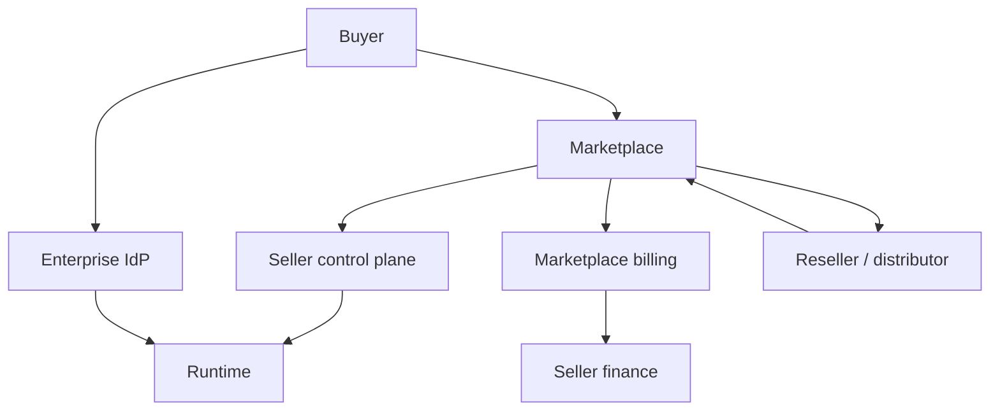

# 4. The Marketplace Is a Distributed System

## Commerce has replicas, clocks, and partitions

A technology marketplace is not a storefront wrapped around an API. It is a distributed system composed of the seller, buyer, marketplace operator, cloud account, billing account, identity provider, runtime, finance systems, support systems, and sometimes distributors or resellers.

Each node holds a different projection of commercial state. They update asynchronously. Messages can be delayed, duplicated, rejected, or observed in a different order. Marketplace engineering is therefore distributed-systems engineering with financial and contractual consequences.



## There is no single universal clock

A purchase can be effective before a callback arrives. A cancellation can be observed by the seller before the runtime finishes deprovisioning. Usage can be measured today and settled weeks later. A private offer can expire while a cached sales system still displays it.

Every asynchronous commercial event should therefore retain at least:

```text
source_event_id
observed_at
effective_at
source_version_or_sequence_if_available
idempotency_key
canonical_subject
```

Arrival order is not business order unless the external contract guarantees that equivalence.

## Truth is object-specific

The marketplace may be authoritative for an accepted agreement. The seller's metering system may be authoritative for raw measured usage. The runtime is authoritative for whether fulfillment postconditions are observable. The marketplace settlement report is authoritative for what that marketplace settled, but not for why an internal usage record exists.

The architecture joins those facts rather than appointing one database as metaphysical truth.

## Event handling without ambient authority

An authenticated callback proves an observation from an admitted channel. It does not itself authorize arbitrary side effects.

```text
callback
  → parse
  → resolve issuer/subject
  → admit O*
  → construct canonical event
  → calculate intended transition
  → authority check
  → DO
  → verify
  → receipt
```

This separation matters most during retries. If an HTTP timeout occurs after the marketplace accepted a meter submission, blindly retrying can duplicate a financial consequence. The system must first observe the external postcondition or use a vendor-supported idempotency mechanism.

## Partition behavior

When a vendor API is unavailable, the product should know which capabilities can continue safely. Runtime access may remain valid under cached admitted entitlement for a bounded period, while new purchases or plan changes are BLOCKED. Meter events can queue if the vendor permits late reporting. Refunds should normally stop rather than guess.

One failed edge is topology, not graph failure.

## Refusals

- `REFUSED:ARRIVAL_ORDER_AS_EFFECTIVE_ORDER`
- `REFUSED:CALLBACK_AS_AMBIENT_AUTHORITY`
- `REFUSED:BLIND_FINANCIAL_RETRY`
- `REFUSED:EMAIL_AS_MACHINE_ENTITLEMENT`
- `REFUSED:SETTLEMENT_AS_USAGE_SOURCE`

## Operational exercise

Draw the distributed graph for one marketplace purchase. Inject a duplicate purchase callback, a delayed cancellation, an unavailable metering API, and an ambiguous timeout after a submission. For each case, specify which node owns the fact, whether DO is permitted, how idempotency is established, and what standing can be claimed after recovery.
