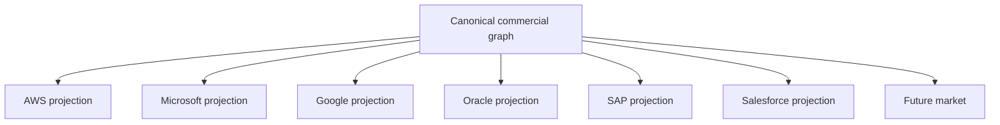

# 5. The Commercial Product Graph

## The graph is the product's commercial source of meaning

If every marketplace console owns its own product name, plan, price, entitlement mapping, deployment instructions, and support terms, the organization does not have a multi-market product. It has a collection of manually synchronized forks.

The commercial product graph removes that ambiguity. It is the canonical semantic object from which listings, plans, adapters, deployment packages, tests, and evidence views are projected.

```text
G_c = (V, E, C, P)

V = commercial objects
E = typed relationships
C = constraints
P = provenance
```

Typical vertices include `CommercialProduct`, `ProductVersion`, `Capability`, `Plan`, `Offer`, `Agreement`, `Entitlement`, `UsageDimension`, `DeploymentClass`, `SupportPolicy`, `SecurityClaim`, `MarketplaceProjection`, and `Receipt`.

## Identity is explicit

A graph makes identity questions impossible to hide behind nested JSON. The canonical product is not the AWS product code. The canonical plan is not the Azure plan ID. An enterprise is not a Google billing account. An entitlement is not a Salesforce package install.

Vendor identifiers are nodes or attributes connected by provenance-bearing mapping edges.

```text
CanonicalPlan --projectedAs--> AwsProductDimension
CanonicalPlan --projectedAs--> MicrosoftPlan
CanonicalPlan --projectedAs--> AlibabaSku
```

The mappings can have different semantics. Each edge therefore records a mapping classification such as `EQUIVALENT`, `NARROWER`, `BROADER`, `LOSSY`, or `EXTENSION`.

## Commercial relationships are typed

A product **has** a plan. An offer **proposes** a plan. An agreement **accepts** an offer. An entitlement **derives from** an agreement. A meter batch **aggregates** usage events. A settlement record **reconciles** marketplace charges.

Those predicates matter. Replacing them with an untyped foreign-key web makes it easy to grant entitlement from an offer that was never accepted or to bill usage against a plan that was not effective during the measurement window.

## The graph drives projections



A projection may contain vendor extensions. Those extensions remain attached to the marketplace namespace rather than contaminating canonical product identity. A future market can therefore be added without rewriting every existing product object.

## Constraints make the graph executable

At minimum:

- every entitlement references an admitted agreement;
- every agreement identifies effective product/plan semantics;
- every meter names unit, window, source, and correction policy;
- every projection identifies the canonical product version it represents;
- every ALIVE standing claim names exact execution and verification evidence;
- every consequential transition names authority and a receipt.

SHACL, type systems, theorem provers, property tests, or other formal methods can enforce different subsets. The critical property is refusal on invalid graph state rather than silent normalization.

## Falsifier

The graph approach fails if a marketplace-facing commercial fact can change customer rights without either changing the canonical graph or producing an explicit buyer-scoped agreement delta and receipt.

## Operational exercise

Model one product with two plans, two deployment classes, one private offer, one agreement, one usage meter, and three marketplace projections. Prove that every marketplace ID resolves to a canonical subject and that no entitlement can exist without an agreement edge.
