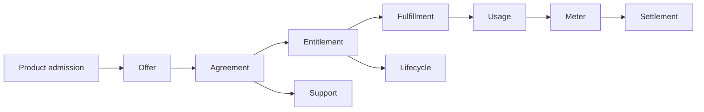

# 71. Execute the First Enterprise Sale

## The sale is the integration test for commercial reality

A listing review, adapter test, or successful deployment proves only one slice. The first end-to-end enterprise transaction demonstrates whether product identity, procurement, agreement, entitlement, fulfillment, metering, support, and financial evidence actually compose.

For a real-money or production sale, every DO in this chapter requires the seller's and buyer's proper authority. In development, execute the same trace in the most faithful approved test environment available and keep its standing scoped to that subject.

## Step 1 — select the route

Resolve the canonical product/version and buyer organization. Select an admitted market/direct/channel route based on buyer procurement requirements, product support, contract expressiveness, seller standing, and economics.

Do not let the route rename the product.

## Step 2 — construct the offer

For a standard purchase, select the canonical plan. For a Fortune 5 negotiated deal, construct:

```text
PrivateOffer = CanonicalPlan + BuyerScopedAdmittedDelta
```

Bind price, quantity, term, support, legal-artifact digests, buyer marketplace identity, seller identity, and channel roles.

Publishing the offer is DO and receives a receipt.

## Step 3 — observe acceptance

Buyer acceptance or marketplace agreement creation is an external fact. Observe it through the vendor's admitted contract, map it to the canonical organization and plan, and create/version the canonical Agreement.

No seller-side sales forecast or CRM stage substitutes for this observation.

## Step 4 — activate entitlement

Normalize the marketplace lifecycle event into the shared entitlement transition. Verify effective rights, quantities, plan version, and billing route.

The entitlement receipt binds the vendor agreement/subscription/license identity to the canonical Agreement.

## Step 5 — fulfill the product

Fulfill the selected deployment class under separate operational authority. Verify the customer-visible postcondition: tenant ready, package installed, Kubernetes environment healthy, private endpoint reachable, or data/model access granted as appropriate.

An active entitlement with failed fulfillment is a support incident, not a successful sale completion.

## Step 6 — observe first value and usage

Record the first meaningful customer operation and any billable usage with exact meter semantics. Freeze a meter batch only after the agreed measurement window/rule admits it.

## Step 7 — submit and reconcile commerce

Submit usage or invoice events through the selected billing route. Verify marketplace acceptance. Later, join settlement/invoice records back to the exact agreement and meter batch.

The transaction is financially PARTIAL until unexplained residuals are resolved; a successful meter API call alone is not settlement.

## Step 8 — exercise support and lifecycle

Verify customer support routing, entitlement explanation, upgrade/plan-change behavior, renewal, cancellation, export, and termination policy before the first contract reaches those events in production.

The best time to discover that cancellation destroys data too early is in qualification, not at churn.

## Sale receipt DAG



Every node is independently receipted and replayable.

## Refusals

- `REFUSED:CHECKOUT_AS_COMPLETE_ENTERPRISE_SALE`
- `REFUSED:CRM_WON_AS_AGREEMENT`
- `REFUSED:ENTITLEMENT_AS_FULFILLMENT_SUCCESS`
- `REFUSED:METER_ACCEPTED_AS_SETTLEMENT_COMPLETE`
- `REFUSED:REAL_MONEY_WITHOUT_EXACT_AUTHORITY`
- `REFUSED:CUSTOMER_TEST_AS_GLOBAL_MARKET_ALIVE`

## Operational exercise

Execute the full trace for one approved test buyer or real buyer under explicit authority: route, offer, acceptance, agreement, entitlement, fulfillment, first usage, meter, reconciliation, support, and lifecycle. Produce the complete receipt DAG and a standing table showing which capabilities became ALIVE and which remain PARTIAL, BLOCKED, or UNKNOWN.
