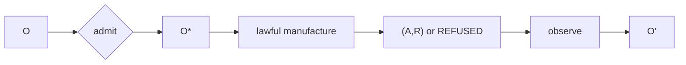

# Canonical Index and Reading Order

**Chatman Ecosystem v26.9.1 — Frozen Constitutional Corpus**

Architecture: `FROZEN`  
Mathematics: `FROZEN`  
Release: `PARTIAL_ALIVE`

## Purpose

This directory is the constitutional source of truth for v26.9.1. It is deliberately organized around mathematical objects and evidence obligations rather than repository topology. Implementations may change, split, merge, or disappear; the calculus remains the governing invariant.

The compressed recursion is:

\[
O_t\xrightarrow{\alpha_t}O_t^*\xrightarrow{\widehat\mu_t}(A_t\times R_t)\sqcup REFUSED\xrightarrow{\chi_t}O_{t+1}.
\]

The cumulative class path is:

\[
[x]_\Gamma\xrightarrow{ClassClose}S_{[x]}\rightarrow\mathcal S.
\]

The asymptotic objective is:

\[
(\lambda_r,\lambda_m,H_{avoidable})\rightarrow(0,0,0),
\]

while novel arrivals and novel unresolved information remain open to reality.

## Reading order

Documents 01–13 establish the constitutional thesis, primitive types, epistemic admission, context fibers, candidate manufacture, evidence, operational admission, BRCE, receipt typing, recursive observation, and mandatory factorization. Documents 14–19 formalize semantic state and semantic manufacturing. Documents 20–37 define the four closure obligations and their crown protocols. Documents 38–43 develop Little's Law, information theory, constitutional compression, DfCM, and the Work Necessity Test. Documents 44–49 define repository governance, component roles, substrate invariance, falsification, swarm execution, and maximum compression.

The corpus should be read under three non-collapse laws:

\[
候不自准\qquad 行不越憲\qquad 解不復疑.
\]

Candidate does not self-admit. Consequence does not bypass the constitution. A class-closed solution does not return as discovery absent falsification or contextual loss of applicability.

## Standing discipline

The standing space is a tagged sum:

\[
\mathbb S=\{UNKNOWN,PARTIAL\_ALIVE,ALIVE,BLOCKED,BUILD\_BROKEN,UNSUPPORTED,REFUSED\}.
\]

These labels are not a maturity score. `UNKNOWN` means evidence is absent or unadmitted. `UNSUPPORTED` means the required mechanism is absent. `REFUSED` means the mechanism exists and lawfully rejected a transition. `BLOCKED` identifies an external prerequisite. `BUILD_BROKEN` records attempted execution failure. `PARTIAL_ALIVE` records incomplete receipt closure. `ALIVE` requires exact observed execution for the subject whose claim requires execution.

## Release discipline

Specification completeness cannot substitute for execution. A diagram does not prove a transition ran. A proof is not authority. A generated artifact is not an actuation receipt. A reusable pack is not class closure until a distinct lawful instance executes without rediscovery.

The only release-raising path after freeze is:

\[
instantiate\rightarrow execute\rightarrow receipt\rightarrow replay\rightarrow classClose.
\]

Every chapter therefore ends at the same question: **where is the exact receipt?**

