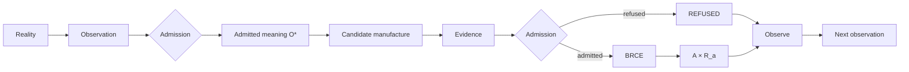

# Constitutional Thesis

## Abstract

The Chatman Ecosystem v26.9.1 is a typed constitutional calculus governing how information receives standing, how admitted meaning is transformed into candidate intent, how consequential intent receives authority, how successful actuation is inseparably receipted, and how solved recurrent structure accumulates so that rediscovery tends to zero.

The invariant shorthand is:

\[
O\xrightarrow{admit}O^*\xrightarrow{\mu}(A,R)\xrightarrow{observe}O'.
\]

This statement is implementation-independent. It does not identify any repository, programming language, graph store, theorem prover, workflow engine, or AI model as foundational.

## Central thesis

Most operational architectures accidentally collapse distinct kinds of standing. They treat an observation as truth because it was ingested, a construction as executable because it was generated, a proof as permission because it is valid, an action as complete because the target state appears changed, or a solved instance as reusable knowledge because someone wrote documentation about it.

The constitution refuses those collapses:

\[
O\neq O^*,\quad A_c\neq A_c^*,\quad A_c\neq A,\quad E\neq Admission,\quad R_d\neq R_a.
\]

It also freezes the process separations:

\[
SELECT\neq CONSTRUCT\neq DO,
\]

and:

\[
Proof\neq Authority.
\]

The result is not merely a pipeline. It is a restriction on lawful morphisms. Consequence may exist, but every consequential path must factor through admitted meaning, candidate construction, evidence, consequential admission, BRCE, and receipt as required by the subject.

## Constitutional manufacture

The familiar equation:

\[
A=\mu(O^*)
\]

is retained as a quotient notation. The expanded system recognizes that candidate construction has zero consequential standing. Context supplies authority, policy, boundary, acceptance, and temporal constraints. Admission may refuse the candidate. Only the admitted branch can cross the exclusive consequential boundary.

The full successful result is therefore not merely \(A\), but:

\[
(A,R_a).
\]

The constitution has no successful unreceipted actuation type.

## Recursive non-self-certification

A system may observe its own consequence, but it may not promote that consequence directly into admitted truth. Both successful consequence and lawful refusal return through observation:

\[
(A_t,R_t)\not\Rightarrow O_{t+1}^*,
\]

\[
REFUSED_t\not\Rightarrow O_{t+1}^*.
\]

This prevents endogenous truth manufacture. The system can cause, record, and inspect; it must still admit the next semantic state.

## Accumulation

The constitutional recursion alone closes instances. Civilization-scale accumulation requires a second path:

\[
x\mapsto[x]_\Gamma\mapsto S_{[x]}.
\]

Class closure is not established by replaying \(x\). It requires a distinct lawful instance \(x'\neq x\), \(x'\in[x]_\Gamma\), such that the instance closes and rediscovery information is zero.

This changes the future work-arrival process rather than merely draining today's queue.

## Economic statement

Let:

\[
\lambda=\lambda_n+\lambda_r+\lambda_m.
\]

Novel arrivals follow genuinely changed reality. Rediscovery arrivals represent already-solved structure returning as cognitive work. Manufactured arrivals are created by defective constitutional design: reconciliation, waiting, duplicated semantics, retrospective evidence reconstruction, unnecessary approval routing, and rework.

The target is:

\[
\lambda_r\rightarrow0,\qquad\lambda_m\rightarrow0,
\]

not suppression of \(\lambda_n\). The ideal is that unresolved work increasingly corresponds only to unabsorbed reality.

## Status

The thesis is specification-frozen. Release standing remains `PARTIAL_ALIVE` because mathematical coherence is not an execution receipt.

