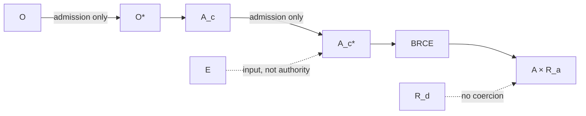

# Primitive Types and Non-Collapse Laws

## Thesis

The constitution is defined as much by distinctions as by operations. A large class of system failures can be described as illegal coercions between types that should remain separate.

The principal sorts are observation \(O\), admitted observation \(O^*\), candidate consequence \(A_c\), admitted candidate \(A_c^*\), evidence \(E\), realized consequence \(A\), derivation receipt \(R_d\), and actuation receipt \(R_a\).

## Non-collapse laws

\[
O\neq O^*
\]

Raw or candidate observation can contain useful information without possessing semantic standing.

\[
G_O\neq G^*
\]

A candidate graph is not a canonical admitted graph merely because both use the same serialization or store.

\[
A_c\neq A_c^*
\]

A constructed intent does not have permission to execute.

\[
A_c\neq A
\]

Constructibility is not consequence.

\[
E\neq Admission
\]

Evidence is input to a standing decision, not the decision itself.

\[
Proof\neq Authority
\]

Formal validity cannot grant operational permission by itself.

\[
R_d\neq R_a
\]

Provenance for a representation cannot prove that the represented consequence occurred.

\[
TextMutation\not\Rightarrow SemanticStanding
\]

An edited projection can produce a candidate semantic delta, not a canonical change.

\[
HistoricalStanding\neq CurrentApplicability\neq Authority.
\]

A class may remain historically valid while being expired, revoked, superseded, unsupported, out of boundary, or unauthorized in the current context.

## Why types matter

If these distinctions exist only as process documentation, implementations will eventually bypass them under optimization pressure. Type separation makes the illegal shortcut visible. The strongest case is BRCE: successful consequence inhabits \(A\times R_a\). There is no constitutional value representing successful \(A\) without its receipt.

Likewise, the reverse semantic path must explicitly produce candidate meaning and cross admission. A text editor cannot mutate \(O^*\) merely because the edit came from a trusted person or model.

## Process separation

The same logic applies to operations:

\[
SELECT\neq CONSTRUCT\neq DO.
\]

Selection identifies a candidate from a possibility space. Construction creates a candidate artifact or intent. DO changes the consequential world. Internal implementation may co-locate these functions, but co-location does not erase their constitutional types.

## Conformance test

For each component or process, ask which conversion it performs and which conversions it must not perform. A component claiming manufacture must not self-admit its candidates. A proof producer must not confer authority. A projection mechanism must not treat its output as canonical semantic state. An actuator must not expose a success path lacking an actuation receipt.

A violation of these laws is architectural, not merely a bug in a local module.

