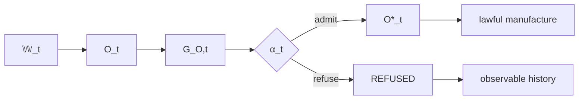

# Epistemic Admission: Observation Does Not Grant Standing

## Formal boundary

Let external state be \(\mathbb W_t\). Observation produces information:

\[
\omega_t:\mathbb W_t\rightarrow O_t.
\]

A reconstitution or representation step may produce candidate semantic structure:

\[
g:O_t\rightarrow G_{O,t}.
\]

Epistemic admission is a separate partial morphism:

\[
\alpha_t:G_{O,t}\times\Gamma_t^E\rightharpoonup O_t^*\sqcup REFUSED.
\]

On the admitted branch:

\[
O_t^*=\alpha_t(g(\omega_t(\mathbb W_t))).
\]

## Standing versus information

Observation can be complete, precise, authenticated, and still not be admitted. The constitution therefore distinguishes information transport from standing transport:

\[
\omega\neq\alpha.
\]

This prevents ingestion from becoming ambient epistemic authority. Legacy artifacts, external APIs, historical events, user edits, generated representations, and prior receipts may all contribute observations. None automatically becomes canonical meaning.

The distinction is especially important in recursive systems. A system can generate a representation, observe that representation, and then be tempted to infer that the represented state is true because the representation originated internally. That path is forbidden. Generation is not truth. The observation returns as a candidate and crosses the same admission boundary as any external observation.

## Refusal

`REFUSED` is not a generic error. It is the lawful result of applying the admission relation to a candidate that fails the relevant fence, ontology, evidence requirement, boundary, temporal condition, or other epistemic invariant. A refused candidate can still become observed history. Its refusal does not make it canonical truth, but the fact of refusal may inform subsequent observations.

## Crown experiment

The epistemic crown should not merely show an admissible observation becoming \(O^*\). It should deliberately exercise candidates designed to expose accidental self-promotion: stale assertions, contradictory assertions, malformed state, previously valid but expired context, and imported representations that look canonical.

The crown succeeds when the system demonstrates that no direct route exists from candidate state to canonical standing and produces exact evidence for both admitted and refused branches.

## Relation to future cycles

Neither successful consequence nor refusal bypasses epistemic admission in the next cycle:

\[
(A_t,R_t)\not\Rightarrow O_{t+1}^*,
\]

\[
REFUSED_t\not\Rightarrow O_{t+1}^*.
\]

The recursive architecture is therefore anti-self-certifying. The system can cause a state and can observe that state, but must admit the semantic interpretation anew.

