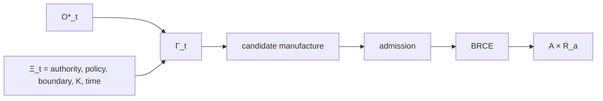

# Context Fibers: Gamma, Xi, and Constitutional Parameterization

## Problem

The equation \(A=\mu(O^*)\) is intentionally compressed. Formalization fails if that compression is mistaken for a claim that admitted meaning alone determines lawful consequence. Authority, policy, boundary, acceptance, and temporal context also matter.

To preserve the original equation without duplicating \(O^*\), define the non-epistemic contextual fiber:

\[
\Xi_t=(\Theta_t,\Pi_t,B_t,K_t,\tau_t).
\]

Here \(\Theta_t\) denotes authority, \(\Pi_t\) policy, \(B_t\) the bounded domain, \(K_t\) acceptance or consequence invariants, and \(	au_t\) temporal context.

Then:

\[
\Gamma_t=O_t^*\times\Xi_t.
\]

## Two equivalent notations

A complete-context manufacture relation can be written:

\[
\mu:\Gamma_t\rightharpoonup A\times R_a.
\]

The context-curried form preserves the semantic prominence of admitted meaning:

\[
\mu_{\Xi_t}:O_t^*\rightharpoonup A\times R_a.
\]

Thus the human shorthand remains:

\[
A=\mu(O^*),
\]

while the formal object retains the constitutional context.

## Why context is not another observation

Authority and policy are not being promoted to the same ontological role as \(O^*\). They parameterize what can lawfully be manufactured from admitted meaning in a specific situation. The same \(O^*\) can yield different admissible consequential sets under different authority, boundaries, acceptance conditions, or times without requiring the semantic facts themselves to become false.

This supports the important separation:

\[
Knowledge\neq Applicability\neq Authority.
\]

A historically standing solution can remain true while current context makes it inapplicable. A currently applicable solution can remain unauthorized for a principal. Revocation and expiration therefore do not imply falsification.

## Temporal consistency

Receipts should bind the relevant context at execution time. Replay need not recreate the current context as if time had not passed; it must be able to verify which context made the original transition lawful. This prevents current policy from silently rewriting the standing of historical execution.

## Class reuse

The same context discipline applies to accumulated class knowledge. A class-closed solution is not ambient authority. A reusable structure re-enters a new instance through contextual applicability and admission. Class closure eliminates rediscovery, not local admission.

