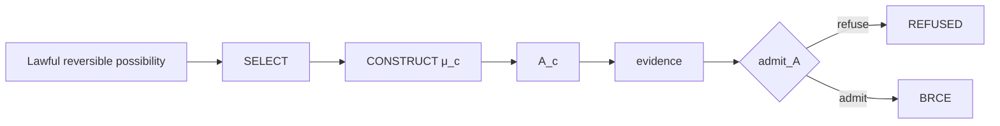

# Candidate Manufacture

## Constitutional role

Candidate manufacture creates a possible artifact or intent without creating consequential standing:

\[
\mu_c:\Gamma_t\rightarrow A_c.
\]

This is the formal home of construction. It includes search, synthesis, deterministic projection, planning, workflow construction, operational proposal, and other mechanisms that can produce an \(A_c\) from admitted state and context.

## Candidate is not consequence

The defining law is:

\[
A_c\neq A.
\]

A candidate can be complete, executable, verified, formally proved, and still lack permission to alter the consequential world. This separation prevents construction systems from acquiring ambient authority merely because they can produce high-quality outputs.

The process hierarchy is therefore strict:

\[
SELECT\neq CONSTRUCT\neq DO.
\]

SELECT chooses from a possibility space. CONSTRUCT manufactures candidate form. DO realizes consequence. A single implementation may perform more than one operation internally, but its constitutional interfaces must preserve the boundaries.

## Relationship to DfCM

Candidate manufacture should follow preservation of maximal lawful reversible possibility rather than premature irreversible selection. DfCM therefore searches for a maximal reversible subset under lawful and constructible constraints before SELECT produces a candidate.

This is not a claim that every possibility should remain forever. It is a claim that irreversible information destruction should be delayed until the relevant constraints require commitment.

## Evidence production

Candidate manufacture does not prove its own candidate. Evidence is produced by a separate relation:

\[
\nu:\Gamma_t\times A_c\rightarrow E.
\]

This allows independent evidence strategies and prevents a manufacturer from automatically granting itself epistemic or operational standing.

## Failure states

An implementation can fail candidate manufacture without implying `REFUSED`. If the mechanism does not exist, the standing may be `UNSUPPORTED`. If an attempted construction fails, it may be `BUILD_BROKEN`. `REFUSED` is reserved for lawful rejection by an admission boundary. Preserving these distinctions matters because the next repair action differs for each state.

## Crown significance

Candidate manufacture itself does not close the operational crown. The crown requires evidence, admission, and then either lawful refusal before DO or a successful BRCE output \((A,R_a)\). A candidate sitting in a repository proves construction only.

