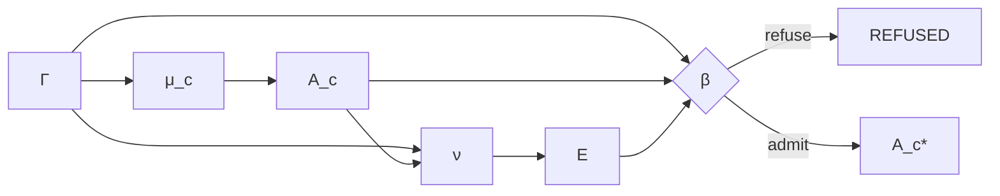

# Evidence, Proof, and Admission

## Formal role

Evidence production is typed separately from candidate manufacture and admission:

\[
\nu:\Gamma_t\times A_c\rightarrow E.
\]

Operational admission consumes context, candidate, and evidence:

\[
\beta:\Gamma_t\times A_c\times E\rightarrow A_c^*\sqcup REFUSED.
\]

The constitution freezes:

\[
E\neq Admission
\]

and:

\[
Proof\neq Authority.
\]

## Why proof cannot be authority

A proof establishes a proposition under a formal system. Authority answers a different question: whether a specific principal, under current policy and boundary, may cause a specific consequential transition. A perfectly valid proof may describe an action that remains prohibited. Conversely, an authorized action may rely on evidence forms other than formal proof.

Collapsing these concepts is dangerous because it lets epistemic confidence leak into operational permission. A theorem prover, validator, test harness, or certification mechanism should manufacture evidence that admission can consume. It should not own the actuation decision by default.

## Evidence families

The type \(E\) can include formal proofs, test results, policy evaluations, simulation results, acceptance checks, provenance, constraint satisfaction, signatures, and other bounded evidence. The constitution does not require one universal proof substrate. It requires that evidence remains distinguishable from the authority-bearing admission decision.

## Evidence failure and refusal

A failed evidence producer is not automatically a refusal. The mechanism may be broken or unsupported. Admission may also lawfully refuse a candidate even when evidence production succeeded because authority, policy, boundary, temporal context, or acceptance conditions do not permit the transition.

This is why standing is a tagged sum rather than a single red/green status.

## Release consequence

The operational crown must show exact evidence for both branches. The forbidden subject should reach `REFUSED` before DO. The permitted subject should reach an admitted candidate and then BRCE. Merely proving the candidate's technical correctness does not satisfy the crown.

## Cumulative significance

Evidence strategies themselves can become class-closed structure. A future instance should be able to instantiate the known verifier rather than rediscover how to justify the same class of transition. Yet the verifier remains evidence-producing; class closure does not turn it into ambient authority.

