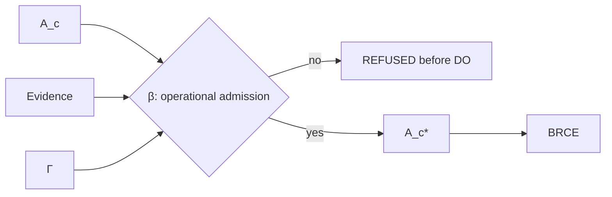

# Operational Admission

## Definition

Operational admission is the standing boundary between evidence-bearing candidate intent and a candidate authorized for consequential actuation:

\[
\beta:\Gamma_t\times A_c\times E\rightarrow A_c^*\sqcup REFUSED.
\]

Its defining law is:

\[
A_c\neq A_c^*.
\]

The star denotes admitted consequential standing, not merely a higher confidence score.

## Inputs

Admission consumes admitted semantic state through \(\Gamma_t\), authority, policy, boundary, acceptance invariants, temporal context, the candidate itself, and evidence about that candidate. The explicit context prevents permission from becoming a timeless attribute of the artifact.

A previously permitted candidate can later be refused because authority was revoked, policy changed, a certificate expired, capability disappeared, the boundary moved, or acceptance conditions changed. None of these events requires the underlying semantic knowledge to become false.

## Refusal as lawful outcome

A refusal is not a failure to run the constitution. It can be the correct constitutional terminal state for an attempted candidate. The operational closure predicate therefore accepts either lawful refusal or successful receipted consequence.

The critical requirement is timing:

\[
Forbidden\Rightarrow REFUSED_{preDO}.
\]

A system that acts and then labels the action refused has violated the boundary even if compensating rollback later succeeds.

## Admission does not perform DO

Operational admission may be physically implemented next to the actuator, but its type remains distinct:

\[
Admission\neq DO.
\]

The admitted result \(A_c^*\) is still not consequence \(A\). It is the only candidate type allowed to enter BRCE.

## Crown test

The strongest crown uses the same consequential boundary for a forbidden and permitted subject. This demonstrates that the result is context-sensitive admission rather than a hard-coded success path. The forbidden subject must produce an inspectable refusal. The permitted subject must produce an admitted candidate and then a receipt-bearing consequence.

## Recursive effect

A refusal can become part of future observation. For example, subsequent policy reasoning may observe that a specific candidate was refused under a specific context. But the refusal does not directly mutate canonical meaning. It returns through the same observation/admission cycle.

