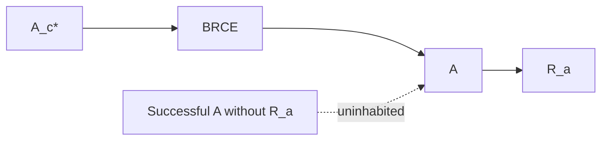

# BRCE: Zero Unreceipted Actuation

## Definition

The Bounded Receipted Chatman Equation boundary is:

\[
\mathcal B:A_c^*\rightarrow A\times R_a.
\]

Let \(\delta=DO\). Then:

\[
\mathcal B(x)=(\delta(x),\rho_a(\delta(x))).
\]

Therefore:

\[
\pi_A\circ\mathcal B=\delta.
\]

## Structural zero-unreceipted-actuation

The important result is not a guideline saying every action should log a receipt. The successful codomain itself is the product \(A\times R_a\). Within the constitutional type system:

\[
SuccessfulUnreceiptedActuation=\varnothing.
\]

There is no valid successful value whose type contains \(A\) and omits \(R_a\).

This is materially stronger than retrospective logging. If an actuator can first change the world and then separately attempt to write evidence, a crash between those operations creates an unreceipted successful state. BRCE forbids that architecture at the constitutional boundary.

## Receipt content

An actuation receipt should bind enough identity to establish the subject, authority path, admission result, execution, consequence, and replay standing. Cryptographic identity can strengthen this binding, but the constitutional requirement precedes any particular hash or signature algorithm.

## BRCE and refusal

BRCE consumes only admitted candidates. Refusal occurs upstream. For a total constitutional outcome, BRCE is lifted over the refusal coproduct:

\[
\mathcal B^+:A_c^*\sqcup REFUSED\rightarrow(A\times R_a)\sqcup REFUSED.
\]

The refusal branch remains observable history without pretending that a consequence occurred.

## Operational crown

The crown must establish both sides of the boundary. A forbidden transition is refused before DO. A permitted transition produces a pair \((A,R_a)\). The evidence should also demonstrate the absence of a successful unreceipted path in the tested actuation surface.

## Replay

Receipt validity is stronger when replay can verify the historical execution under its original context. Replay is not necessarily literal repetition of the world-changing operation. It is reproducible verification that the recorded transition, context, authority, and consequence bind correctly.

