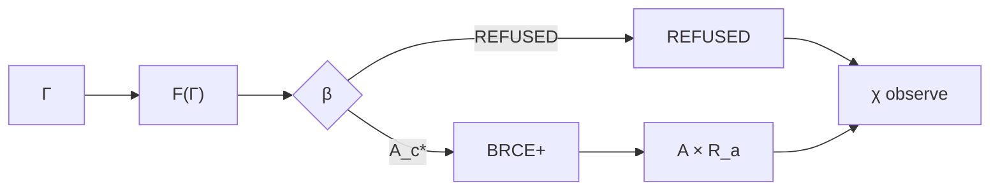

# Total Constitutional Manufacture and Refusal

## Motivation

Alternating informally between partial functions and a refusal value creates type ambiguity. v26.9.1 therefore defines a total constitutional outcome and derives consequential manufacture as its admitted restriction.

Candidate manufacture is:

\[
\mu_c:\Gamma_t\rightarrow A_c.
\]

Evidence is:

\[
\nu:\Gamma_t\times A_c\rightarrow E.
\]

Define the lifted tuple:

\[
F(\Gamma_t)=\left(\Gamma_t,\mu_c(\Gamma_t),\nu(\Gamma_t,\mu_c(\Gamma_t))\right).
\]

Admission yields:

\[
\beta\circ F:\Gamma_t\rightarrow A_c^*\sqcup REFUSED.
\]

Lift BRCE over refusal:

\[
\mathcal B^+:A_c^*\sqcup REFUSED\rightarrow(A\times R_a)\sqcup REFUSED.
\]

Then:

\[
\boxed{\widehat\mu_t=\mathcal B^+\circ\beta\circ F}
\]

with:

\[
\widehat\mu_t:\Gamma_t\rightarrow(A\times R_a)\sqcup REFUSED.
\]

## Admitted restriction

Consequential manufacture is the restriction to the admitted branch:

\[
\mu_t:\Gamma_t\rightharpoonup A\times R_a.
\]

Or, curried by non-epistemic context:

\[
\mu_{\Xi_t}:O_t^*\rightharpoonup A_t\times R_{a,t}.
\]

The original constitutional shorthand remains:

\[
A=\mu(O^*).
\]

The shorthand hides context; it does not erase it.

## Why total outcome matters

Refusal is a lawful constitutional result, not an exception outside the model. A total outcome makes this explicit and enables recursive observation to consume both branches. It also prevents a caller from interpreting absence of \(A\) ambiguously: the result can be typed as refusal rather than silently conflating denial, unsupported mechanism, execution failure, or unknown standing.

## Recursive composition

Observation consumes the coproduct:

\[
\chi_t:((A\times R_a)\sqcup REFUSED)\times\mathbb W_{t+1}\rightarrow O_{t+1}.
\]

Thus both consequence and refusal may influence later observation while neither can self-promote into \(O_{t+1}^*\).

## Release significance

The total function gives the operational crown a crisp terminality condition: the exact candidate must end either as typed refusal or as a receipt-bearing consequence. No successful untyped intermediate state is constitutionally recognized.

