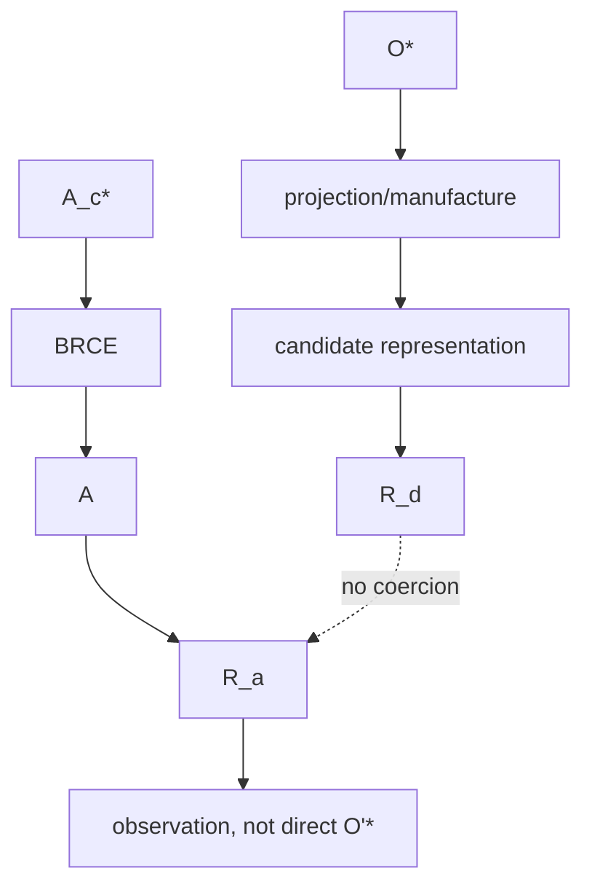

# Receipt Bifurcation: Derivation versus Actuation

## Constitutional requirement

v26.9.1 freezes two distinct receipt families because derivation provenance and worldly consequence establish different kinds of standing.

A derivation receipt is typed conceptually as:

\[
\rho_d:(O^*,Q,G,V,I,X,A_c)\rightarrow R_d.
\]

It binds the admitted semantic source, query or selection, grammar, view, invariants, exclusions, and manufactured candidate. It answers questions such as: which admitted facts caused this representation, which projection contract was applied, which version of canonical meaning was consumed, and can the projection be reproduced?

An actuation receipt is typed as:

\[
\rho_a:(A,Subject,Authority,Admission,Execution)\rightarrow R_a.
\]

It binds the exact consequential subject, authority path, admission decision, execution, resulting consequence, and sufficient evidence for replay or standing verification.

The constitutional law is:

\[
R_d\neq R_a,
\]

and no ambient coercion exists:

\[
R_d\nRightarrow R_a.
\]

## Why one generic receipt is insufficient

A generated policy, executable plan, infrastructure representation, formal proof, or process model can possess perfect derivation provenance while never having altered the consequential world. If its provenance record could satisfy an actuation receipt obligation, the constitution would collapse CONSTRUCT into DO.

The converse is also important. A worldly consequence can be strongly evidenced by an actuation receipt without proving that every textual or formal representation derived from the prior semantic state was correct. Operational standing and representational correspondence are orthogonal crowns.

## Standing dimensions

A receipt should be interpreted as evidence about a typed transition, not as universal truth. \(R_d\) establishes standing for a derivation claim. \(R_a\) establishes standing for an actuation claim. Neither directly grants the next epistemic state:

\[
R_a\not\Rightarrow O'^*.
\]

The consequence and its receipt re-enter observation and admission.

## Replay

Replay for \(R_d\) means reproducing or verifying the projection from the bound semantic source and projection contract. Replay for \(R_a\) means verifying the historical consequential transition under its bound subject and context. These replay semantics may use different mechanisms and need not repeat an irreversible actuation.

## Identity and cryptography

Hashes, signatures, event identifiers, and provenance graphs can strengthen identity, but the receipt distinction is logically prior to any cryptographic choice. A BLAKE3 digest can identify either a derivation object or an actuation object; the digest algorithm does not collapse their constitutional types.

## Crown implication

Representational closure requires valid \(R_d\) across all required projections. Operational closure requires valid \(R_a\) for permitted consequential execution. A release claim that substitutes one for the other is constitutionally invalid.

