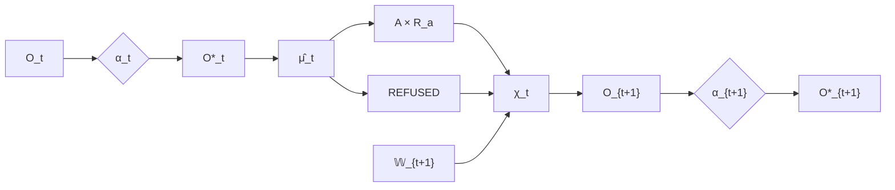

# Recursive Observation and Non-Self-Certification

## Outcome is the recursive input

Constitutional manufacture returns a typed outcome:

\[
\widehat\mu_t:\Gamma_t\rightarrow(A_t\times R_{a,t})\sqcup REFUSED.
\]

Observation must therefore consume both successful receipted consequence and lawful refusal:

\[
\chi_t:\left((A\times R_a)\sqcup REFUSED\right)\times\mathbb W_{t+1}\rightarrow O_{t+1}.
\]

The recursion is:

\[
O_{t+1}=\chi_t(\widehat\mu_t(\Gamma_t),\mathbb W_{t+1}).
\]

Then the next epistemic boundary is crossed again:

\[
O_{t+1}\xrightarrow{\alpha_{t+1}}O_{t+1}^*.
\]

## Non-self-certification

The system may cause a state. It may receipt the act that caused the state. It may observe the resulting environment. None of these facts gives the new semantic interpretation automatic standing.

Therefore:

\[
(A_t,R_{a,t})\not\Rightarrow O_{t+1}^*.
\]

Likewise:

\[
REFUSED_t\not\Rightarrow O_{t+1}^*.
\]

The refusal can be observed as history, but its semantic consequences remain candidates until admitted.

## Why this matters

Without recursive admission, an actuator could indirectly manufacture truth. It would act, observe its own output, and treat the observation as canonical simply because the action was authorized. That would make authority a back door into epistemic standing.

The constitution refuses that collapse. Authority can permit consequence; it cannot declare the semantic interpretation of future reality true without observation and admission.

## Environmental divergence

The explicit environment \(\mathbb W_{t+1}\) matters because the world can diverge from the intended consequence. A successful command is not necessarily successful realization of \(K\). Observation can reveal partial effect, interference, external change, or contradiction. This is another reason \(A_t\not\Rightarrow O_{t+1}^*\).

## Refusal as information

Refusals are not discarded errors. They can inform future policy analysis, boundary refinement, class knowledge, or diagnostics. The fact that a candidate was refused under a specific context may itself become an admitted fact in the next cycle. What is forbidden is direct self-promotion.

## Recursive invariant

The stable loop is therefore:

\[
Reality\rightarrow Observation\rightarrow Admission\rightarrow Manufacture\rightarrow Outcome\rightarrow Observation.
\]

Every cycle preserves the same standing boundaries. Novelty changes the contents of \(O\); it does not require a new mechanism beyond the calculus.

