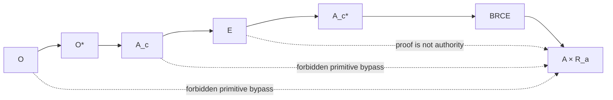

# Mandatory Lawful Factorization

## From forbidden edges to required factorization

A naïve categorical formulation might state that \(Hom(O,A)=\varnothing\) or \(Hom(A_c,A)=\varnothing\). That is incorrect once lawful intermediate morphisms exist: composition necessarily creates lawful morphisms from observation to consequence and from candidate to consequence.

The constitutional property is therefore not absence of composites. It is mandatory factorization.

Let \(\mathcal F\) be the family of constitutional boundaries required for a consequential transition. Then:

\[
Consequential(f)\Rightarrow Factor_{\mathcal F}(f).
\]

For every lawful \(f:A_c\rightarrow A\), the morphism must factor through evidence as required, operational admission, and BRCE. For every lawful \(f:O\rightarrow A\), the morphism must also factor through epistemic admission into \(O^*\).

## Safety as topology of lawful paths

The system can be regarded as a graph whose nodes are typed standing states and whose edges are primitive constitutional transitions. A dangerous architecture is one that introduces a new primitive edge capable of bypassing a required boundary.

The strongest formulation is:

\[
\boxed{Safety=MandatoryLawfulFactorization.}
\]

This is stronger than a runtime deny list. It says that successful consequential morphisms have a required shape.

## Factorization obligations

The exact set of factors can vary by domain while preserving the constitutional invariant. Some domains may require additional evidence morphisms, dual control, external signatures, or specialized acceptance. These are refinements of the factorization, not new permission to bypass the core boundaries.

At minimum, observation cannot reach consequence without admitted meaning; candidate construction cannot reach consequence without consequential admission; successful DO cannot leave the BRCE boundary without \(R_a\).

## Refusal

A refused candidate terminates before the consequential factors complete. Refusal is itself a lawful result of admission, not a bypass. The factorization requirement applies to successful consequential morphisms.

## Falsifier

The architecture should be reopened if execution demonstrates a lawful consequential requirement that cannot be expressed without an unmodeled primitive morphism, or if a component can produce valid consequence through a path that the frozen factorization cannot type. Mere implementation inconvenience is not such a falsifier.

## Governance use

Every component can now be reviewed by asking what primitive edges it exposes. If it creates a shortcut from candidate state to consequence, from proof to authority, or from representation edit to canonical meaning, it violates the constitution regardless of how useful the shortcut appears locally.

