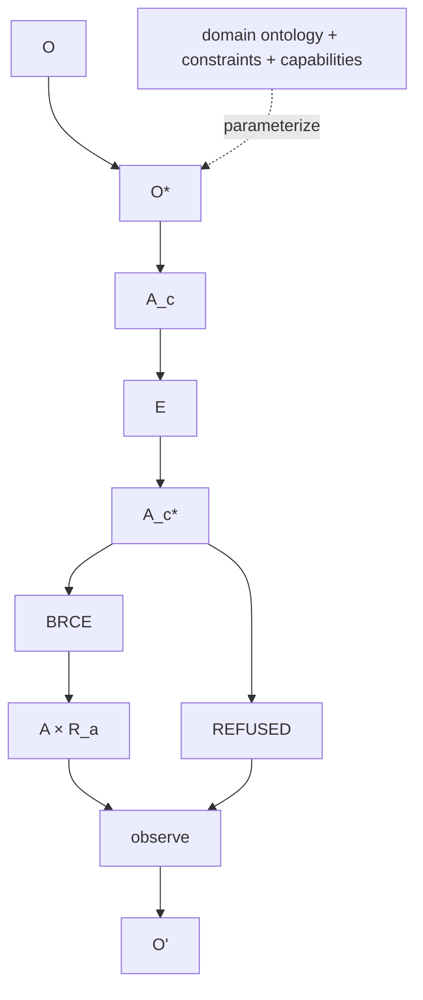

# Constitutional Generating Graph and Category

## Generating graph

Let \(\mathcal G_{\mathfrak C}\) denote the directed typed graph containing the primitive constitutional objects and morphisms. Representative objects include \(O\), \(O^*\), \(A_c\), \(E\), \(A_c^*\), \(A\times R_a\), `REFUSED`, and accumulated class structure \(\mathcal S\).

Representative primitive morphisms include observation, epistemic admission, candidate manufacture, evidence production, operational admission, BRCE, receipt construction, recursive observation, class normalization, transfer, and contextual class admission.

## Generated category

Define:

\[
\mathbf C_{\mathfrak C}=Free(\mathcal G_{\mathfrak C})/\mathcal E_{\mathfrak C},
\]

where \(\mathcal E_{\mathfrak C}\) contains the constitutional equations that identify lawful composite descriptions while preserving type boundaries.

The category permits lawful composites. For example, the admitted successful execution path induces a composite from \(O^*\) to \(A\times R_a\). That is desirable. The safety condition is that every consequential composite factors through the mandatory constitutional boundaries.

## Primitive versus composite authority

A repository or process may expose a composite operation for convenience. That does not create a new primitive constitutional morphism. Its conformance obligation is to prove that the composite internally factors through the same admission and receipt boundaries.

This distinction allows performance optimization without constitutional collapse. A low-latency runtime may fuse operations physically while preserving their logical standing transitions and receipts.

## Missing morphisms

The absence of certain primitive morphisms is intentional. There is no primitive `candidate -> consequence`, `proof -> authority`, `text edit -> admitted meaning`, or `receipt_d -> receipt_a` coercion. Lawful composites involving these types must traverse the specified boundaries.

## Domain extension

For a bounded domain \(D\), the domain system can be modeled as the constitutional core together with domain ontology, constraints, capabilities, and acceptance:

\[
System_D=Core_{\mathfrak C}+Ontology_D+Constraints_D+Capabilities_D+Acceptance_D.
\]

Generality is demonstrated when the core category remains invariant while these domain terms change.

## Research value

This categorical framing separates implementation topology from constitutional topology. Repositories can be deleted, split, rewritten, or replaced without changing the mathematical object, provided their exposed morphisms preserve the same factorization laws.

