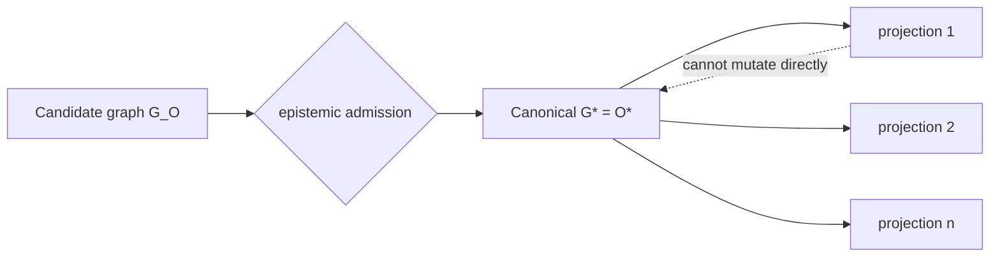

# Semantic State and Canonical Meaning

## Role of semantic state

Semantic state stores admitted meaning. It does not perform epistemic admission merely because the storage substrate can validate or query data.

The canonical relation is:

\[
G^*_t\equiv O_t^*.
\]

Candidate observation state remains separate:

\[
G_{O,t}\neq G^*_t.
\]

This distinction prevents a graph store, database, or data ingestion path from acquiring ambient epistemic authority.

## Canonical meaning as primary state

In the constitutional model, generated artifacts are purpose-specific projections from admitted meaning. The canonical semantic state therefore has priority over any one code file, policy document, workflow, report, schema, or natural-language representation.

This does not mean every detail of the world is encoded in a single monolithic graph. It means that when a semantic fact is treated as constitutional source of truth, its standing comes from admission and its dependencies can be addressed independently of its projections.

## Public ontologies and bounded semantics

Domain semantics can reuse public ontologies, vocabularies, units, provenance models, event structures, and policy concepts. Reuse is valuable because it lowers representational invention, but imported ontology terms still do not self-admit local assertions. Vocabulary standing and instance standing are different questions.

## Semantic versioning of facts

A representation should be able to identify which admitted semantic version it consumed. This enables stale-projection detection:

\[
Version(O^*_{dependency})\neq Version(O^*_{projection})\Rightarrow Stale(T_i).
\]

Representational WIP is the set of required projections whose semantic dependencies no longer match their manufacturing basis.

## Historical state

Historical admitted meaning should not be overwritten conceptually when context changes. The system needs enough temporal/provenance structure to distinguish: a fact was admitted at time \(t\); the fact was later falsified; the fact remains true but is no longer applicable; authority changed; policy changed; or a new boundary replaced an old one.

## Anti-self-certification

Even the system's own successful action returns first as observation. Semantic state cannot be updated by the actuator directly as proof that its intended consequence occurred. The next admitted state follows observation and epistemic admission.

