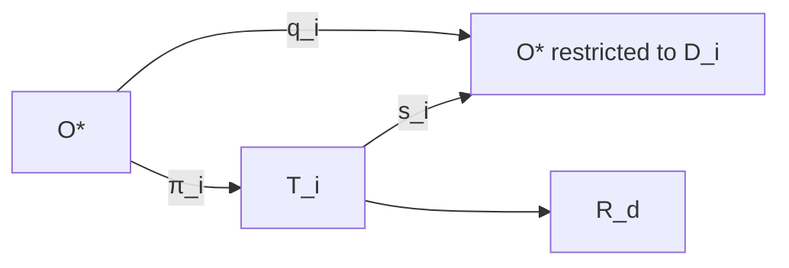

# Semantic Projection Calculus

## Projection family

For each required representation index \(i\), define a projection:

\[
\pi_i:O^*\rightarrow T_i.
\]

The projection is governed by a contract:

\[
P_i=(Q_i,G_i,V_i,I_i,X_i,D_i,\mathcal A_i).
\]

Here \(Q_i\) specifies semantic selection, \(G_i\) the representation grammar, \(V_i\) the intended view or audience, \(I_i\) required invariants, \(X_i\) intentional exclusions, \(D_i\) the semantic domain represented, and \(\mathcal A_i\) acceptance.

## Semantic correspondence

Let:

\[
s_i:T_i\rightarrow\mathcal D_i
\]

interpret the representation semantically, and let:

\[
q_i:O^*\rightarrow O^*|_{D_i}
\]

restrict canonical meaning to the required domain.

The required commuting condition is:

\[
\boxed{s_i\circ\pi_i\cong q_i.}
\]

The relation is intentionally over the required semantic slice rather than total equality. A board memorandum and an executable module should not contain identical representations; they should faithfully preserve the invariants each contract requires.

## Heterogeneous representations

This produces the key property:

\[
SemanticIdentity\land RepresentationalPlurality.
\]

One admitted semantic fact can lawfully manufacture code, tests, policy, procedures, audit narratives, contracts, machine interfaces, training material, executive text, diagrams, and other representations without making any one of those artifacts canonical truth.

## Build failure

If interpretation does not commute with canonical restriction:

\[
[s_i\circ\pi_i]\neq[q_i],
\]

then the representation is not merely editorially imperfect. Its semantic build is broken for the stated projection contract:

\[
BUILD\_BROKEN.
\]

## Provenance

A derivation receipt should bind the projection contract and semantic source so that a reader or machine can answer why a sentence, control, test, or configuration exists. Claim-level provenance is the strongest form: each derived claim can be traced to graph-addressable admitted semantics.

## Projection does not admit

No projection gains authority to update \(O^*\) from its output. Reverse mutation produces candidate semantic delta and crosses epistemic admission separately.

