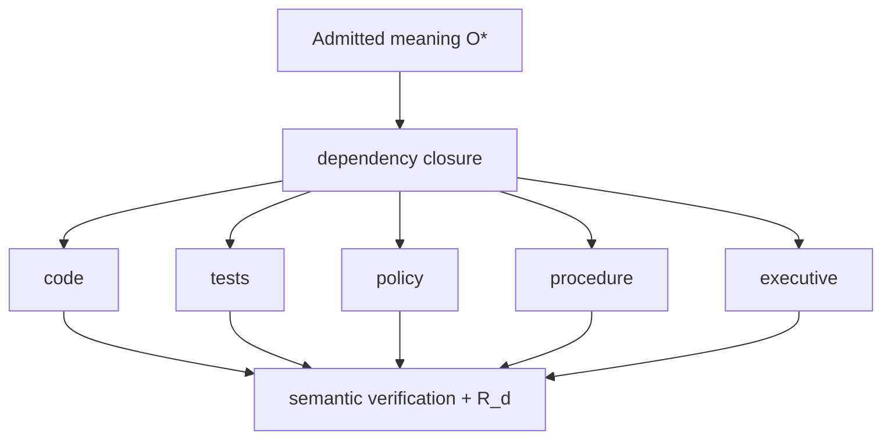

# Semantic Manufacturing

## Category

Semantic manufacturing is the lawful derivation of purpose-specific representations from admitted canonical meaning. It is broader than code generation and narrower than consequential actuation.

The general relation is:

\[
T_i=\pi_i(O^*),
\]

or equivalently a candidate-manufacture specialization:

\[
\mu_{semantic,c}(O^*,P_i)\rightarrow T_i.
\]

Its result can receive a derivation receipt \(R_d\), but the representation has no actuation standing merely because manufacture succeeded.

## Author meaning once

The manufacturing objective is to encode semantic decisions once in admitted state and derive all required representations from those decisions. The organizational problem being attacked is repeated manual transcription and synchronization of the same meaning across code, tests, policy, procedure, compliance, contracts, training, executive communication, and machine interfaces.

A conventional institution frequently uses people as semantic synchronization protocols. One person changes implementation, another edits procedure, another revises compliance language, another updates a slide deck, and meetings reconcile contradictions. Semantic manufacturing moves synchronization into explicit dependency and projection contracts.

## Projection obligations

A semantic change creates a closure obligation over every affected representation. The system should derive dependency closure, manufacture affected projections, verify semantic correspondence, and issue derivation receipts. A required projection that cannot represent the changed semantics should be typed `UNSUPPORTED`; a projection that attempts manufacture but violates its contract is `BUILD_BROKEN`.

## Manual representation ratio

For a crown semantic change, the desired manual representation change ratio is:

\[
RCR_{manual}=0.
\]

This does not mean humans cannot edit candidate text. It means the crown change should not require independent manual synchronization of representations after the semantic decision is admitted.

## Yield

Semantic manufacturing yield can be stated as:

\[
Y_s=\frac{valid\ projection\ obligations}{required\ projection\ obligations}.
\]

Crown closure requires \(Y_s=1\) for the bounded subject.

## Standing

A complete family of \(R_d\) receipts proves derivation standing. It does not prove a policy was enforced, infrastructure changed, or a consequential workflow ran. Those claims belong to operational closure and \(R_a\).

