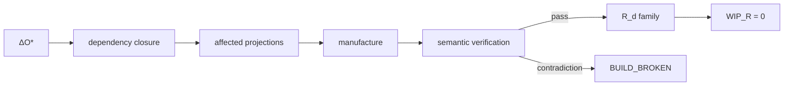

# Semantic CI and Dependency Closure

## Motivation

Traditional CI usually asks whether files compile, tests pass, and packages satisfy local constraints. Semantic CI adds a higher-order question: after admitted meaning changes, are every required representation and cross-representation invariant still current and semantically consistent?

The canonical flow is:

\[
\Delta O^*\rightarrow Admission\rightarrow DependencyClosure\rightarrow AffectedProjections\rightarrow Manufacture\rightarrow SemanticVerification\rightarrow Receipts.
\]

## Dependency closure

A semantic mutation can affect representations that do not share files, languages, or repositories. Dependency closure is therefore computed over semantic dependencies, not only source imports. A changed production authority rule may affect runtime controls, tests, policy statements, runbooks, compliance prose, and executive control descriptions simultaneously.

## Semantic contradiction as build failure

When two required projections imply incompatible semantics, the system should not defer the contradiction to a meeting by default. If the contradiction is mechanically derivable, it should become a typed build failure.

For example, suppose canonical meaning requires a bounded production-change authority while a generated contract states that any authenticated engineer may deploy. If both claims address the same semantic domain, the contradiction should fail semantic verification.

## Staleness

Define representational WIP as required projections manufactured from stale dependencies:

\[
W_R(t)=|\{T_i:Version(O^*_{dep(i)})\neq Version(O^*_{used(i)})\}|.
\]

Semantic CI is closed only when required affected projections have current receipts and:

\[
W_R=0.
\]

## Failure taxonomy

A candidate semantic mutation rejected by admission is `REFUSED`. A required representation with no supported projection is `UNSUPPORTED`. A supported projection that violates its semantic contract is `BUILD_BROKEN`. A projection awaiting an external prerequisite may be `BLOCKED`. Lack of evidence is `UNKNOWN`. This taxonomy prevents the CI surface from collapsing all non-green states into one error.

## Crown criterion

For the representational crown, one real admitted semantic mutation should fan out into heterogeneous surfaces with no manual synchronization, exact provenance, semantic correspondence, adversarial contradiction refusal or build failure, and zero representational WIP at closure.

