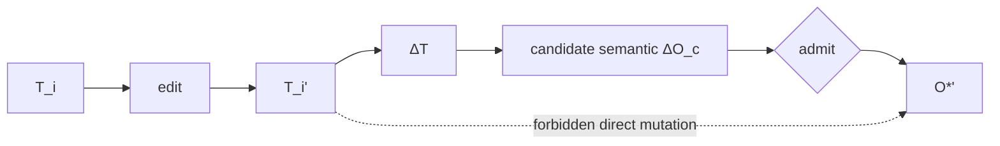

# Reverse Semantic Mutation

## The reverse path

Generated or human-edited representations can contain useful candidate changes. The constitution permits reverse interpretation but forbids direct semantic escalation.

Let a representation change from \(T_i\) to \(T_i'\). Define the edit delta:

\[
\Delta_T:T_i\rightarrow T_i'.
\]

A semantic inversion mechanism may manufacture:

\[
\sigma(\Delta_T)=\Delta O_c.
\]

The result is candidate semantic change, not admitted state.

The only lawful path is:

\[
T_i'\rightarrow\Delta O_c\xrightarrow{\alpha}O^{*'}.
\]

Therefore:

\[
TextMutation\nRightarrow SemanticStanding.
\]

## Why this is necessary

If edits to generated representations could mutate canonical meaning directly, the system would recreate manual synchronization under a different name. A change to a policy document could silently alter runtime semantics; a code edit could silently redefine governance; a model-generated sentence could become truth because it appeared in a canonical-looking file.

The reverse boundary ensures that representation remains a view, proposal surface, or candidate source while canonical meaning retains an explicit admission path.

## Human edits

The rule does not prohibit human authorship. A human may deliberately modify a representation. The system should compute the semantic delta, expose ambiguity, and submit the candidate meaning for admission. If admitted, semantic CI can then regenerate all dependent projections, including the edited one if appropriate.

## Conflicts

A reverse edit can be ambiguous or underdetermined. The inversion mechanism should not invent standing to resolve ambiguity. It can return candidate alternatives, `UNSUPPORTED`, or `UNKNOWN` depending on the bounded semantics. Admission remains explicit.

## Provenance

The new admitted semantic state should preserve provenance back to the candidate edit and admission decision. Subsequent regenerated representations receive new derivation receipts. This makes the edit traceable without granting the editor ambient authority.

## Constitutional symmetry

The forward and reverse paths are symmetrical in one deep sense: neither observation nor representation self-promotes. Raw observations become \(O^*\) only through epistemic admission; artifact edits become semantic standing only through the same class of boundary.

