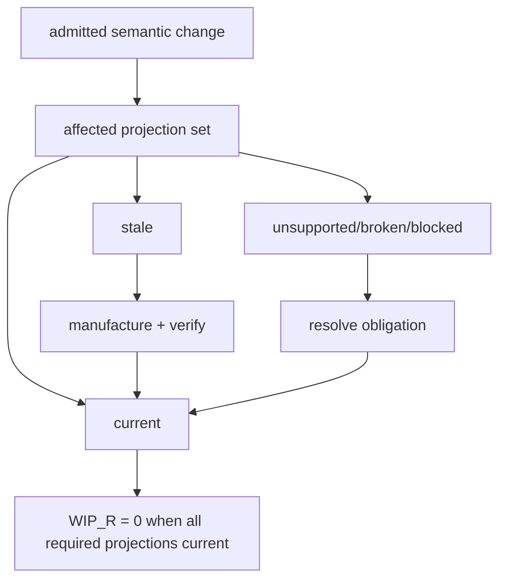

# Representational WIP and Closure

## Definition

Representational WIP measures required projections that are not current with respect to the admitted semantic dependencies they are obligated to represent.

A useful form is:

\[
W_R(t)=\left|\left\{T_i:Version(O^*_{dependency(i)})\neq Version(O^*_{projection(i)})\right\}\right|.
\]

The representational closure crown requires:

\[
W_R(t_{close})=0.
\]

## Why this is WIP

A stale procedure, outdated test, inconsistent policy sentence, old runbook, or executive description that no longer corresponds to canonical meaning is unfinished work even if no ticket exists. The organization is carrying latent representational inventory. Future readers pay the reconciliation cost when contradictions surface.

This expands Little's Law reasoning beyond issue trackers. WIP is not merely open tasks; it includes obligations whose dependent representations have not reached semantic closure.

## Closure time

Representational closure time \(	au_R\) can be measured from admitted semantic mutation to the point at which every required projection is current, valid, and receipted. Reducing this interval decreases the window in which the organization simultaneously exposes incompatible representations of itself.

## Manual synchronization

The crown also requires:

\[
RCR_{manual}=0
\]

for the bounded semantic change. Independent manual edits used to synchronize projections would mask rather than eliminate representational work generation. Human edits can still propose semantic changes, but the downstream synchronization should be manufactured from admitted meaning.

## Failure handling

Zero WIP does not mean suppressing failures. If a required projection is `UNSUPPORTED`, the obligation is not closed. If semantic verification is `BUILD_BROKEN`, it is not closed. If an external prerequisite is `BLOCKED`, the state remains open. Closure requires terminal evidence for every required representation.

## Relationship to class closure

Representational closure solves the current semantic mutation. Class closure ensures the projection machinery itself is reusable across future instances without rediscovering how to synchronize the same class of meaning. The two obligations therefore operate at different horizons.

