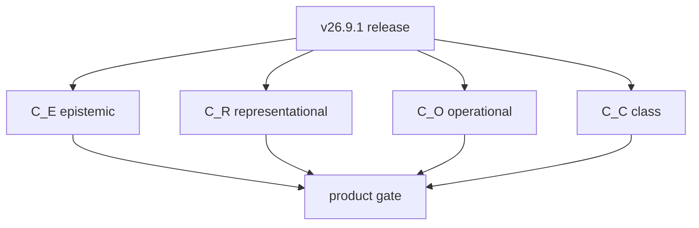

# The Four Closure Obligations

## Why obligations, not closure operators

v26.9.1 uses the term **closure obligation** deliberately. A mathematical closure operator on a partially ordered set normally requires extensivity, monotonicity, and idempotence. Those axioms have not been proven for every closure notion in this constitution. Operational terminalization and class transfer, in particular, are better expressed as predicates than as endofunctions on one lattice.

The four predicates are:

\[
C_E,\quad C_R,\quad C_O,\quad C_C.
\]

They are orthogonal in the sense that success in one does not compensate for failure in another.

## Epistemic closure

Epistemic closure establishes that candidate observation acquired standing only through the admission boundary:

\[
C_E(O)\iff Standing(\alpha(O))=ALIVE.
\]

The crown must include adversarial candidates demonstrating that raw or reconstituted observation cannot enter canonical state directly.

## Representational closure

For a required projection family \(\Pi\):

\[
C_R(O^*,\Pi)\iff\forall i\in\Pi:\ Current(T_i)\land Valid(T_i)\land Valid(R_{d,i}).
\]

Equivalent bounded crown condition:

\[
WIP_R=0.
\]

This is closure over representational obligations, not merely successful generation of one artifact.

## Operational closure

Operational closure terminalizes an exact candidate as either lawful refusal or successful receipted consequence:

\[
C_O(A_c)\iff \beta(A_c)=REFUSED\lor\exists(A,R_a)=\mathcal B(A_c^*).
\]

There is no recognized successful intermediate state with missing receipt.

## Class closure

For a normalized class \([x]_\Gamma\):

\[
C_C([x]_\Gamma)\iff\exists x'\in[x]_\Gamma,\ x'\neq x:\ InstanceClosed(x')\land Rediscovery(x')=0.
\]

The distinct-instance condition prevents reproduction of the training case from being mislabeled generalization.

## Why four

The four obligations protect different conservation laws. Epistemic closure protects standing. Representational closure protects semantic correspondence. Operational closure protects authority and consequence. Class closure protects accumulated capability against future rediscovery.

The release theorem is therefore conjunctive:

\[
Release=ALIVE\Rightarrow C_E\land C_R\land C_O\land C_C.
\]

No weighted average can substitute for the product.

## Recursive relation

The closures are coupled without collapsing. Operational outcome becomes new observation, which can trigger epistemic closure in the next cycle. A closed instance can become evidence for class closure. A class-closed solution later re-enters a new instance as candidate knowledge and must still pass contextual applicability and admission.

