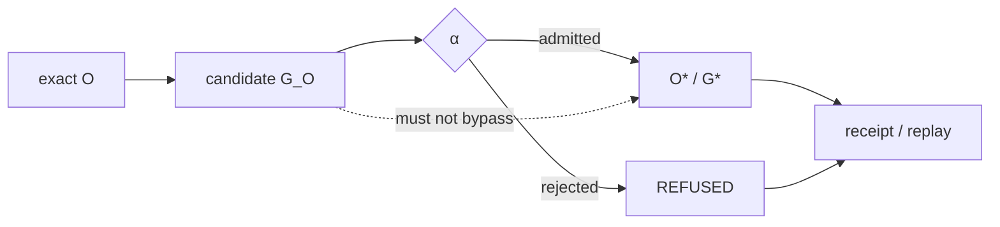

# Epistemic Closure Crown

## Crown claim

The epistemic crown establishes that canonical meaning can be reached only through epistemic admission and that candidate observation has no ambient standing.

The core path is:

\[
O\rightarrow G_O\xrightarrow{\alpha}O^*\sqcup REFUSED.
\]

The crown is stronger than demonstrating one valid input. It must demonstrate the boundary under both admissible and adversarial conditions.

## Exact subjects

A bounded crown should select exact observation subjects whose expected classifications are known from the admitted fence. Useful adversarial classes include stale state, internally inconsistent state, externally authenticated but semantically unauthorized state, a legacy artifact that resembles canonical output, a generated representation fed back as observation, and an assertion valid under a prior temporal context but not the present one.

The point is not to maximize pathological test cases. It is to exercise the specific ways observation could accidentally acquire standing.

## Required evidence

For each exact subject, the crown receipt should bind observation identity, candidate graph identity, admission context, admission outcome, resulting canonical delta if admitted, and refusal reason if refused. It should make direct insertion into \(G^*\) distinguishable from the lawful path.

The key negative property is:

\[
G_O\not\Rightarrow G^*.
\]

A successful crown demonstrates that candidate state cannot bypass \(\alpha\).

## Recursive subject

At least one subject should originate from the system's own prior consequence or refusal. This directly tests the non-self-certification law:

\[
(A_t,R_t)\not\Rightarrow O_{t+1}^*,
\]

\[
REFUSED_t\not\Rightarrow O_{t+1}^*.
\]

## Standing

A static code review of an admission function is not enough. The crown requires exact observed execution. If the mechanism is implemented but the crown subject has not been run, standing remains `PARTIAL_ALIVE` or `UNKNOWN` depending on evidence. If a required mechanism is absent, `UNSUPPORTED` is more precise. If an adversarial candidate is lawfully rejected, `REFUSED` is success for that candidate, not a failed release.

## Acceptance

The crown is ALIVE when the admitted subject reaches canonical state only through the admission path, all forbidden subjects are typed refusals, no direct candidate-to-canonical path is observed, and the resulting receipts can be replayed or verified.

