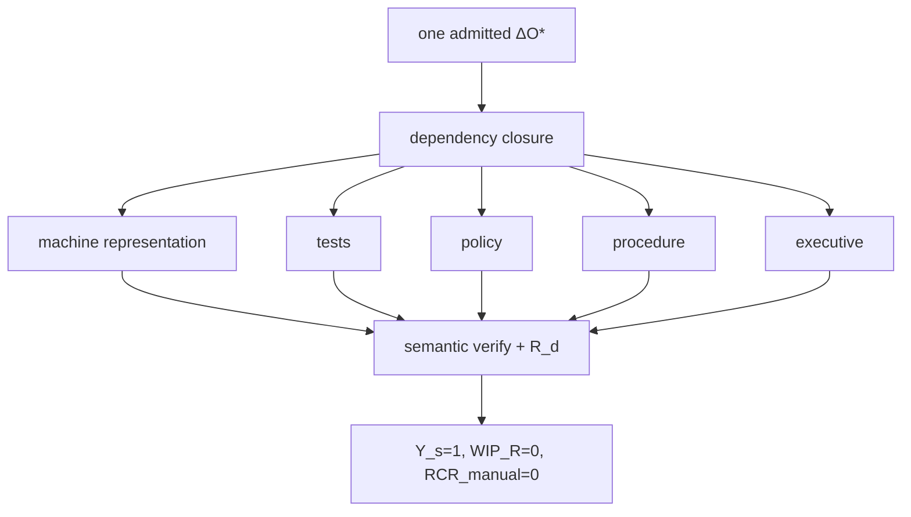

# Representational Closure Crown

## Crown claim

The representational crown demonstrates that one admitted semantic mutation can be propagated into every required heterogeneous representation with semantic correspondence, exact derivation provenance, zero manual synchronization, and zero remaining representational WIP.

The crown begins with one real admitted change:

\[
\Delta O^*.
\]

Dependency closure derives the required projection set. The set should be heterogeneous enough that success cannot be explained as one templating format copied several times. A strong bounded family includes code or machine configuration, tests, policy/control language, procedure/runbook text, compliance evidence or narrative, and executive communication.

## Required conditions

For each projection \(T_i\), require:

\[
s_i\circ\pi_i\cong q_i,
\]

and a valid \(R_{d,i}\) binding the admitted semantic source and projection contract.

At closure:

\[
WIP_R=0,
\]

and for the crown change:

\[
RCR_{manual}=0.
\]

No independent manual edit may be required merely to synchronize the same semantic decision across representations.

## Adversarial contradiction

The crown should deliberately introduce or request a representation whose semantics contradict the admitted source. Semantic verification should prevent publication or classify the projection `BUILD_BROKEN`. This demonstrates that semantic manufacturing is not blind text generation.

A second adversarial case should edit a generated representation and attempt to feed it back into canonical meaning. The result must be candidate semantic delta followed by admission, not direct graph mutation.

## Yield

Define bounded semantic yield:

\[
Y_s=\frac{valid\ projection\ obligations}{required\ projection\ obligations}.
\]

The crown requires:

\[
Y_s=1.
\]

A required `UNSUPPORTED`, `BLOCKED`, stale, or broken projection keeps the crown open.

## Evidence

The crown receipt family should make it possible to ask why each derived claim exists and trace the answer to admitted semantic facts. Claim-level provenance is preferred for natural-language projections because document-level provenance can hide unsupported assertions.

## Standing

The crown proves representational closure only. It does not prove any generated representation was actuated in the world. \(R_d\neq R_a\) remains in force.

