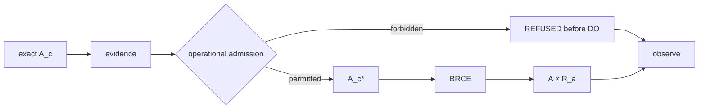

# Operational Closure Crown

## Crown claim

The operational crown proves the exclusive consequential path. It must demonstrate both lawful rejection and lawful success against exact subjects at the same consequential boundary.

The canonical route is:

\[
A_c\rightarrow E\rightarrow A_c^*\sqcup REFUSED\rightarrow(A,R_a)\sqcup REFUSED.
\]

The required dual result is:

\[
Forbidden\Rightarrow REFUSED_{preDO},
\]

and:

\[
Permitted\Rightarrow(A,R_a)\in Im(\mathcal B).
\]

## Why both branches matter

A system that only demonstrates permitted execution might simply lack meaningful admission. A system that only demonstrates refusal might be incapable of actuation. The crown therefore uses a bounded pair or family of subjects showing that the same constitution discriminates context lawfully.

## Forbidden subject

The forbidden subject should be technically constructible so that refusal cannot be explained by inability to build the action. Evidence may even establish that the action would work technically. The decisive failure should be authority, policy, boundary, acceptance, or another operational admission condition.

Refusal must occur before consequential DO. A compensate-after-execution pattern does not satisfy the crown.

## Permitted subject

The permitted subject must cross admission, execute, produce consequence, and inhabit the BRCE product:

\[
\mathcal B(A_c^*)=(A,R_a).
\]

The receipt should bind exact subject identity, context, authority, admission, execution, and consequence strongly enough for replay verification.

## No successful unreceipted path

The crown should inspect and, where possible, adversarially exercise the actuation surface for a path capable of returning successful \(A\) without \(R_a\). The constitutional claim is structural:

\[
SuccessfulUnreceiptedActuation=\varnothing.
\]

If implementation exposes such a path, architecture conformance is broken regardless of whether ordinary callers use it.

## Recursive observation

Both success and refusal should become observable outcomes through \(\chi\). Neither should directly set \(O'^*\). This links operational closure to the next epistemic cycle while preserving separation.

