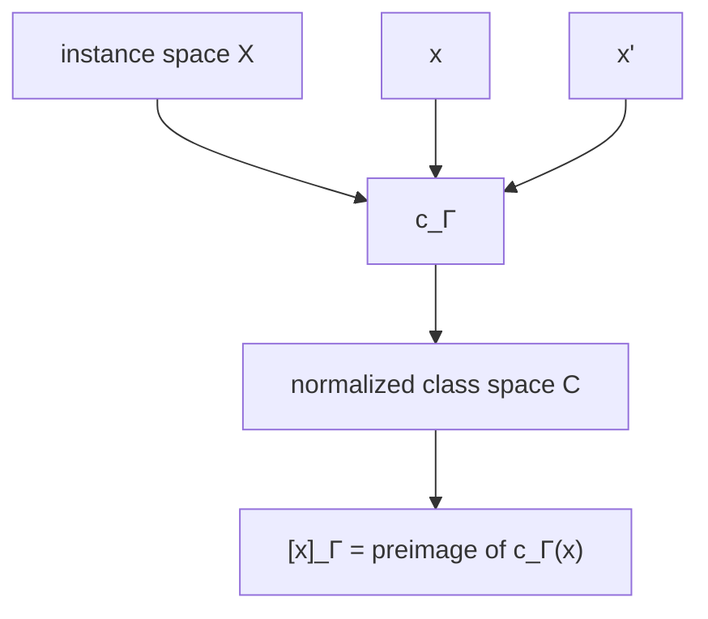

# Class Quotient and Equivalence

## Formalization problem

Saying two instances “share the same solution structure” does not automatically define an equivalence relation. Reflexivity, symmetry, and especially transitivity must be guaranteed if the notation \([x]\) is to denote a mathematical quotient.

v26.9.1 therefore defines a normalized admitted classing morphism:

\[
c_\Gamma:X\rightarrow\mathcal C.
\]

Then:

\[
x\sim_\Gamma y\iff c_\Gamma(x)=c_\Gamma(y).
\]

Equality in \(\mathcal C\) immediately supplies reflexivity, symmetry, and transitivity.

The class is:

\[
[x]_\Gamma=c_\Gamma^{-1}(c_\Gamma(x)).
\]

## Why context appears in the relation

Class membership can depend on lawful boundary and acceptance. Two instances may share a structural pattern under one domain but not another. Context indexing prevents universalizing a reusable solution beyond the conditions that make its transfer valid.

This is especially important for policy, compliance, authority, temporal rules, and capabilities. A class relation that ignores context can turn reuse into ambient authority.

## Normal form

The map \(c_\Gamma\) should normalize away instance-specific details irrelevant to the reusable solution while preserving the invariants that determine whether transfer is lawful. The normalized representation can be ontology-backed, algebraic, graph-based, or otherwise structured; the constitution requires the equivalence semantics, not one storage mechanism.

## Class candidate

Solving \(x\) can produce a candidate reusable structure:

\[
\eta:x\rightarrow S_{[x]}.
\]

But \(\eta\) alone does not prove that the normalization is correct. Transfer to \(x'\neq x\) provides empirical evidence that the chosen class boundaries capture reusable structure.

## Falsification

A failed transfer can falsify or refine the class definition rather than the original instance solution. If \(x'\in[x]_\Gamma\) under the frozen classifier but requires rediscovery or violates acceptance, then either the reusable encoding is incomplete, the classifier is too broad, or an unmodeled contextual factor exists.

That observation can legitimately reopen the class model while leaving the constitutional calculus intact.

## Accumulation

Civilization memory should index normalized class identities, not raw solved instances. This allows many historical instances to contribute evidence to one reusable structure without duplicating the entire solution as separate knowledge.

