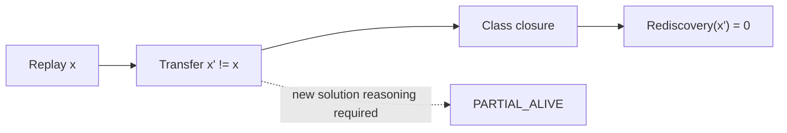

# Reproduction, Transfer, and Class Closure

## Three evidentiary levels

The constitution distinguishes three claims that are often conflated.

**Reproduction** asks whether the known solution for \(x\) can be replayed or regenerated for the same subject. A passing reproduction establishes determinism, preserved provenance, or execution repeatability depending on the object.

**Transfer** asks whether encoded solution structure can be instantiated on a distinct lawful member \(x'\neq x\) of the same admitted class.

**Class closure** adds the requirement that transfer occurs without rediscovery of the solution:

\[
Rediscovery(x')=0.
\]

The evidentiary order is:

\[
Reproduction<Transfer<ClassClosure.
\]

## Why the distinction matters

A system can overfit its original instance. A generated package may contain literal identifiers, hidden assumptions, hard-coded environmental state, or tacit decisions that were never elevated into the reusable class structure. Replay will pass while the next real instance forces a human or model to solve the problem again.

That is not class closure.

## Transfer protocol

A transfer test should select \(x'\) independently enough that instance-specific leakage is exposed, yet verify membership in \([x]_\Gamma\) before execution. The reusable structure is instantiated with the new observation and contextual parameters. Normal admission still occurs. The test records any new solution information introduced after instantiation.

If the new information is only genuinely novel instance data already modeled as parameters, rediscovery remains zero. If the operator must reconstruct a solution rule, invent a missing verifier, reinterpret the class boundary, or manually synchronize representations, class closure has not been achieved.

## Failure interpretation

Transfer failure is valuable evidence. It can indicate incomplete encoding, an invalid equivalence class, missing contextual dimensions, unsupported capability, or a genuinely novel requirement that means \(x'\) was misclassified. The correct standing should preserve these distinctions.

## Marketplace significance

A marketplace of reusable structures has civilization-scale value only when entries can demonstrate transfer standing. A catalog of packages that merely exist or replay demo cases is a convenience registry, not accumulated executable knowledge.

## Crown receipt

The class receipt should bind original instance identity, normalized class identity, reusable structure identity, distinct transfer instance, membership evidence, execution receipts, and measured rediscovery information.

