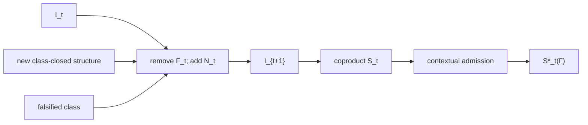

# Civilization Accumulator

## Historical class identity set

Reserve \(\Lambda\) for the work-arrival measure. Civilization memory uses a distinct sort:

\[
\mathcal I_t=\{\text{class identities with historical standing at }t\}.
\]

The historical identity set evolves as:

\[
\mathcal I_{t+1}=(\mathcal I_t\setminus F_t)\cup N_t,
\]

where \(F_t\subseteq\mathcal I_t\) contains falsified class identities and \(N_t\) contains newly class-closed identities.

Executable accumulated structure is:

\[
\mathcal S_t=\coprod_{c\in\mathcal I_t}S_c.
\]

## Knowledge ratchet

The accumulator encodes a key civilizational property: forgetting is not falsification. A solved class should not disappear because a person leaves, a document goes stale, a chat history vanishes, or an organization loses tacit memory.

Historical standing leaves the accumulator because the class was falsified, not merely because it is currently unusable.

This gives a ratchet-like form:

\[
Knowledge_{t+1}=(Knowledge_t-Falsified_t)\cup NewlyAdmitted_t.
\]

## Applicability projection

Current use is separately determined:

\[
\mathcal S_t^*(\Gamma_t)=Adm_{\mathcal S}(\mathcal S_t,\Gamma_t).
\]

A historically valid structure may not belong to the current applicable subset. Authority can be revoked, law superseded, certificates expire, capabilities disappear, or a domain boundary change. None of these events alone means the historical structure was false.

## Class closure and growth

Only class-closed structures should enter \(N_t\). A solved instance, a draft pack, a generated workflow, or a plausible generalized rule remains candidate knowledge until distinct-instance transfer demonstrates the class.

This is intentionally conservative. The accumulator is meant to store reusable standing, not every attempted abstraction.

## Falsification

Falsification should be receipted and specific. Removing a class identity from \(\mathcal I_t\) is a stronger operation than making it currently inapplicable. Evidence should preserve why the class itself no longer stands.

## Post-AGI significance

The accumulator changes the economics of reasoning. If solved classes persist in executable form, repeated intelligence is not required to reconstruct them. The frontier moves to genuinely novel observations and genuinely new class structure.

