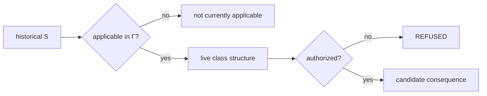

# Knowledge, Applicability, and Authority

## Three separate questions

A reusable structure can have historical standing while not being applicable now. It can be applicable now while the current principal lacks authority to actuate it. These are separate constitutional questions:

\[
Knowledge\neq CurrentApplicability\neq Authority.
\]

## Historical knowledge

Historical knowledge asks whether a class solution has standing as accumulated reusable structure. Its identity belongs to \(\mathcal I_t\) unless falsified.

This form of standing is intentionally durable. A change in organizational policy should not rewrite history by declaring a previously valid engineering or legal relation false when the actual change is contextual applicability.

## Current applicability

Applicability is a contextual projection:

\[
\mathcal S_t^*(\Gamma_t)=Adm_{\mathcal S}(\mathcal S_t,\Gamma_t).
\]

It can exclude a historically valid class because the current boundary, policy, temporal conditions, acceptance requirements, or available capabilities differ.

## Authority

Authority answers whether a principal may use an applicable structure to cross into consequence. It remains part of the consequential context and admission path. Applicable knowledge does not confer authority merely because the solution is known.

This blocks a dangerous inference:

\[
Known\land Applicable\not\Rightarrow Authorized.
\]

## Examples of non-falsifying exclusion

A certificate expires. A law is superseded. A production role is revoked. A cloud capability is unavailable in one region. A process is valid only inside a narrower boundary. A previously accepted risk threshold changes. In each case, historical structure can remain knowledge while current applicability changes.

## Reuse discipline

Class closure therefore does not create ambient authority. When a reusable class is instantiated, the new instance still contributes observation, crosses epistemic admission, receives contextual applicability, constructs a candidate, produces evidence, and crosses operational admission before DO.

The benefit of class closure is removal of rediscovery, not removal of governance.

## Audit significance

Separating these dimensions produces more precise explanations. Instead of saying “the solution is invalid,” the system can say “the solution remains historically valid but is expired in this context,” or “it is applicable but the acting principal is unauthorized.” That precision is essential for machine-scale reasoning and post-AGI swarms.

