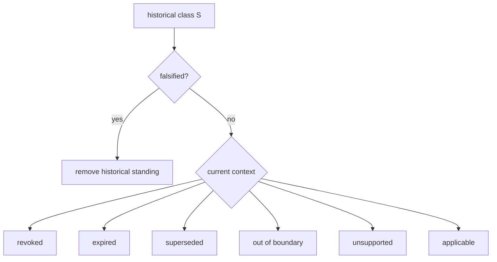

# Contextual Standing and Non-Falsifying Invalidations

## Standing is indexed

For reusable structure \(S\), standing should be understood with context and time:

\[
Standing(S,\Gamma,t).
\]

This prevents a binary true/false model from absorbing distinctions that matter operationally.

## Falsification

`Falsified(S)` means the reusable class structure itself no longer stands under the relevant epistemic standard. This can justify removing its identity from the historical accumulator:

\[
\mathcal I_{t+1}=(\mathcal I_t\setminus F_t)\cup N_t.
\]

Falsification is deliberately stronger than non-applicability.

## Revocation

`Revoked(S,Γ)` means authority or permission previously available for use has been withdrawn in the current context. The underlying solution can remain true.

## Expiration

`Expired(S,t)` means temporal validity has ended. Expiration can be planned and can later be superseded by renewal without implying that the original structure was historically false.

## Supersession

`Superseded(S)` means a newer standing structure replaces the old one for current use. Historical provenance should retain the older structure and the relation explaining its replacement.

## Out of boundary

`OutOfBoundary(S,Γ)` means the structure is being applied beyond the domain for which its class standing was established. This is especially important for class closure: successful transfer inside \([x]_Γ\) does not prove universal applicability.

## Unsupported

`Unsupported(S,Γ)` means the current capability set cannot realize the structure. This is not refusal and not falsification. A capability can later return without changing the truth of the class solution.

## Deep law

The durable rule is:

\[
Forget\neq Falsify,
\]

and also:

\[
NotCurrentlyAdmissible\not\Rightarrow Falsified.
\]

These distinctions allow civilization memory to accumulate without turning historical knowledge into ambient power.

## Machine consequences

A swarm should never collapse these reasons into “invalid.” Each has a different repair: reacquire authority, renew, select the superseding class, narrow the boundary, restore capability, or revise the class after genuine falsification. Typed standing therefore reduces unnecessary rediscovery and repair work.

