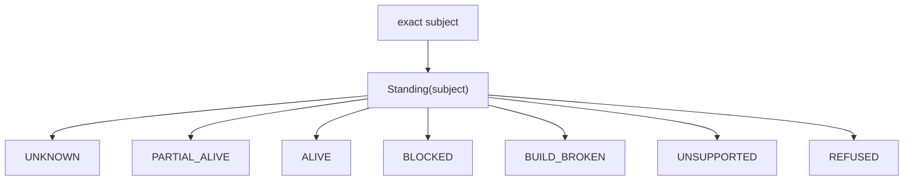

# Standing Algebra

## Tagged standing space

v26.9.1 defines standing as a tagged sum rather than a scalar maturity score:

\[
\mathbb S=\{UNKNOWN,PARTIAL\_ALIVE,ALIVE,BLOCKED,BUILD\_BROKEN,UNSUPPORTED,REFUSED\}.
\]

The map is:

\[
Standing:Subject\rightarrow\mathbb S.
\]

No naïve total order is imposed because the labels encode different causal situations rather than points on one linear scale.

## UNKNOWN

`UNKNOWN` means admitted evidence is insufficient to classify the exact claim. Unknown does not imply the mechanism is absent and does not imply the transition would be refused. It is epistemic incompleteness.

## PARTIAL_ALIVE

`PARTIAL_ALIVE` means some required evidence or closure exists, but the exact crown is incomplete. A mathematically complete specification with missing execution receipts belongs here at release level. Likewise, an implementation can have passing local tests while a distinct transfer instance has not yet proven class closure.

## ALIVE

`ALIVE` is reserved for the standing claimed by the subject. If the claim is executable, ALIVE requires exact observed execution, not merely inspection or argument. The evidence must correspond to the exact admitted subject and acceptance invariant.

## BLOCKED

`BLOCKED` identifies an external unmet dependency that prevents the required transition from being attempted or completed. A blocked subject is not broken by definition. The remedy is to resolve or change the external prerequisite.

## BUILD_BROKEN

`BUILD_BROKEN` records attempted manufacture or verification failure for a mechanism that is expected to exist. Semantic noncommutation, failing generation, compilation, or an execution-path defect can inhabit this tag depending on the boundary being tested.

## UNSUPPORTED

`UNSUPPORTED` means the required mechanism or representation does not exist under the current bounded system. It differs from `UNKNOWN`: the absence is known. It differs from `REFUSED`: no lawful admission decision rejected a valid candidate; the capability is absent.

## REFUSED

`REFUSED` is lawful rejection by an admission boundary. For a forbidden operational crown subject, `REFUSED` before DO is the expected successful result.

## Conservation laws

\[
UNKNOWN\neq UNSUPPORTED\neq REFUSED.
\]

\[
Inspection\neq Execution.
\]

A standing label without an exact subject and evidence reference is narrative, not constitutional standing.

## Swarm use

Every swarm worker should terminate a bounded task with a tagged standing and bind it to observation, subject identity, execution or refusal evidence, and next permissible action. This prevents “looks good,” “probably works,” and “not sure” from contaminating release logic.

